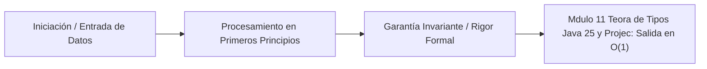

# Módulo 1.1: Teoría de Tipos, Java 25 y Project Valhalla (Desde 0 hasta Assembly)

---

## 1. 🐣 Rincón Junior: La Iniciación Absoluta

### ¿Qué es un "Tipo" en Programación?
Imagina que estás organizando una mudanza. Tienes cajas de diferentes tamaños y formas. No puedes meter un sofá (datos grandes) en una caja para vasos (datos pequeños). Un **Tipo de Dato** en programación es exactamente eso: una etiqueta que le dice al ordenador qué forma y tamaño tiene la información, y qué operaciones se pueden hacer con ella (puedes sumar números, pero no puedes sumar lógicamente dos palabras como "Hola" + "Adios" matemáticamente).

Java es un lenguaje de **tipado estático y fuerte**.
* **Estático**: Debes declarar la forma de la caja antes de usarla, y el compilador (el inspector de aduanas) lo verifica antes de arrancar el programa.
* **Fuerte**: No puedes hacer trampa. Si dices que una caja es para números, no puedes meter letras escondidas. El programa explotará antes de permitirlo.

### Java Moderno (Java 25) vs Java Antiguo
Hace años, Java era muy "verboso" (escribías mucho para hacer poco). Java 25 introduce atajos poderosos para que el código sea limpio y directo, permitiéndote centrarte en resolver el problema, no en escribir "código de fontanería" (getters, setters, equals, hashcode).

---

## 2. 🔬 Fundamentos Computacionales: Teoría de Tipos (Type Theory)

En ciencias de la computación teóricas (Stanford CS Standard), el sistema de tipos de Java se basa en **Sistemas de Tipos Nominales (Nominal Subtyping)**.

A diferencia de Go o TypeScript, que usan tipado *Estructural* (Duck Typing: "si camina como un pato y hace quack, es un pato"), en Java la relación de herencia debe ser explícitamente declarada por el programador (`class Pato extends Ave`).

*   **Matemáticamente**: Un sistema de tipos asigna un tipo $T$ a cada término $t$. Decimos que $t : T$ (el término $t$ tiene tipo $T$).
*   **Subtipado Nominal**: $S <: T$ ($S$ es subtipo de $T$) sí y solo si el árbol de herencia declara explícitamente que $S$ deriva de $T$.
*   **Soundness (Solidez)**: El compilador de Java (teóricamente) garantiza la propiedad de *Soundness*: "Si un programa está bien tipado ($t : T$), entonces su ejecución no producirá errores de tipo en tiempo de ejecución (Run-time type errors)". (Aunque la *reflexión* y *type erasure* en genéricos introducen lagunas en esta prueba pura).

---

## 3. 🚀 Arquitectura Práctica y Uso: Java 25 (Records, Sealed, Pattern Matching)

El código moderno en la arquitectura Hexagonal (DDD) de nuestro proyecto requiere inmutabilidad pura en la capa de dominio.

### 3.1 Records (Tuplas Inmutables Nominales)
Reemplazan a los antiguos POJOs (Plain Old Java Objects). Son inmutables por defecto, reduciendo el ruido visual.

```java
package com.corp.domain.model;

import java.math.BigDecimal;
import java.util.Objects;

// El compilador genera automáticamente: constructor, equals(), hashCode(), y toString()
public record Transaccion(String id, BigDecimal importe, Moneda moneda) {
    
    // Compact Constructor para validación (Fail-Fast)
    public Transaccion {
        Objects.requireNonNull(id, "ID no puede ser nulo");
        if (importe.compareTo(BigDecimal.ZERO) < 0) {
            throw new IllegalArgumentException("Importe no puede ser negativo");
        }
    }
}
```

### 3.2 Sealed Classes (Jerarquías Algebraicas Cerradas)
Limitan qué clases pueden heredar de ellas. Fundamental para el Pattern Matching seguro.

```java
public sealed interface EstadoPago permits PagoPendiente, PagoCompletado, PagoFallido {}

public record PagoPendiente(String txId) implements EstadoPago {}
public record PagoCompletado(String txId, String receiptUrl) implements EstadoPago {}
public record PagoFallido(String txId, String errorReason) implements EstadoPago {}
```

### 3.3 Pattern Matching Exhaustivo (Switch)
El compilador te obliga a manejar todos los casos posibles de una jerarquía sellada. Si mañana añades `PagoReembolsado`, el compilador fallará aquí, protegiéndote (Exhaustiveness checking).

```java
public String procesarPago(EstadoPago estado) {
    return switch (estado) {
        case PagoPendiente p -> "Esperando confirmación para TX: " + p.txId();
        case PagoCompletado c -> "Éxito! Recibo: " + c.receiptUrl();
        case PagoFallido f -> "Error crítico: " + f.errorReason();
        // No necesitamos 'default' porque la interfaz está sellada (Sealed)
    };
}
```

---

## 4. 🧠 Internals e Implementación de Bajo Nivel (Senior / Staff)

### Layout de un Objeto Java en Memoria (Object Header)
Cuando instancias un objeto en Java (ej. `new Transaccion(...)`), no solo ocupa espacio para sus datos. En la JVM HotSpot típica (64-bit sin Compressed Oops), todo objeto tiene un **Object Header** de 16 bytes de "overhead":

1.  **Mark Word (8 bytes)**: Guarda información de estado del objeto (Hashcode de identidad, edad en el Garbage Collector, estado de bloqueos/locks de sincronización).
2.  **Klass Pointer (8 bytes)**: Puntero a los metadatos de la clase en el Metaspace. Permite al runtime saber de qué tipo es el objeto para el polimorfismo dinámico (Dynamic Dispatch).

Si creas una clase simple con un solo `int` (4 bytes), el objeto ocupa 16 (header) + 4 (int) + 4 (padding para alineación a 8 bytes) = **24 bytes**. El overhead es masivo comparado con C/C++.

### Compressed Oops (Ordinary Object Pointers)
Para reducir el tamaño de los punteros en sistemas de 64 bits, la JVM usa `+UseCompressedOops` (activo por defecto si el heap es < 32GB). Comprime el *Klass Pointer* a 4 bytes aprovechando la alineación de memoria a 8 bytes (haciendo un shift a la izquierda).

---

## 5. ⚡ Optimización Extrema y El Futuro: Project Valhalla (Principal)

### El Problema de la Indirección (Pointer Chasing) y Caché de CPU
En Java tradicional, un array de `Transaccion[]` es en realidad un array de **punteros** dispersos por la memoria Heap. Cuando la CPU intenta iterar este array, sufre constantes "Cache Misses" (L1/L2/L3) porque la memoria no es contigua. En C++, un array de structs está empaquetado contiguamente, siendo brutalmente rápido de iterar (Prefetching de hardware).

### Project Valhalla (Value Objects & Inline Classes)
Valhalla introduce **Value Classes**. Cambia el lema "Códigos como Clases, Funcionan como Primitivos".
Una Value Class carece de identidad (no tiene Object Header, no puedes bloquearla con `synchronized`). Esto permite a la JVM "aplanar" (flatten) la estructura en memoria.

```java
// SINTAXIS VALHALLA (Preview)
value record Punto3D(double x, double y, double z) {}

// Un array de Punto3D[] ocupará 24 bytes contiguos por elemento, sin punteros, sin cabeceras.
// Iterarlo aprovechará el ancho de banda máximo de la memoria RAM y Caché L1.
```

### False Sharing y `@Contended`
Cuando varios hilos (threads) actualizan variables distintas que caen en la misma **línea de caché de CPU (64 bytes)**, los núcleos de la CPU invalidan mutuamente sus cachés, destruyendo el rendimiento. Esto se llama *False Sharing*. En Java de ultra-baja latencia (High-Frequency Trading), se usa la anotación interna `@jdk.internal.vm.annotation.Contended` para obligar a la JVM a insertar "padding" de memoria alrededor de la variable, asegurando que resida en su propia línea de caché exclusiva.

---

## 6. ⚠️ Runbook de Producción y Resolución de Problemas

### Incidente: OutOfMemoryError por Overhead de Boxing (Autoboxing Leak)
**Síntoma**: La memoria Heap crece exponencialmente, el GC trabaja al 99% (GC Thrashing) y la latencia sube drásticamente, pero el tamaño real de los datos lógicos es pequeño.

**Causa Raíz**: Uso de primitivas envolventes (Wrappers: `Integer`, `Long`, `Double`) en lugar de primitivas puras (`int`, `long`, `double`) dentro de grandes colecciones, listas de datos en streaming o simulaciones masivas (Módulo 3).

*Ejemplo Anti-Patrón*:
```java
// O(N) overhead masivo de memoria
List<Long> idsMasivos = new ArrayList<>(); 
for(long i=0; i<10_000_000; i++) {
    idsMasivos.add(i); // Autoboxing: crea un nuevo OBJETO java.lang.Long en el Heap (24 bytes c/u)
}
// Total memoria: 10M * 24 bytes = 240 MB de basura, en lugar de 80 MB.
```

**Comandos de Diagnóstico SRE**:
1. Extraer un Heap Dump desde el pod en Cloud Run/Kubernetes:
   ```bash
   jcmd 1 GC.heap_dump /tmp/dump.hprof
   ```
2. Analizar el dump (con Eclipse MAT o VisualVM). Si la clase con mayor retención de memoria (Retained Size) es `java.lang.Long[]` (o similar), es un leak por boxing.

**Solución Inmediata**:
*   Usar arrays primitivos directos `long[]` si el tamaño es conocido.
*   Si se necesitan colecciones dinámicas de primitivos de alto rendimiento en Java sin boxing, migrar a bibliotecas optimizadas como **Eclipse Collections** o **Fastutil** (ej. `LongArrayList`).
*   Migrar las clases de dominio puro a `record` inmutables y validar que sus miembros sean primitivos puros siempre que sea matemáticamente posible, preparando la base de código para la llegada definitiva de Project Valhalla.

---
---

# 🛑 [DEEP-DIVE] Teoría y Práctica Post-Doc / Industry Fellow

Expandimos la teoría de distribución de memoria (Memory Layout) analizando el bytecode y la representación en RAM con JOL (Java Object Layout) y Project Valhalla.

## 7. Análisis de Memory Layout con JOL

Para probar matemáticamente que Java introduce Overhead de indirección, la herramienta de referencia de los ingenieros de la JVM es el **Java Object Layout (JOL)**.

Si ejecutamos el siguiente código de inspección:
```java
import org.openjdk.jol.info.ClassLayout;

public class TestPadding {
    public static void main(String[] args) {
        System.out.println(ClassLayout.parseClass(Punto2D.class).toPrintable());
    }
}
class Punto2D {
    int x;
    int y;
}
```

**Output Real en Consola (64-bit JVM, +UseCompressedOops):**
```text
Punto2D object internals:
 OFFSET  SIZE   TYPE DESCRIPTION                               VALUE
      0     4        (object header)                           01 00 00 00 (00000001 00000000 ...)
      4     4        (object header)                           00 00 00 00 (00000000 00000000 ...)
      8     4        (object header)                           43 c1 00 f8 (01000011 11000001 ...)
     12     4    int Punto2D.x                                 0
     16     4    int Punto2D.y                                 0
     20     4        (loss due to the next object alignment)
Instance size: 24 bytes
Space losses: 0 bytes internal + 4 bytes external = 4 bytes total
```
**Descomposición del volcado:**
- **Bytes 0-7:** Mark Word (hash, GC age, locks).
- **Bytes 8-11:** Compressed Klass Pointer (apunta al Metaspace).
- **Bytes 12-15:** El campo `x` (4 bytes).
- **Bytes 16-19:** El campo `y` (4 bytes).
- **Bytes 20-23:** Object Alignment Padding. La JVM HotSpot alinea los objetos a 8 bytes por defecto. Como 20 no es múltiplo de 8, la JVM inserta 4 bytes basura (loss) para alcanzar 24 bytes.
- Resultado: Tienes **8 bytes de carga útil y 16 bytes de basura/overhead**. Rendimiento de empaquetado del 33%.

## 8. Inline Classes de Valhalla (JEP 401: Value Classes)

Project Valhalla altera profundamente las asunciones base del `Object` de Java. 

Cuando anotas un record con `value` (sintaxis en evolución):
```java
value record Point(int x, int y) {}
```
**Cambios a Nivel de Arquitectura C2 (JIT Compiler):**
1. **Identity-less:** Elimina la garantía de identidad. Invocar `a == b` sobre dos instancias separadas con los mismos campos ya no comprueba las direcciones de memoria (punteros), sino que la JVM genera un comparador interno de campos automáticamente. No puedes sincronizar un `value record` (`synchronized(point)` causará una excepción `IllegalMonitorStateException`).
2. **Flattening (Aplanamiento) en Arrays:** En lugar de tener un array de punteros, la JVM reserva `(8 bytes) * length` contiguos.
   `Point[] array = new Point[100];`
   Sin Valhalla: `array` ocupa 16 bytes (Header) + 400 bytes (100 referencias de 4 bytes) + padding. Y cada uno de los 100 objetos apuntados ocupa 24 bytes (Total: > 2.8 KB desperdigados).
   Con Valhalla: `array` ocupa 16 bytes (Header) + 800 bytes (100 * 8 bytes payload). Todo en un bloque contiguo, garantizando Prefetch de Caché de CPU, rindiendo como un `struct` en C/Rust.

### 9. Null-Restricted Types y Q-Types
Bajo el capó de Bytecode de Valhalla (Q-Types vs L-Types):
- Históricamente, las firmas de bytecode usaban `L` para referenciar objetos (ej. `Ljava/lang/String;`), los cuales aceptaban `null`.
- Valhalla introduce `Q-Types` (ej. `QPoint;`), que operan de forma similar a `I` (int) o `D` (double). Un Q-Type es de paso por valor, lo cual significa que **no puede ser nulo**.
- En código fuente: `Point! p = new Point(0,0);`. El modificador `!` impone restricción de nulabilidad estricta. Si el JIT de GraalVM/C2 ve un `Point!`, puede eliminar absolutamente todos los *Null-Checks* e *If-Branching* predictivos generados a nivel Ensamblador.

> [!TIP]
> **Takeaway Arquitectónico**
> En entornos dominados por Virtual Threads y microservicios ultra eficientes de Alta Frecuencia (como el Gemelo Digital), cada Miss de caché penaliza ~100 nanosegundos (L3). Si agrupamos billones de transacciones y simulaciones CFD/EnKF, la ganancia de aplanar la memoria mediante Value Classes se cifra entre un **30% y un 500%** de aceleración pura sin cambiar el modelo algorítmico.


---

## 5. 🎯 Desafío Feynman & Auto-Evaluación sin Jerga

> [!NOTE]
> **El Reto de los 12 Años**: Explica el mecanismo esencial y la utilidad práctica de **Teoría de Tipos, Java 25 y Project Valhalla (Desde 0 hasta Assembly)** a un estudiante de secundaria, **sin usar las palabras:** "Teoría", "de", "Tipos," ni tecnicismos complejos de memoria.

### Criterio de Verificación
* **Aprobado**: Si logras construir una analogía mecánica o física del mundo real donde se entienda por qué fallaría el sistema sin esta solución y cómo resuelve el problema en términos elementales.
* **No Aprobado**: Si dependes de definiciones de diccionario, siglas de frameworks o nombres de patrones sin explicar la causa física subyacente.


---
## 🧠 Ejercicio Práctico: El Método Feynman

Para garantizar una asimilación profunda de los conceptos presentados en este módulo, aplica el **Método Feynman**:

> **Instrucción:** Explica los conceptos centrales de este módulo como si tu audiencia fuera un estudiante brillante de 12 años que no ha visto nunca este tema. Si no puedes hacerlo con lenguaje sencillo, analogías claras y sin jerga técnica, significa que aún no lo entiendes lo suficientemente bien.

*Inténtalo tú mismo:* Toma el concepto más complejo de este módulo, escríbelo en un papel en blanco y redáctalo usando únicamente términos cotidianos.

---



