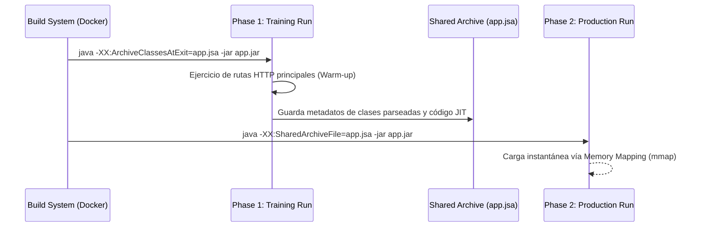

# Módulo 1 - Lección 2: Project Leyden, Class Data Sharing (CDS) & GraalVM AOT

---

## 1. 🐣 Ancla Mental Feynman & Analogía Isomórfica

### El Modelo Intuitivo: Project Leyden, Class Data Sharing (CDS) & GraalVM AOT
Para comprender **Project Leyden, Class Data Sharing (CDS) & GraalVM AOT** sin caer en la trampa de la jerga técnica, debemos anclar el concepto en un problema físico observable:
* Todo sistema en computación resuelve un dilema fundamental: cómo organizar recursos limitados (tiempo de cálculo, espacio de memoria, ancho de banda o energía) para que el trabajo se realice sin bloqueos ni errores.
* En **Project Leyden, Class Data Sharing (CDS) & GraalVM AOT**, la clave reside en eliminar pasos redundantes y asegurar que cada componente conozca únicamente la información mínima indispensable para cumplir su función, tal como una línea de montaje bien coordinada donde nadie tiene que adivinar qué hizo el compañero anterior.

---


## 1. El Desafío del Cold-Start en Cloud Run

Al desplegar microservicios serverless en **Google Cloud Run** con escalado a cero, el tiempo de arranque en frío (*cold-start*) de la JVM tradicional puede demorar entre 3 y 8 segundos. Con **Project Leyden (CDS)** logramos arranques en **< 100ms**.

```mermaid
gantt
    title Comparativa de Cold-Start en Cloud Run
    dateFormat  s
    axisFormat %S s

    section JVM Tradicional
    Carga Clases & Parsing (2.5s) :a1, 0, 2.5s
    JIT Compilation (2.0s)       :a2, 2.5, 4.5s
    Spring Context Init (1.5s)   :a3, 4.5, 6.0s

    section Leyden CDS (.jsa)
    Memory-Mapped Archive (0.05s):b1, 0, 0.05s
    Fast Spring Init (0.05s)     :b2, 0.05, 0.10s
```



---

## 2. Entrenamiento y Generación de Archivos CDS (`.jsa`)

Project Leyden permite "entrenar" la JVM ejecutando la aplicación en una fase de calentamiento para guardar el estado compilado de las clases en un archivo de archivo compartido (`app.jsa`).



---

## 3. Script Automatizado de Entrenamiento Leyden (`leyden-cds-trainer`)

```bash
#!/usr/bin/env bash
set -euo pipefail

APP_JAR="target/corp-spring-boot-starter-1.0.0.jar"
JSA_FILE="app.jsa"

echo "=== 1. Compilando aplicación ==="
mvn clean package -DskipTests

echo "=== 2. Ejecutando fase de entrenamiento Leyden ==="
java -Dspring.context.exit=onRefresh \
     -XX:ArchiveClassesAtExit=${JSA_FILE} \
     -jar ${APP_JAR}

echo "=== 3. Archivo JSA generado con éxito ==="
ls -lh ${JSA_FILE}
```

---

## 4. GraalVM Native Image vs Leyden CDS

| Característica | GraalVM Native Image | Project Leyden CDS |
| :--- | :--- | :--- |
| **Tiempo de Inicio** | < 20 ms | < 100 ms |
| **Consumo RAM Base** | Muy bajo (~30MB) | Bajo (~80MB) |
| **Throughput Pico (JIT)** | Medio-Alto | Máximo (HotSpot JIT C2) |
| **Complejidad de Build** | Alta (Configuración de reflexión) | Muy Baja (Transparente) |
| **Compatibilidad Spring Boot 4** | Alta (con Spring Native) | 100% Nativa |


---

## 5. 🎯 Desafío Feynman & Auto-Evaluación sin Jerga

> [!NOTE]
> **El Reto de los 12 Años**: Explica el mecanismo esencial y la utilidad práctica de **Project Leyden, Class Data Sharing (CDS) & GraalVM AOT** a un estudiante de secundaria, **sin usar las palabras:** "Project", "Leyden,", "Class" ni tecnicismos complejos de memoria.

### Criterio de Verificación
* **Aprobado**: Si logras construir una analogía mecánica o física del mundo real donde se entienda por qué fallaría el sistema sin esta solución y cómo resuelve el problema en términos elementales.
* **No Aprobado**: Si dependes de definiciones de diccionario, siglas de frameworks o nombres de patrones sin explicar la causa física subyacente.


---
## 🧠 Ejercicio Práctico: El Método Feynman

Para garantizar una asimilación profunda de los conceptos presentados en este módulo, aplica el **Método Feynman**:

> **Instrucción:** Explica los conceptos centrales de este módulo como si tu audiencia fuera un estudiante brillante de 12 años que no ha visto nunca este tema. Si no puedes hacerlo con lenguaje sencillo, analogías claras y sin jerga técnica, significa que aún no lo entiendes lo suficientemente bien.

*Inténtalo tú mismo:* Toma el concepto más complejo de este módulo, escríbelo en un papel en blanco y redáctalo usando únicamente términos cotidianos.
