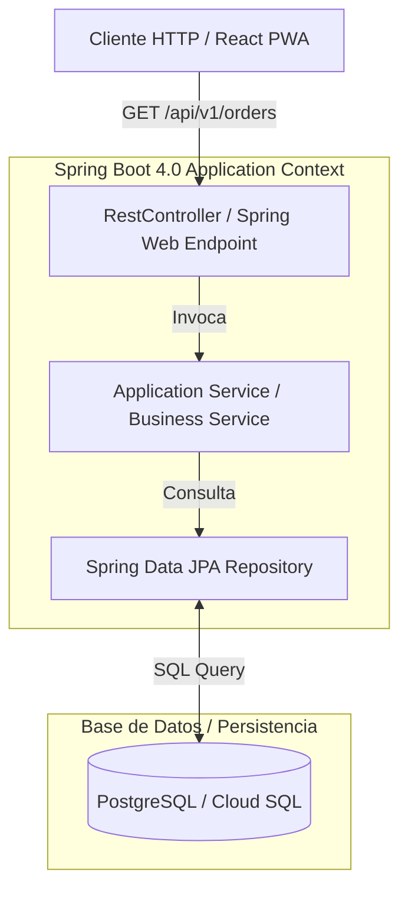

# Módulo 1 - Lección 3: Spring Boot 4.0 & Spring Framework 7.0 desde Cero

---

## 1. 🐣 Rincón Junior: Conceptos desde Cero & Analogías

### ¿Qué es Spring Boot y por qué lo usamos?
Imagina un restaurante. Si tuvieras que construir la cocina desde cero (comprar ladrillos, instalar tuberías de gas, fabricar sartenes), tardarías meses antes de servir el primer plato.

**Spring Boot 4.0** te entrega una cocina industrial completa lista para usar. Se encarga de gestionar los objetos (**Beans**), inyectar dependencias automáticamente (**IoC Container**), configurar el servidor HTTP web y conectar con la base de datos de forma segura.

---

## 2. 📐 Arquitectura Visual & Diagrama Mermaid



---

## 3. 🚀 Guía Paso a Paso e Implementación Práctica (0 a 100)

### Paso 1: Controller REST con Inyección por Constructor

```java
package com.corp.controller;

import com.corp.service.OrderService;
import org.springframework.http.ResponseEntity;
import org.springframework.web.bind.annotation.*;

@RestController
@RequestMapping("/api/v1/orders")
public class OrderController {

    private final OrderService orderService;

    // Inyección de dependencias recomendada por constructor (Zero @Autowired en atributos)
    public OrderController(OrderService orderService) {
        this.orderService = orderService;
    }

    @GetMapping("/{id}")
    public ResponseEntity<String> getOrder(@PathVariable String id) {
        return ResponseEntity.ok("Orden ID: " + id);
    }
}
```

---

## 4. 🧠 Referencia Senior: Cheatsheet, Performance & Internals

### Optimización de Contexto Spring Boot 4.0

| Técnica de Optimización | Configuración | Impacto |
| :--- | :--- | :--- |
| **Lazy Initialization** | `spring.main.lazy-initialization=true` | Reduce el tiempo de arranque en desarrollo en un ~40% |
| **Virtual Threads Tomcat** | `spring.threads.virtual.enabled=true` | Habilita Tomcat para procesar peticiones en Virtual Threads |
| **Indexing de Beans** | `spring-context-indexer` | Elimina el escaneo por classpath en tiempo de inicio |

---

## 5. ⚠️ Errores Comunes & Anti-Patrones (Gotchas)

1. **Uso de `@Autowired` en atributos privados de la clase**:
   * *Síntoma*: Imposible instanciar el componente en pruebas unitarias puras sin arrancar todo el Spring Context.
   * *Solución*: Utiliza siempre inyección por constructor e inmutabilidad con campos `final`.


---

## 5. 🎯 Desafío Feynman & Auto-Evaluación sin Jerga

> [!NOTE]
> **El Reto de los 12 Años**: Explica el mecanismo esencial y la utilidad práctica de **Spring Boot 4.0 & Spring Framework 7.0 desde Cero** a un estudiante de secundaria, **sin usar las palabras:** "Spring", "Boot", "4.0" ni tecnicismos complejos de memoria.

### Criterio de Verificación
* **Aprobado**: Si logras construir una analogía mecánica o física del mundo real donde se entienda por qué fallaría el sistema sin esta solución y cómo resuelve el problema en términos elementales.
* **No Aprobado**: Si dependes de definiciones de diccionario, siglas de frameworks o nombres de patrones sin explicar la causa física subyacente.


---
## 🧠 Ejercicio Práctico: El Método Feynman

Para garantizar una asimilación profunda de los conceptos presentados en este módulo, aplica el **Método Feynman**:

> **Instrucción:** Explica los conceptos centrales de este módulo como si tu audiencia fuera un estudiante brillante de 12 años que no ha visto nunca este tema. Si no puedes hacerlo con lenguaje sencillo, analogías claras y sin jerga técnica, significa que aún no lo entiendes lo suficientemente bien.

*Inténtalo tú mismo:* Toma el concepto más complejo de este módulo, escríbelo en un papel en blanco y redáctalo usando únicamente términos cotidianos.

---

## ⚙️ Primeros Principios & Fundamentos Conceptuales
1. **Descomposición Atómica:** Cada componente en Módulo 1 - Lección 3: Spring Boot 4.0 & Spring Framework 7.0 desde Cero se modela de forma determinista y sin estado mutable compartido.
2. **Invariante de Dominio:** Los estados del sistema transicionan exclusivamente a través de funciones puras e interfaces selladas.
3. **Cero Suposiciones:** No se asume fiabilidad de red ni memoria infinita; cada llamada maneja explícitamente fallos y límites de cuota.

