# Módulo 1 - Lección 4: Project Leyden, Class Data Sharing (CDS) & GraalVM AOT

---

## 1. 🐣 Rincón Junior: Conceptos desde Cero & Analogías

### ¿Qué es el Cold-Start y por qué es un problema?
Cuando despliegas una aplicación en Google Cloud Run con **escalado a cero**, el servicio apaga todas las instancias si nadie lo usa para ahorrar dinero ($0.00 de coste). 

Sin embargo, cuando entra un nuevo usuario, la JVM normal debe encenderse, buscar miles de archivos `.class`, parsearlos, verificar el bytecode y compilar el código en tiempo de ejecución (JIT). Esto hace que el primer usuario espere **entre 3 y 8 segundos** (**Cold-Start**).

### La Solución: Project Leyden & CDS (`.jsa`)
Project Leyden es como congelar el estado de la cocina ya limpia y preparada. En lugar de parsear todas las clases Spring al encender, guardamos un "fotograma congelado" en un archivo compartido (`app.jsa`). Al iniciar, la JVM simplemente hace una carga en memoria instantánea (**Memory Mapping / mmap**) arrancando en **< 100 milisegundos**.

---

## 2. 📐 Arquitectura Visual & Diagrama Mermaid

```mermaid
gantt
    title Comparativa de Cold-Start en Cloud Run
    dateFormat  s
    axisFormat %S s

    section JVM Tradicional
    Parsing de Clases & Bytecode (2.5s) :a1, 0, 2.5s
    Spring Context Warm-up (2.0s)       :a2, 2.5, 4.5s
    JIT C1/C2 Compilation (1.5s)        :a3, 4.5, 6.0s

    section Project Leyden CDS (.jsa)
    Memory-Mapped Archive mmap (0.04s)  :b1, 0, 0.04s
    Spring Context Fast Load (0.05s)    :b2, 0.04, 0.09s
```



---

## 3. 🚀 Guía Paso a Paso e Implementación Práctica (0 a 100)

### Script de Entrenamiento Leyden (`leyden-cds-trainer.sh`)

```bash
#!/usr/bin/env bash
set -euo pipefail

APP_JAR="target/corp-spring-boot-starter-1.0.0.jar"
JSA_FILE="app.jsa"

echo "=== 1. Compilando aplicación Spring Boot ==="
mvn clean package -DskipTests

echo "=== 2. Generando archivo de entrenamiento CDS ==="
java -Dspring.context.exit=onRefresh \
     -XX:ArchiveClassesAtExit=${JSA_FILE} \
     -jar ${APP_JAR}

echo "=== 3. Archivo JSA generado correctamente ==="
ls -lh ${JSA_FILE}
```

### Ejecución en Producción con CDS
```bash
java -XX:SharedArchiveFile=app.jsa -jar target/corp-spring-boot-starter-1.0.0.jar
```

---

## 4. 🧠 Referencia Senior: Cheatsheet, Performance & Internals

### Benchmarking de Tecnologías AOT / Warm-up

| Estrategia | Cold-Start | Memoria RAM Base | Throughput Max | Complejidad de Build |
| :--- | :--- | :--- | :--- | :--- |
| **JVM Tradicional (HotSpot)** | 4,000 - 8,000 ms | ~250 MB | 100% (JIT C2 Peak) | Nula |
| **Project Leyden CDS (`.jsa`)** | **< 100 ms** | **~90 MB** | **100% (JIT C2 Peak)** | **Muy Baja** |
| **GraalVM Native Image** | **< 20 ms** | **~35 MB** | ~90% (PGO requerido) | Alta (Reflection Config) |

---

## 5. ⚠️ Errores Comunes & Anti-Patrones (Gotchas)

1. **Entrenar el archivo `.jsa` en una versión de JDK diferente a la de producción**:
   * *Síntoma*: La JVM ignora el archivo `.jsa` silenciosamente al arrancar y realiza un cold-start lento normal.
   * *Solución*: La fase de entrenamiento CDS y la ejecución final deben usar exactamente el mismo container base JDK/JRE.
