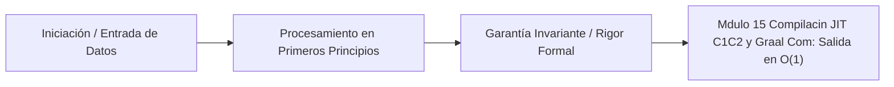

# Módulo 1.5: Compilación JIT, C1/C2 y Graal Compiler (Nivel Principal)

---

## 1. 🐣 Rincón Junior: El Traductor Simultáneo Experto

Recuerdas que la JVM funciona como un "intérprete" que lee Bytecode y lo traduce al vuelo (Interpretación pura). 
El problema de un intérprete puro es que es lento. Si tienes un bucle que se repite 10,000 veces, el intérprete traducirá las mismas líneas de Bytecode 10,000 veces.
El **Compilador JIT (Just-In-Time)** es un traductor simultáneo inteligente. Cuando nota que un trozo de código se ejecuta miles de veces (es un "Hot Spot", un punto caliente), detiene la interpretación, compila ese trozo directamente a código máquina nativo ultrarrápido (Assembly de la CPU), y lo guarda en caché. La próxima vez, ejecutará el código nativo directamente.

---

## 2. 🔬 Fundamentos Computacionales: Representación Intermedia (IR) y Grafos

Para convertir Bytecode a código de máquina súper optimizado, el compilador JIT no lo traduce directamente. Pasa el código por una fase matemática profunda. Convierte el Bytecode en una **Representación Intermedia (IR)** en forma de Grafo (Sea of Nodes).

En el "Sea of Nodes" (Mar de Nodos) inventado por Cliff Click, los nodos representan operaciones (Suma, Lectura, Salto) y las aristas representan el flujo de datos (Data Flow) o el flujo de control (Control Flow). Analizando matemáticamente las aristas de este grafo, el JIT puede demostrar que ciertas variables nunca cambian, que ciertos bucles pueden desenrollarse (Loop Unrolling), o que ciertos bloques `if` nunca se alcanzarán (Dead Code Elimination), borrándolos por completo del código nativo final.

---

## 3. 🚀 Arquitectura Interna: Tiered Compilation

Desde Java 8+, la JVM HotSpot utiliza **Tiered Compilation** (Compilación por Niveles). Existen múltiples motores trabajando en paralelo:

1.  **Nivel 0 (Interpreter)**: Arranca instantáneamente. Velocidad de ejecución lenta. Recopila información sobre *cómo* se está comportando el código (Profiling).
2.  **Niveles 1, 2, 3 (C1 Compiler / Client Compiler)**: Compilación rápida y ligera a código nativo. Añade contadores para seguir analizando el código.
3.  **Nivel 4 (C2 Compiler / Server Compiler)**: El peso pesado. Un compilador C++ monstruoso y lentísimo que aplica las optimizaciones teóricas más brutales conocidas en ciencias de la computación. Solo se activa para métodos extremadamente "calientes" basándose en el profiling del Nivel 0 y C1.

---

## 4. 🧠 Internals de Optimización C2 (Senior)

### Monomorphic vs Megamorphic Dispatch
En POO, el polimorfismo es costoso porque la CPU tiene que buscar en una tabla virtual (vtable) qué método exacto llamar en tiempo de ejecución.
El JIT hace *Profiling*. Si nota que la interfaz `ProcesadorPagos` durante los últimos 10,000 usos *siempre* fue implementada por `StripeProcesador` (Monomorphic), el JIT C2 eliminará la búsqueda virtual y reemplazará la llamada abstracta por un salto directo a la memoria del método de Stripe (Inlining brutal).
Si mañana tu código usa `PaypalProcesador`, la suposición se rompe. El JIT hace **Deoptimization**: tira la basura el código C2 súper rápido, y vuelve a bajar al Nivel 0 (Interprete) perdiendo todo el rendimiento (Performance Cliff) temporalmente.

### Escape Analysis y Scalar Replacement
Esta es la magia oscura más poderosa del C2.
Imagina este código en un bucle:
```java
public void calcular() {
    Punto p = new Punto(10, 20); // Crear objeto en el Heap (Costoso)
    int suma = p.x + p.y;
    // 'p' muere aquí
}
```
El JIT analiza el grafo IR y descubre que el objeto `p` *nunca escapa* del método `calcular()` (no se retorna, ni se pasa a otro hilo).
En lugar de alocar `p` en el Heap lento, el JIT C2 aplica **Scalar Replacement**: descompone el objeto en sus campos básicos (dos enteros, x e y) y los aloja directamente en los **Registros de la CPU** o en el Stack del Hilo local.
**Resultado**: ¡El objeto jamás existió en la memoria RAM! Esto evita gigabytes de presión sobre el Garbage Collector. El código Java de alto nivel se ejecuta a la velocidad de C puro.

---

## 5. ⚡ El Futuro (y Presente): Graal JIT Compiler

El compilador C2 es una base de código C++ antigua, inmensa, y prácticamente in-mantenible (espagueti de punteros C++).
**Graal** es un nuevo compilador JIT **escrito íntegramente en Java**. 

La JVM (escrita en C++) extrae el Bytecode, se lo pasa al compilador Graal (escrito en Java) usando una interfaz C++ (JVMCI), Graal analiza el Sea of Nodes, optimiza, y devuelve el código de máquina nativo ensamblado. Graal aprovecha el Escape Analysis mucho mejor que C2 y aplica optimizaciones de "Partial Evaluation". Es el cerebro subyacente detrás de GraalVM Native Image (AOT).

---

## 6. ⚠️ Runbook de Producción SRE: Code Cache Exhaustion

**Incidente**: La aplicación en Cloud Run se vuelve súbitamente lenta, consumiendo CPU pero el rendimiento (Throughput) cae un 90%. El GC está sano. Los logs muestran: `CodeCache is full. Compiler has been disabled`.

**Causa Raíz**: La **Code Cache** es un área de memoria *nativa* separada del Heap y Metaspace, donde el JIT almacena el código máquina (Assembly) que ya ha compilado (Nivel C1 y C2).
Si tienes una aplicación monolítica inmensa (miles de clases de Spring Boot) y configuras un límite muy bajo, la Code Cache se llena.
Cuando se llena, **la JVM desactiva el compilador JIT (C1 y C2)** de forma irreversible. A partir de ese momento, todo el código Java de tu servidor pasa a ejecutarse mediante el Intérprete (Nivel 0), siendo hasta 100 veces más lento.

**Diagnóstico y Solución SRE**:
1. Monitorizar métricas JMX: `java.lang:type=MemoryPool,name=Code Cache`.
2. Aumentar el límite usando la bandera: `-XX:ReservedCodeCacheSize=256m` (el valor por defecto es ~240MB, suele ser suficiente, pero microservicios gigantes requieren más).
3. Si el OOM persiste, buscar bugs de "Deoptimization loops" donde el código constantemente asume cosas incorrectas (Monomorphic) y obliga al JIT a borrar y recompilar en un bucle infinito, saturando la caché y el compilador de hilos nativos (`C2 CompilerThread`).

---
---

# 🛑 [DEEP-DIVE] Teoría y Práctica Post-Doc / Industry Fellow

Expandimos hacia los límites absolutos de la compilación Just-In-Time y Ahead-Of-Time utilizando GraalVM (Truffle Framework y Partial Evaluation).

## 7. Partial Evaluation y el Graal Compiler (Matemáticas Puras)

La compilación JIT clásica trata el código como un árbol de sintaxis estático a ser traducido. Graal introduce el concepto teórico de la **Partial Evaluation (Evaluación Parcial)** o la **Primera Proyección de Futamura**.

Matemáticamente, si tienes un programa `P` que acepta dos entradas `(estática, dinámica)`, la Evaluación Parcial construye un nuevo programa especializado `P_spec` que ya ha ejecutado todo el cálculo posible asumiendo la entrada `estática` como constante.

Graal hace esto a nivel de Bytecode AST (Abstract Syntax Tree). En el ecosistema Truffle de Graal, tú no escribes un compilador nativo; escribes un Intérprete de AST sencillo en Java. Truffle y Graal usan "Partial Evaluation" para comprimir ese Intérprete + Tu Script = Un ejecutable nativo puro de alto rendimiento (así funciona GraalJS y TruffleRuby).

## 8. El GraalVM Escape Analysis Avanzado (PEA)

C2 tiene un **Escape Analysis (EA)** estándar basado en flujo de bloques. Es muy rígido: si un objeto escapa en una sola rama del `if` (incluso una rama de manejo de errores que se llama 0.001% de las veces), el C2 aborta el *Scalar Replacement* para todo el método.

Graal introduce **Partial Escape Analysis (PEA)**:
```java
public void procesar(boolean error) {
    Calculadora c = new Calculadora();
    int r = c.calcularRapido(); // Graal aplica Scalar Replacement aquí (no asigna memoria)
    
    if (error) {
        // Graal aplica "Materialización Retrasada" (Delayed Materialization).
        // SOLO si entramos en este 'if', Graal crea el objeto físico real en el Heap
        // en este exacto microsegundo, inyectándole el estado interno reconstruido de los registros.
        logger.error("Falló la calculadora: " + c.toString()); 
    }
}
```

Esto permite reducir la presión del Garbage Collection masivamente en arquitecturas Cloud-Native llenas de bloques `try-catch` y loggers dinámicos. 

## 9. PGO (Profile-Guided Optimization) en GraalVM AOT

El gran defecto de compilar todo a nativo antes de ejecutar (Ahead-Of-Time con Spring Boot 3/4 Native Image) es la **Pérdida del Perfilado JIT**.
Un JIT sabe exactamente que un salto condicional es 99% verdadero en *tu* hardware en tiempo real y optimiza las rutas de pipeline de la CPU (Branch Prediction) en consecuencia. GraalVM AOT nativo, al compilar el binario Linux en la pipeline CI/CD, carece de esta información.

**Profile-Guided Optimization (PGO)** es la solución del Post-Doc:
1. **Fase 1 (Instrumentación):** Compilas la Native Image pidiéndole inyectar contadores: `native-image --pgo-instrument`
2. **Fase 2 (Generación de Carga):** Ejecutas el binario Linux y le lanzas tráfico real (ej. Gatling/JMeter). El binario genera un archivo enorme llamado `default.iprof`.
3. **Fase 3 (Compilación Matemática):** Vuelves a compilar en el CI/CD, pero inyectándole los resultados: `native-image --pgo=default.iprof`.

El compilador Graal, en Fase 3, lee el `.iprof` y aplica *Monomorphic Dispatch Inlining* y *Loop Unrolling* matemáticamente perfectos para la carga de trabajo *exacta* que sufrió el binario en Fase 2.
El resultado es un contenedor nativo (Scale-to-Zero, Cold Start < 50ms) que **iguala o supera** la velocidad pico de una JVM clásica que llevara 3 días calentando.


---

## 5. 🎯 Desafío Feynman & Auto-Evaluación sin Jerga

> [!NOTE]
> **El Reto de los 12 Años**: Explica el mecanismo esencial y la utilidad práctica de **Compilación JIT, C1/C2 y Graal Compiler (Nivel Principal)** a un estudiante de secundaria, **sin usar las palabras:** "Compilación", "JIT,", "C1/C2" ni tecnicismos complejos de memoria.

### Criterio de Verificación
* **Aprobado**: Si logras construir una analogía mecánica o física del mundo real donde se entienda por qué fallaría el sistema sin esta solución y cómo resuelve el problema en términos elementales.
* **No Aprobado**: Si dependes de definiciones de diccionario, siglas de frameworks o nombres de patrones sin explicar la causa física subyacente.


---
## 🧠 Ejercicio Práctico: El Método Feynman

Para garantizar una asimilación profunda de los conceptos presentados en este módulo, aplica el **Método Feynman**:

> **Instrucción:** Explica los conceptos centrales de este módulo como si tu audiencia fuera un estudiante brillante de 12 años que no ha visto nunca este tema. Si no puedes hacerlo con lenguaje sencillo, analogías claras y sin jerga técnica, significa que aún no lo entiendes lo suficientemente bien.

*Inténtalo tú mismo:* Toma el concepto más complejo de este módulo, escríbelo en un papel en blanco y redáctalo usando únicamente términos cotidianos.

---



