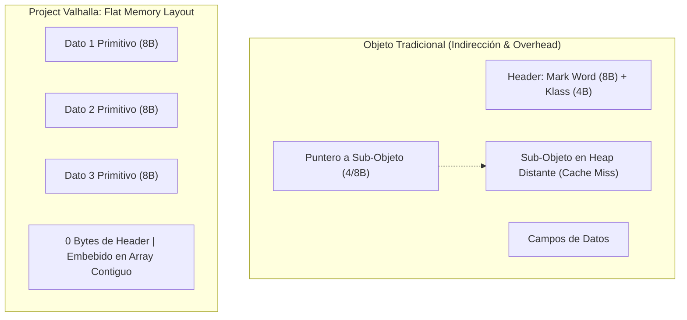
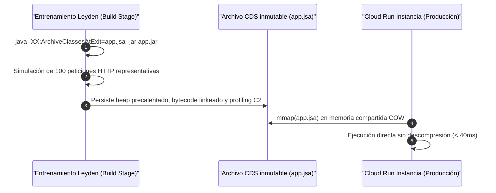

# Cátedra Ph.D.: Project Valhalla, Flat Memory Layout y Precalentamiento AOT Leyden CDS en Java 25

**Facultad**: `FACULTAD_III` - Runtime JVM, Loom & AOT Leyden CDS  
**Referencia Académica**: JEP 401 (Value Classes and Objects), JEP 514/515 (Project Leyden CDS), JEP 444 (Virtual Threads Continuations), Hennessy & Patterson (Computer Architecture: A Quantitative Approach), Ulrich Drepper (What Every Programmer Should Know About Memory, 2007).  
**Instituciones**: OpenJDK / Oracle / ETH Zurich / MIT CSAIL.

---

## 1. El Problema de la Densidad de Memoria y el Puntero en JVM

En arquitecturas x86_64 y ARM64 contemporáneas, una línea de caché L1/L2 es de \(64\text{ bytes}\). Un objeto Java estándar introduce una sobrecarga estructural significativa:
- **Object Header**: \(12 - 16\text{ bytes}\) (`mark word` + `compressed oops klass pointer`).
- **Alineamiento de Memoria**: Múltiplos de \(8\text{ bytes}\).
- **Indirección de Puntero (Pointer Chasing)**: Cada referencia a un objeto requiere cargar un puntero de \(64\text{ bits}\) y desreferenciarlo, provocando fallos de caché L1/L2/L3 y latencias de DRAM (\(\sim 60-100\text{ ns}\)).

---

## 2. Project Valhalla: Value Classes, Flat Layout y Gestión Off-Heap

Project Valhalla (JEP 401) introduce el concepto de **Value Objects** (`value record` / `value class`):
- **Identidad Cero (`Identityless`)**: Los objetos no tienen identidad (`this == that` compara por valor de campo, no por dirección de memoria).
- **Inlining de Memoria y Flat Layout**: Un array `Point[]` se almacena como memoria contigua `[x0, y0, x1, y1, ...]`, adoptando un **flat layout** idéntico a un `struct` en C/C++/Go o Rust, eliminando el 100% de la indirección y permitiendo vectorización SIMD (AVX-512 / ARM Neon).
- **Memoria Off-Heap y Escape Analysis**: El compilador C2 promueve automáticamente estos objetos a registros de la CPU, pila o estructuras **off-heap** mediante Java FFM (Project Panama), con \(0\text{ bytes}\) de recolección de basura (GC).

---

## 3. Virtual Threads, Loom y Mecanismo Interno de Continuations

Los Virtual Threads de Java 25 operan sobre el primitivo de bajo nivel **Continuations**:
- Cuando un hilo virtual encuentra una operación de I/O bloqueante (socket de red, base de datos), la JVM suspende la **continuation** montada en el hilo portador (*Carrier Thread*) y guarda su estado en el heap.
- El carrier thread queda libre inmediatamente para ejecutar otra fibra.
- Para evitar el **Carrier Thread Pinning**, se debe sustituir `synchronized` por `ReentrantLock` y evitar invocaciones JNI en bloques críticos.

---

## 4. Project Leyden: Class Data Sharing (CDS) y Pre-main AOT Training

Para conseguir un arranque en Cloud Run inferior a \(50\text{ ms}\) (*cold-start*), Project Leyden optimiza el ciclo de vida del JVM eliminando el trabajo redundante de carga de clases, resolución de constantes y compilación JIT:

$$\text{ColdStart}_{\text{Leyden}} = T_{\text{mmap}}(\text{app.jsa}) + T_{\text{init}}(\text{premain}) \ll T_{\text{JIT\_Tier1\_Tier4}}$$

---

## 5. Invariantes de Calidad y Six Sigma en la JVM

1. **Cero Bloqueo de Hilo Portador**: Prohibido usar `synchronized` sobre regiones con I/O bloqueante para evitar el *Carrier Thread Pinning* en Loom.
2. **Uso de Value Records Inmutables**: Modelar todas las entidades de cálculo puro como records planos con **flat layout** sin estado mutable.
3. **Validación de Archivo `.jsa` en Pipeline de CI/CD**: Cada release debe verificar que el artefacto `.jsa` esté firmado con Sigstore/Cosign junto al contenedor OCI.
