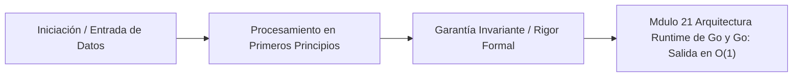

# Módulo 2.1: Arquitectura, Runtime de Go y Goroutines

---

## 1. 🐣 Rincón Junior: El Coste de un Hilo (Thread)

En lenguajes tradicionales como Java (pre-Loom), C++ o Python, cuando creas un "Hilo" (Thread), le estás pidiendo al Sistema Operativo (Linux/Windows) que cree un Hilo Real (OS Thread). 
Cada Hilo del SO es carísimo: ocupa $\sim 1$ Megabyte de memoria RAM solo para empezar, y el procesador tarda milisegundos en cambiar de un hilo a otro (Context Switch) porque tiene que ir al Kernel de Linux a pedir permiso.
Si intentas crear 100,000 hilos en Java 8 para atender a 100,000 usuarios a la vez, tu servidor morirá sin memoria (OOM) en 5 segundos, alcanzando los 100 GB de RAM estática.
**Go (Golang)** resolvió esto inventando las **Goroutines**. Crear una Goroutine cuesta **$2$ Kilobytes**. Puedes arrancar un millón de Goroutines en un portátil normal y ni sudará. No son hilos del sistema operativo, son hilos "virtuales" gestionados por Go.

---

## 2. 🔬 Fundamentos Arquitectónicos: El Planificador M:N

¿Cómo logra Go correr 1,000,000 de Goroutines si mi CPU solo tiene 8 núcleos reales?
Con el **Runtime Scheduler de Go (El Planificador M:N)**.

El Runtime mapea $M$ Goroutines (ligeras) sobre $N$ Hilos del Sistema Operativo (pesados).
Para entender su magia matemática, usa el modelo **GMP**:
1.  **G (Goroutine)**: Tu función ejecutándose con `go hacerCosa()`. Contiene su propia mini-pila (stack) y estado.
2.  **M (Machine / OS Thread)**: El Hilo real de Linux. Go crea exactamente tantos $M$ como núcleos tenga tu CPU (definido por `GOMAXPROCS`). Si tienes 8 núcleos, habrá 8 Máquinas trabajando.
3.  **P (Processor / Contexto)**: El intermediario matemático. Es una cola local de ejecución (Local Run Queue). Cada $M$ necesita agarrar un $P$ para poder ejecutar las $G$ que están dentro de ese $P$.

*El flujo*: Una máquina ($M$) toma un Procesador ($P$), mira su cola de Goroutines ($G$) y ejecuta una. Cuando la Goroutine se bloquea (ej. esperando un archivo del disco o una petición de red HTTP), el hilo real ($M$) NO se duerme. El Runtime *desengancha* la $G$ atascada, la aparca, y la $M$ coge inmediatamente la siguiente $G$ de la cola. Así, la CPU real está siempre al 100% de uso útil.

---

## 3. 🚀 Arquitectura Práctica: Work Stealing (Robo de Trabajo)

¿Qué pasa si el núcleo 1 termina todo su trabajo, pero el núcleo 2 tiene una cola de 500,000 Goroutines atascadas (Imbalance)?
El Planificador de Go implementa el algoritmo de **Work Stealing (Robo de Trabajo)**.

1.  Si el Procesador $P1$ se queda vacío, primero mira si hay Goroutines sueltas en la Cola Global (Global Run Queue).
2.  Si la Cola Global está vacía, el $P1$ matemáticamente asalta al Procesador $P2$.
3.  El $P1$ le **roba exactamente la mitad (50%)** de las Goroutines atascadas en la cola de $P2$, y se las lleva a su propio núcleo para ejecutarlas.
Esta técnica matemática garantiza un balanceo de carga perfecto y dinámico entre todos los núcleos de la CPU sin necesidad de un controlador centralizado (que sería un cuello de botella).

---

## 4. 🧠 Internals Avanzados: Preemption (Go 1.14+)

Antes de Go 1.14, el planificador era "Cooperativo". Si escribías un bucle infinito `for { i++ }` puro de CPU que no llamaba a ninguna función (ni de red, ni de disco, ni llamadas a punteros), esa Goroutine monopolizaba el hilo real ($M$) para siempre. El planificador no podía expulsarla porque la Goroutine "no cooperaba". Esto congelaba servidores.

**Asynchronous Preemption (Apropiación Asíncrona)**:
En Go 1.14+, los ingenieros de Google implementaron un sistema de señales UNIX (`SIGURG`).
Si una Goroutine lleva ejecutándose ininterrumpidamente más de **10 milisegundos**, un hilo secundario del sistema operativo le dispara un rayo matemático (una señal de hardware `SIGURG`). 
El núcleo del procesador interrumpe a la fuerza el bucle infinito, guarda el estado de los registros, empuja la Goroutine egoísta al fondo de la cola Global, y le da el turno a otra Goroutine justa.
Gracias a esto, Go hoy en día es predecible (Low Latency) sin importar lo mal que programen los desarrolladores Junior.

---

## 5. ⚠️ Runbook SRE: GOMAXPROCS y Contenedores Kubernetes

**Incidente**: Despliegas un microservicio Go en Kubernetes. Le asignas un límite rígido de `0.5 CPUs` en el archivo YAML de K8s. De repente, el rendimiento de Go es 10 veces peor que en tu máquina local y el Throttling de Linux se vuelve loco.

**Diagnóstico Arquitectónico**:
Por defecto, la función matemática de Go mira el Hardware Físico, no la cuota de Kubernetes (Cgroups). 
El servidor físico de Amazon/GCP debajo de K8s puede tener 64 núcleos. Go ve 64 núcleos, y decide crear `GOMAXPROCS=64` Hilos del Sistema Operativo ($M$).
Sin embargo, Kubernetes y Linux Cgroups te han limitado a `$0`.5$ núcleos de tiempo de CPU.
Tus 64 hilos reales empezarán a pelearse salvajemente (Context Switching contention) por las migajas de tiempo de procesador que K8s te permite, colapsando el Kernel de Linux.

**Solución SRE Obligatoria**:
1. En entornos Docker/Kubernetes con Go, siempre usar la librería `go.uber.org/automaxprocs`.
2. Esta librería lee mágicamente los Cgroups de Linux al arrancar y fuerza `GOMAXPROCS=1` (o lo que K8s te haya dado matemáticamente), eliminando la contención de hilos y devolviendo el 100% de la velocidad perdida.

---
---

# 🛑 [DEEP-DIVE] Teoría y Práctica Post-Doc / Industry Fellow

Profundicemos en las estructuras de datos y algoritmos de concurrencia exactos codificados en lenguaje ensamblador y C puro dentro de `runtime/proc.go`, el corazón matemático del scheduler.

## 6. Local Run Queue: Lock-Free Ring Buffer

Cada Procesador ($P$) mantiene su "Local Run Queue" de Goroutines. Pero, ¿cómo evita el $P$ los costosos Locks del sistema operativo (`mutex`) cuando otro $P$ viene a ejecutar "Work Stealing" (Robo de trabajo)?

La Local Run Queue no es un array o lista enlazada normal; es un **Ring Buffer (Buffer Circular Lock-Free) de 256 posiciones continuas en memoria**.
El struct en C subyacente se ve simplificado así:

```go
type p struct {
    runqhead uint32
    runqtail uint32
    runq     [256]guintptr // Array circular de 256 punteros a Goroutines
}
```

La genialidad matemática de Google aquí radica en las **Barreras de Memoria (Atomic Load/Store)** (Instrucciones `LOCK CMPXCHG` en Ensamblador x86_64).
- El dueño $P1$ solo inserta y extrae Goroutines desde `runqhead`. Como él es el único dueño, lo hace con Load/Stores atómicos muy rápidos. No hay contención.
- El asaltante $P2$ (el ladrón en Work Stealing) roba desde `runqtail`.
Como el dueño lee del *frente* y el ladrón roba del *final*, casi nunca hay colisión de punteros (salvo que la cola tenga 1 solo elemento).
Para robar exactamente la mitad (hasta 128 $G$s), $P2$ usa la instrucción atómica `Compare-And-Swap (CAS)` para mover `runqtail` 128 bloques en una sola transacción matemática $O(1)$. Si el dueño $P1$ justo sacó una de ahí en ese microsegundo, el CAS falla y el ladrón vuelve a calcular, evitando Locks que detendrían los 8 núcleos del servidor entero.

## 7. El Misterio del Sistema "Handoff" (M Handoff) y Syscalls Lentas

Habíamos dicho que si una Goroutine $G1$ se bloquea esperando a la red (I/O HTTP), el hilo $M1$ simplemente la aparca gracias al Network Poller (`epoll` en Linux). Esto es rápido y eficiente.

Pero, ¿qué pasa si la Goroutine llama a una **Syscall de Linux que no es de red** o ejecuta C-Code vía `CGO`? (Por ejemplo, leer un archivo grande del disco vía CGO).
El hilo real $M1$ del SO queda matemática y físicamente bloqueado por el Kernel de Linux en una "Syscall Síncrona". Ningún `epoll` puede salvarlo.

Si el sistema solo tuviera 8 Hilos de SO ($M$) porque `GOMAXPROCS=8`, y 8 Goroutines ejecutan simultáneamente operaciones pesadas de CGO, los 8 hilos del SO se quedarían bloqueados. Toda la aplicación Go se congelaría irremediablemente. 

**Solución Arquitectónica: The Handoff Mechanism**
Go resuelve esto dinámicamente:
1. El runtime tiene un monitor de background (el Hilo *Sysmon*).
2. Cuando `sysmon` detecta que un hilo $M1$ lleva bloqueado en una Syscall más de 20 microsegundos, el runtime toma la decisión drástica de **Handoff (Traspaso)**.
3. El planificador *desengancha* el Procesador $P1$ de las manos del bloqueado $M1$. $P1$ queda "huérfano".
4. El planificador despierta inmediatamente un nuevo hilo del SO inactivo (o instancia un hilo *nuevo* si no hay ninguno) digamos $M2$.
5. $M2$ adopta a $P1$ y comienza a procesar el resto de Goroutines de su Local Queue sin latencia.
6. Eventualmente, la Syscall de Linux de la Goroutine inicial termina. El viejo hilo $M1$ despierta, intenta devolver el resultado de la Syscall, pero se da cuenta de que ya no tiene a su $P1$. Entonces, $M1$ aparca a la Goroutine finalizada en la Global Run Queue, se pone en estado latente (Sleep), y entra a un pool de hilos de reserva (Thread Cache) para futuros Handoffs, limitando un máximo de 10,000 OS Threads.

La belleza matemática de este proceso radica en que para ti, el programador de microservicios, el código Go se ve totalmente síncrono línea por línea, mientras el Runtime de Go enruta, roba, bloquea y transfiere los Contextos de Procesador ($P$) por debajo del hardware invisiblemente a escala de decenas de microsegundos, simulando un paralelismo puro.


---

## 5. 🎯 Desafío Feynman & Auto-Evaluación sin Jerga

> [!NOTE]
> **El Reto de los 12 Años**: Explica el mecanismo esencial y la utilidad práctica de **Arquitectura, Runtime de Go y Goroutines** a un estudiante de secundaria, **sin usar las palabras:** "Arquitectura,", "Runtime", "de" ni tecnicismos complejos de memoria.

### Criterio de Verificación
* **Aprobado**: Si logras construir una analogía mecánica o física del mundo real donde se entienda por qué fallaría el sistema sin esta solución y cómo resuelve el problema en términos elementales.
* **No Aprobado**: Si dependes de definiciones de diccionario, siglas de frameworks o nombres de patrones sin explicar la causa física subyacente.


---
## 🧠 Ejercicio Práctico: El Método Feynman

Para garantizar una asimilación profunda de los conceptos presentados en este módulo, aplica el **Método Feynman**:

> **Instrucción:** Explica los conceptos centrales de este módulo como si tu audiencia fuera un estudiante brillante de 12 años que no ha visto nunca este tema. Si no puedes hacerlo con lenguaje sencillo, analogías claras y sin jerga técnica, significa que aún no lo entiendes lo suficientemente bien.

*Inténtalo tú mismo:* Toma el concepto más complejo de este módulo, escríbelo en un papel en blanco y redáctalo usando únicamente términos cotidianos.

---



