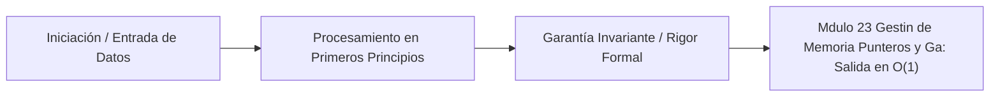

# Módulo 2.3: Gestión de Memoria, Punteros y Garbage Collection (GC) en Go

---

## 1. 🐣 Rincón Junior: ¿Punteros en el Siglo XXI?

Si vienes de Python o Java, estás acostumbrado a que todas las variables (objetos) pasen por referencia mágica y el lenguaje limpie la basura por ti.
Si vienes de C/C++, estás traumatizado por el `malloc()`, el `free()` y los punteros defectuosos (Segfaults) que crashean el sistema.
Go es el híbrido perfecto. Go **sí tiene punteros explícitos** (`*int`, `&usuario`), permitiéndote controlar exactamente qué se pasa a las funciones (una copia pesada de datos, o una dirección ligera de memoria). PERO Go **no permite aritmética de punteros** (no puedes sumarle +4 a un puntero para espiar la variable de al lado como en C). Además, Go tiene un Garbage Collector (GC) moderno, así que nunca tienes que hacer `free()`. Tienes la velocidad de C, con la seguridad de Java.

---

## 2. 🔬 Fundamentos Arquitectónicos: Stack vs Heap

En cualquier ordenador, la memoria se divide en dos zonas de guerra:
1.  **El Stack (La Pila)**: Es extremadamente rápida y barata. Los datos entran ordenados y, cuando la función termina, el compilador los borra gratis (como platos apilados). El GC no tiene que vigilar esta zona.
2.  **El Heap (El Montón)**: Un mar de datos caótico y lento. Cuando pides memoria que tiene que sobrevivir más tiempo que la función que la creó, va al Heap. El recolector de basura (GC) gasta mucha CPU escaneando el Heap buscando objetos huérfanos para borrarlos.

En Java, casi TODOS los objetos (`new Usuario()`) van al Heap (lento, genera presión al GC). En Go, los objetos van por defecto al Stack (ultra rápido).

---

## 3. 🚀 Arquitectura Práctica: Escape Analysis (Análisis de Escape)

¿Cómo sabe Go si meter tu `Usuario` en el Stack rápido o en el Heap lento si tú no se lo dices (como harías en Rust)?
El compilador de Go ejecuta un algoritmo matemático en tiempo de compilación llamado **Escape Analysis**.

El compilador traza las líneas de vida de tu variable:
*   Si creas un `usuario` en la `funcionA()`, se lo pasas a `funcionB()`, ambas terminan, y el usuario nunca se envió fuera de ahí... el compilador lo mete en el Stack. RAM limpia y coste cero.
*   Pero si creas un `usuario`, coges su puntero (`&usuario`), y metes ese puntero en una variable Global, o lo mandas por un Canal (Channel) a otra Goroutine... la variable "Escapó" (Escaped) del alcance vital de su función original. El compilador, para evitar que la otra Goroutine acceda a memoria muerta, mueve matemáticamente la variable al Heap.

**Comando SRE**: Puedes espiar al compilador escribiendo `go build -gcflags="-m"`. El compilador te dirá exactamente qué variables "escaparon al heap" y arruinaron el rendimiento, dándote la oportunidad de refactorizar tu código matemático para evitar fugas.

---

## 4. 🧠 Internals Avanzados: El Tricolor Mark-and-Sweep GC

El Garbage Collector de Go está diseñado con una sola obsesión: **Latencia Ultra-Baja (Sub-milisecond)**. No le importa si usa más CPU general, siempre y cuando NO pause el servidor de Taxis (Stop-The-World) durante medio segundo (algo típico en Java 8 antiguo).

El algoritmo es un **Concurrent Tricolor Mark-and-Sweep**:
Pinta todos los objetos de la memoria en tres colores:
1.  **Blanco**: Basura potencial (Pendiente de escanear).
2.  **Gris**: Objetos vivos que están en la cola de revisión (Tienen punteros que aún no he revisado).
3.  **Negro**: Objetos vivos 100% revisados. No apuntan a ningún objeto blanco.

El recolector de Go corre *en paralelo* (Concurrente) a tus Goroutines.
Mientras tu código sigue calculando viajes, un hilo de Go está pintando la memoria. 
*El Problema*: Como tu código corre a la vez, podrías coger un objeto Negro, y hacer que apunte a un objeto Blanco (arruinando la lógica del algoritmo).
*La Solución*: Go inyecta matemáticamente unas "barreras de escritura" (Write Barriers) en el código ensamblador (Assembly). Si intentas conectar el objeto Negro con el Blanco en tiempo real, el ensamblador interrumpe la CPU por nanosegundos y vuelve el objeto Blanco inmediatamente Gris, garantizando que el GC no lo borre accidentalmente.
Gracias a esta proeza de ingeniería, el GC de Go pausa tu servidor durante **menos de 1 milisegundo**, ideal para Gemelos Digitales de alta frecuencia.

---

## 5. ⚠️ Runbook SRE: Pool de Objetos (GC Thrashing)

**Incidente**: El Microservicio C (un BFF que procesa JSONs gigantes) consume un 40% de CPU. Sin embargo, al hacer un *Profiling* SRE con `pprof`, descubres que tu código de lógica de negocio solo gasta el 5% de la CPU. El 35% de la CPU restante lo está consumiendo un proceso interno llamado `runtime.gcBgMarkWorker`. Tu servidor no está trabajando, está barriendo basura desesperadamente.

**Diagnóstico Arquitectónico**:
El servidor está creando miles de pequeños Arrays (Slices de `[]byte`) para deserializar peticiones JSON web que llegan a 10,000 requests/sec. Estos slices son tan grandes que "Escapan al Heap".
El Garbage Collector no da abasto. Acaba de limpiar 10,000 JSONs, y al segundo siguiente le metes 10,000 JSONs nuevos (GC Thrashing). 

**Solución SRE (Reutilización - sync.Pool)**:
Para optimizar matemáticamente el $O(N)$ de memoria a un $O(1)$ estático:
1.  Importar `sync.Pool`. Es un almacén seguro para reciclar variables.
2.  En lugar de usar `make([]byte, 2048)` para cada petición web nueva, el servidor acude al `sync.Pool` y pide "un Array usado".
3.  Cuando termina de enviar la respuesta HTTP al usuario, en lugar de tirar el Array a la basura para que el GC lo limpie, lo "limpia con ceros" y lo devuelve a la piscina (`pool.Put()`).
4.  La próxima petición coge ese mismo trozo de RAM físico.
5.  Resultado: El uso del Heap cae a Cero. El GC deja de trabajar (CPU baja del 40% al 5%), y el microservicio escala gratis.

---
---

# 🛑 [DEEP-DIVE] Teoría y Práctica Post-Doc / Industry Fellow

El comportamiento del compilador y el recolector de basura de Go no es magia, se basa en demostraciones matemáticas estrictas (Graph Reachability) y manipulación de AST (Abstract Syntax Tree).

## 6. Mathematical Proof: Tricolor Invariant (Invariante Fuerte y Débil)

El problema de recolectar basura de forma concurrente con el código del usuario (Mutator) es la corrupción del grafo de memoria (Dangling Pointers o recolecciones accidentales). 
El algoritmo Tricolor debe mantener matemáticamente unos **Invariantes**.

*   **Invariante Tricolor Fuerte**: Un objeto Negro NUNCA debe contener un puntero a un objeto Blanco. (Si lo hace, el GC asume erróneamente que todo lo que cuelga del Negro está a salvo y no revisará el Blanco, eliminando memoria en uso).
*   **Invariante Tricolor Débil**: Un objeto Negro puede apuntar a un objeto Blanco, *solo si* existe otro objeto Gris que también apunte a ese objeto Blanco (protegiéndolo en la ruta de escaneo).

Go utiliza una variación del **Yuasa Deletion Barrier** y del **Dijkstra Insertion Barrier**. En Go 1.8+, se adoptó una barrera híbrida (**Hybrid Write Barrier**).
La formulación en seudocódigo ensamblador que el compilador inyecta silenciosamente cada vez que escribes `*ptr = obj` es:

```text
// Híbrido de Dijkstra y Yuasa
if writeBarrier.enabled {
    // 1. Marca el objeto antiguo (Yuasa Deletion)
    // Evita que un blanco recién desconectado se pierda si otro gris iba a escanearlo
    shade(*slot) 
    
    // 2. Marca el objeto nuevo (Dijkstra Insertion)
    // Evita conectar un negro a un blanco directamente (Mantiene el Invariante Fuerte)
    shade(ptr)
}
*slot = ptr // Escritura real (Memory Store)
```
Esta barrera matemática garantiza que no haya "Stop The World" durante el re-escaneo final de la pila, bajando la latencia de 10ms a $< 0.1ms$ en Go 1.8+.

## 7. Dump and Trace: Escape Analysis a nivel AST

A diferencia de C (donde tú mandas) y Java (donde el JVM JIT asume y compila en caliente), el Escape Analysis de Go es 100% estático en tiempo de compilación AOT.

Veamos un ejemplo de código SRE:
```go
package main

func createUser() *int {
    x := 42
    return &x
}

func main() {
    ptr := createUser()
    _ = ptr
}
```

Si volcamos el árbol del compilador usando:
`go tool compile -m -m code.go` (El doble `-m` activa verbosidad matemática profunda):

**Dump de salida del Compilador:**
```text
code.go:4:2: x escapes to heap:
code.go:4:2:   flow: ~r0 = &x:
code.go:4:2:     from &x (address-of) at code.go:5:9
code.go:4:2:     from return &x (return) at code.go:5:2
code.go:4:2: moved to heap: x
```

**Análisis SRE del AST**:
1. El compilador crea un nodo de flujo (Flow Graph).
2. Detecta que la dirección de `x` (address-of) fluye hacia el nodo `return` (`~r0`).
3. Como el ámbito de vida (Lifetime scope) del `return` excede al marco de pila de `createUser()`, la propiedad de *Escape* se evalúa como `True`.
4. El compilador muta internamente `x := 42` a `x := new(int)` inyectando una llamada de reserva en el Heap mediante `runtime.newobject()`.

Reglas de oro SRE para anular escapes:
- Pasar valores (structs) por valor (copia de 24-48 bytes) suele ser **más rápido** que pasarlos por puntero (`*Struct`), ya que la copia ocurre en la Cache L1/L2 (nanosegundos), mientras que el puntero fuerza a la variable al Heap, desencadenando un GC Cycle futuro (microsegundos a milisegundos).
- Los Slices cuyo tamaño no se conoce en tiempo de compilación (`make([]byte, sizeVariable)`) escapan incondicionalmente al Heap porque el Stack Pointer requiere offsets fijos matemáticos.

## 8. El Profiler de Memoria (Pprof) y Trace de Barreras

Para auditar el coste real del GC en sistemas Cloud-Native de alta frecuencia (ej. H3 H3-Core Surge Calculator), los ingenieros SRE extraen la traza criptográfica de la ejecución del GC.

Ejecutar el programa exportando las trazas del runtime:
`GODEBUG=gctrace=1 go run server.go`

**Análisis de Trace Dump:**
`gc 1 @0.005s 2%: 0.015+0.28+0.012 ms clock, 0.12+0.16/0.25/0.79+0.098 ms cpu, 4->4->0 MB, 5 MB goal, 8 P`

*   `gc 1`: Ciclo de GC número 1.
*   `@0.005s`: Ocurrió a los 5 milisegundos del arranque.
*   `2%`: El GC ha consumido el 2% del tiempo total de la CPU de la aplicación hasta ahora. (Si esto supera el 10-15%, el programa está Thrashing).
*   `0.015+0.28+0.012 ms clock`: Fases matemáticas de latencia.
    *   `0.015 ms`: Fase STW (Stop The World) de Inicio (Sweep Termination + Mark Setup).
    *   `0.28 ms`: Fase Concurrente (Marca Tricolor + Write Barriers). No pausa tu app.
    *   `0.012 ms`: Fase STW de Fin (Mark Termination).
*   `4->4->0 MB`: Tamaño del Heap al iniciar la recolección -> Tamaño antes de limpiar -> Tamaño de objetos vivos restantes tras limpiar.

El objetivo del Ingeniero SRE es asegurar matemáticamente que las sumas de las latencias STW (`0.015 + 0.012 = 0.027 ms`) permanezcan consistentes $< 1 ms$ independientemente del tamaño del Heap de 50GB.


---

## 5. 🎯 Desafío Feynman & Auto-Evaluación sin Jerga

> [!NOTE]
> **El Reto de los 12 Años**: Explica el mecanismo esencial y la utilidad práctica de **Gestión de Memoria, Punteros y Garbage Collection (GC) en Go** a un estudiante de secundaria, **sin usar las palabras:** "Gestión", "de", "Memoria," ni tecnicismos complejos de memoria.

### Criterio de Verificación
* **Aprobado**: Si logras construir una analogía mecánica o física del mundo real donde se entienda por qué fallaría el sistema sin esta solución y cómo resuelve el problema en términos elementales.
* **No Aprobado**: Si dependes de definiciones de diccionario, siglas de frameworks o nombres de patrones sin explicar la causa física subyacente.


---
## 🧠 Ejercicio Práctico: El Método Feynman

Para garantizar una asimilación profunda de los conceptos presentados en este módulo, aplica el **Método Feynman**:

> **Instrucción:** Explica los conceptos centrales de este módulo como si tu audiencia fuera un estudiante brillante de 12 años que no ha visto nunca este tema. Si no puedes hacerlo con lenguaje sencillo, analogías claras y sin jerga técnica, significa que aún no lo entiendes lo suficientemente bien.

*Inténtalo tú mismo:* Toma el concepto más complejo de este módulo, escríbelo en un papel en blanco y redáctalo usando únicamente términos cotidianos.

---



