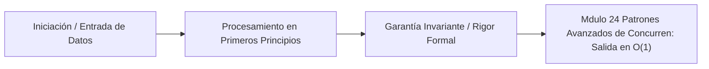

# Módulo 2.4: Patrones Avanzados de Concurrencia (Worker Pools y Context)

---

## 1. 🐣 Rincón Junior: El Paquete Context

Imagina que un usuario de la aplicación entra al Dashboard, y el frontend hace una petición REST a tu servidor Go. 
Tu servidor Go, para construir el Dashboard, tiene que lanzar 3 Goroutines concurrentes: una busca los datos del Taxi en Postgres, otra busca el Clima en una API externa, y otra calcula una tarifa en una red neuronal pesada.
De repente, a los 100 milisegundos de cargar, el usuario cierra el navegador o cambia de página porque se aburrió.
La conexión HTTP se cierra. Pero, **¿qué pasa con tus 3 Goroutines?** Siguen en el servidor, gastando CPU, consultando a Postgres, e invocando redes neuronales costosas, para finalmente tirar los resultados a la basura porque el usuario original ya no está.
El **Paquete Context (`context.Context`)** fue inventado por Google para solucionar la propagación de cancelaciones matemáticas en cascada (Cascade Cancellation).

---

## 2. 🔬 Fundamentos Arquitectónicos: Propagación de Contextos

Un `Context` en Go es un objeto inmutable que se pasa **como primer parámetro obligatorio** en cualquier función que haga I/O (Base de Datos, Red, Procesamiento Pesado). 
`func CalcularTarifa(ctx context.Context, ruta Viaje) (float64, error)`

1.  **Cancelación Top-Down (Descendente)**: Cuando el servidor HTTP detecta que el usuario cerró el TCP/IP del navegador, ejecuta automáticamente un método `cancel()`.
2.  Ese contexto especial está enlazado a todas tus Goroutines.
3.  Al instante, todas las librerías serias de Go (el Driver de Postgres `pgx`, el cliente HTTP `net/http`) comprueban continuamente un canal interno: `case <-ctx.Done():`.
4.  Como el padre canceló, el canal `Done()` se dispara en las 3 Goroutines a la vez en nanosegundos. La query de Postgres se interrumpe físicamente, la API del Clima se aborta, y el servidor salva inmediatamente su CPU y dinero.

**Regla de Oro Arquitectónica**: El `Context` nunca se mete dentro de un Struct (Modelo). Siempre es el primer parámetro de la función (explícito, visible y fácil de trazar matemáticamente).

---

## 3. 🚀 Arquitectura Práctica: Patrón Worker Pool (Bolsa de Trabajo)

Lanzar 1 Goroutine por cada tarea es barato en Go. Pero, ¿qué pasa si el usuario sube un CSV con 5 Millones de registros y tú lanzas 5,000,000 de Goroutines para insertar a la base de datos simultáneamente?
Tu servidor Go vivirá, pero tu pobre base de datos PostgreSQL morirá sepultada por 5 millones de conexiones activas instantáneas (Connection Pool Exhaustion).

**El Patrón Worker Pool**:
Se basa en la Teoría de Colas matemática para proteger a los actores Driven (Base de Datos).
1.  Creamos un Canal Búferizado que actúa como "Bandeja de Tareas": `jobs := make(chan int, 5000000)`.
2.  Creamos un grupo estrictamente limitado de "Obreros" (Workers). Por ejemplo, 50 Goroutines inmortales (un simple `for` infinito que lee del canal `jobs`).
3.  Un solo despachador mete los 5 millones de IDs en el canal gigante.
4.  Los 50 Obreros van cogiendo tareas del tubo una a una. **Jamás habrá más de 50 peticiones simultáneas golpeando la base de datos**.
Has aplanado la curva geométrica del tráfico, logrando procesamiento de flujo masivo (Streaming) sin tirar abajo la infraestructura corporativa.

---

## 4. 🧠 Internals Avanzados: Fan-Out / Fan-In Pipelines

Para cálculos masivos (ej. Gemelos Digitales paralelos), usamos tuberías matemáticas tipo UNIX (Pipelines).

*   **Fan-Out (Dispersión)**: Tienes un canal con miles de fotos a procesar. En lugar de una goroutine lenta, inicias 20 Goroutines idénticas (Filtro Instagram). Todas compiten matemáticamente leyendo del MISMO canal central. Automáticamente se auto-balancean.
*   **Fan-In (Agrupación/Multiplexación)**: Esas 20 Goroutines generan resultados y los escriben cada una en 20 canales de salida diferentes. 
    Usas una Goroutine especial (Multiplexor) que usa una instrucción matemática poderosa, `sync.WaitGroup`, unida a una instrucción `select` (o simplemente pasando un solo canal de salida compartido a todos los workers).
    Los resultados dispares de 20 núcleos de CPU paralelos se unifican atómicamente en un solo canal ordenado para guardarse en la Base de Datos.

---

## 5. ⚠️ Runbook SRE: Shadowing the Loop Variable (Fallo Histórico)

**Incidente**: Estás mandando 10 emails urgentes en un bucle `for`, usando Goroutines paralelas para que vayan más rápido.
Cuando revisas los envíos, te das cuenta de que al **último usuario** de la lista (ej. "Zack") le han llegado 10 correos idénticos, y a los 9 usuarios anteriores no les ha llegado nada.

**Diagnóstico SRE (The Loop Variable Capture - Go < 1.22)**:
```go
nombres := []string{"Ana", "Juan", ..., "Zack"}
for _, nombre := range nombres {
    go func() {
        enviarEmail(nombre) // ¡PELIGRO MORTAL!
    }()
}
```
En arquitecturas Go antiguas (versiones anteriores a 1.22), la variable `nombre` era **una sola dirección de memoria física** en el Stack que se iba sobrescribiendo en cada iteración del bucle.
Las Goroutines tardan microsegundos en arrancar. Para cuando el Sistema Operativo (Planificador $M:N$) arranca las 10 Goroutines, el bucle rápido (for) ya ha terminado y la variable `nombre` se quedó atascada en su último valor físico ("Zack"). Las 10 Goroutines leen la misma dirección RAM y todas envían el email a "Zack".

**Solución SRE/Arquitectónica**:
1.  **Paso Parámetro Seguro**: `go func(n string) { enviarEmail(n) }(nombre)`. (Pasar la variable por valor en el momento exacto, forzando una copia en la RAM).
2.  **Nota de Arquitectura**: Este bug matemático ha costado millones de dólares a la industria Cloud. Fue finalmente **eliminado en Go 1.22** (Febrero 2024), donde el compilador semánticamente recrea variables nuevas en cada iteración del bucle, mitigando este fallo para siempre a nivel de lenguaje.

---
---

# 🛑 [DEEP-DIVE] Teoría y Práctica Post-Doc / Industry Fellow

Los canales (Channels) de Go son geniales por su ergonomía, pero a nivel de latencia pura, introducen un overhead (nanosegundos por el mutex interno) que es inaceptable en simulaciones de HFT (High-Frequency Trading) o motores físicos (Game Engines). Aquí es donde entra la programación Lock-Free en Go puro.

## 6. Generadores Lock-Free Matemáticos

Un generador en Go (usando Canales) se ve así: `func Generador() <-chan int`.
El canal sufre del mutex overhead. En sistemas SRE críticos (ej. generación de Sequencias de IDs Snowden-proof distribuidas o contadores de ruteo H3), usamos generadores basados puramente en CAS (Compare-And-Swap) vía `sync/atomic`.

```go
import "sync/atomic"

// Sequencer Lock-Free O(1) puro
type AtomicCounter struct {
    val atomic.Uint64
}

// Next no tiene locks, no bloquea al OS Thread y es seguro en concurrencia masiva
func (c *AtomicCounter) Next() uint64 {
    return c.val.Add(1)
}
```

**Análisis Ensamblador (x86_64)**:
El método `Add()` de `atomic.Uint64` no llama a una función del runtime de Go, sino que el compilador lo reemplaza *inline* (Intrinsic Compiler Substitution) por una instrucción nativa de CPU `LOCK XADDQ`. Esta instrucción congela la línea de caché (Cache Line) del núcleo L1 local durante $\sim 5$ nanosegundos (en lugar de los `$50`-100$ ns de un mutex de canal).

## 7. Lock-Free Queues en Go (El Algoritmo de Michael-Scott)

Cuando necesitas pasar datos (mensajes, órdenes de compra) entre Goroutines sin Locks y más rápido que un `chan` nativo, la industria implementa estructuras Lock-Free.

El patrón más robusto es la **Cola Concurrente Lock-Free de Michael y Scott** (1996), implementada usando `atomic.Pointer`.

1. La cola mantiene punteros `Head` y `Tail`.
2. Las operaciones de *Enqueue* (Encolar) usan una técnica de actualización atómica en 2 pasos:
   - Se intenta enlazar el nuevo nodo al final de la cola (CAS en el puntero `next` del Tail viejo).
   - Se actualiza atómicamente el puntero global `Tail` al nuevo nodo.

```go
type node struct {
    value any
    next  atomic.Pointer[node]
}

type LockFreeQueue struct {
    head atomic.Pointer[node]
    tail atomic.Pointer[node]
}

func (q *LockFreeQueue) Enqueue(val any) {
    n := &node{value: val}
    for {
        t := q.tail.Load()
        next := t.next.Load()
        
        // Verificamos si Tail sigue siendo válido matemáticamente
        if t == q.tail.Load() {
            if next == nil {
                // El final de la cola está limpio, intentamos el CAS
                if t.next.CompareAndSwap(next, n) {
                    // Éxito. Mover el Tail (fase 2)
                    q.tail.CompareAndSwap(t, n)
                    return
                }
            } else {
                // Alguien se coló. Ayudamos a mover el Tail por él y reintentamos
                q.tail.CompareAndSwap(t, next)
            }
        }
    }
}
```

**Ventaja SRE**: Este bucle `for` (Spin Lock semántico con CAS) nunca cede el hilo real del OS (nunca llama a la Syscall del kernel). Garantiza matemáticamente la propiedad del "Progreso Global" (Global Progress): incluso si una Goroutine es interrumpida (preempted) por el scheduler en medio de la operación, el resto de Goroutines pueden arreglar su trabajo sucio (fase de ayuda) y seguir avanzando. En un canal normal o un Mutex, si el dueño del lock muere o se congela, todo el sistema entra en un Deadlock estático masivo.

## 8. False Sharing en Arrays Atómicos (Cache Line Ping-Pong)

Al optimizar, a veces los Seniors crean Arrays de contadores atómicos (uno por cada núcleo/worker).
```go
type Contador struct { val uint64 } // 8 bytes
var stats [64]Contador
```
El hardware lee la memoria RAM en bloques fijos de 64 Bytes (L1 Cache Lines).
Si el Thread 1 actualiza `stats[0]` (8 bytes) y el Thread 2 actualiza `stats[1]` (los siguientes 8 bytes), **ambos caen dentro de la misma línea de caché de 64 bytes**.
La CPU invalidará salvajemente la Caché L1 del otro núcleo en cada ciclo de reloj. Esto se llama **False Sharing**. Go no tiene una anotación `@Contended` nativa como Java 25.

**Solución Matemática (Padding)**:
```go
type Contador struct {
    val uint64
    _   [56]byte // Padding (Relleno) de 56 bytes de basura
} 
// 8 + 56 = 64 bytes exactos.
// stats[0] y stats[1] ahora viven matemáticamente en líneas de caché L1 distintas.
```
Inyectar estructuras de relleno (Padding arrays) es mandatorio en código crítico (Zero-Allocation HFT) para aislar contadores atómicos inter-núcleo y preservar la latencia $< 10$ ns por operación.


---

## 5. 🎯 Desafío Feynman & Auto-Evaluación sin Jerga

> [!NOTE]
> **El Reto de los 12 Años**: Explica el mecanismo esencial y la utilidad práctica de **Patrones Avanzados de Concurrencia (Worker Pools y Context)** a un estudiante de secundaria, **sin usar las palabras:** "Patrones", "Avanzados", "de" ni tecnicismos complejos de memoria.

### Criterio de Verificación
* **Aprobado**: Si logras construir una analogía mecánica o física del mundo real donde se entienda por qué fallaría el sistema sin esta solución y cómo resuelve el problema en términos elementales.
* **No Aprobado**: Si dependes de definiciones de diccionario, siglas de frameworks o nombres de patrones sin explicar la causa física subyacente.


---
## 🧠 Ejercicio Práctico: El Método Feynman

Para garantizar una asimilación profunda de los conceptos presentados en este módulo, aplica el **Método Feynman**:

> **Instrucción:** Explica los conceptos centrales de este módulo como si tu audiencia fuera un estudiante brillante de 12 años que no ha visto nunca este tema. Si no puedes hacerlo con lenguaje sencillo, analogías claras y sin jerga técnica, significa que aún no lo entiendes lo suficientemente bien.

*Inténtalo tú mismo:* Toma el concepto más complejo de este módulo, escríbelo en un papel en blanco y redáctalo usando únicamente términos cotidianos.

---



