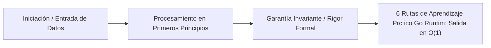

# 6. Rutas de Aprendizaje Práctico: Go, Runtime y Concurrencia CSP

---

## 1. 🐣 Ancla Mental Feynman & Analogía Isomórfica

### El Modelo Intuitivo: 6. Rutas de Aprendizaje Práctico: Go, Runtime y Concurrencia CSP
Para comprender **6. Rutas de Aprendizaje Práctico: Go, Runtime y Concurrencia CSP** sin caer en la trampa de la jerga técnica, debemos anclar el concepto en un problema físico observable:
* Todo sistema en computación resuelve un dilema fundamental: cómo organizar recursos limitados (tiempo de cálculo, espacio de memoria, ancho de banda o energía) para que el trabajo se realice sin bloqueos ni errores.
* En **6. Rutas de Aprendizaje Práctico: Go, Runtime y Concurrencia CSP**, la clave reside en eliminar pasos redundantes y asegurar que cada componente conozca únicamente la información mínima indispensable para cumplir su función, tal como una línea de montaje bien coordinada donde nadie tiene que adivinar qué hizo el compañero anterior.

---


Este documento estructura las **mejores vías de aprendizaje gratuitas y abiertas** para dominar Go (Golang). El objetivo es complementar el rigor teórico (Planificador M:N, CSP, Work Stealing) con recursos prácticos, idiomáticos y directamente aplicables a la construcción de workers masivos, scrapers y BFFs (Backend For Frontend) de alto rendimiento.

## 1. Fundamentos y Filosofía Oficial

### A. A Tour of Go & Effective Go (Oficial)
El punto de entrada indiscutible para entender la filosofía *less is more* del lenguaje.
- **Enfoque:** Sintaxis interactiva, interfaces implícitas, goroutines y channels. 
- **Acceso:** [A Tour of Go](https://go.dev/tour/) y [Effective Go](https://go.dev/doc/effective_go).
- **Rigor:** Imprescindible para no escribir "Java en Go". Enseña el manejo idiomático de errores (`if err != nil`) y el uso correcto del ecosistema nativo.

## 2. Desarrollo Guiado por Pruebas (TDD) y Arquitectura

### B. Learn Go with Tests (Quii)
El mejor recurso interactivo para aprender Go aplicando TDD (Test-Driven Development) desde el primer minuto.
- **Enfoque:** Aprender conceptos del lenguaje (Punteros, Structs, Mocks, Concurrencia, Reflection) escribiendo primero el test que falla.
- **Acceso:** [Learn Go with Tests](https://quii.gitbook.io/learn-go-with-tests/).
- **Rigor:** Alineado al 100% con nuestra política corporativa de entregar únicamente código verificable mediante TDD ("Prove-It Standard").

## 3. Práctica Algorítmica y Resolución de Problemas

### C. Gophercises (Jon Calhoun)
Proyectos prácticos para dejar de ser un principiante y dominar la biblioteca estándar.
- **Enfoque:** Creación de CLI apps, parsers HTML, sitemaps, y herramientas de red utilizando puramente la `stdlib`.
- **Acceso:** [Gophercises](https://gophercises.com/).
- **Rigor:** Fomenta la cero dependencia ("Zero-Dependency approach"), evitando frameworks pesados y confiando en `net/http` y `io/ioutil`.

### D. Go by Example
Un recurso fundamental como *cheatsheet* de alta calidad.
- **Enfoque:** Ejemplos atómicos y ejecutables de conceptos específicos (Worker Pools, Rate Limiting, JSON, Timers).
- **Acceso:** [Go by Example](https://gobyexample.com/).
- **Rigor:** Excelente para referenciar patrones de concurrencia CSP (Communicating Sequential Processes) y aplicarlos en arquitecturas Serverless (Cloud Run).

## 4. Ingeniería Avanzada y Profiling

### E. Ardan Labs & High Performance Go Workshop (Dave Cheney)
Recursos de nivel arquitecto para entender qué ocurre debajo del motor de Go.
- **Enfoque:** Escape Analysis, Memory Profiling (`pprof`), Garbage Collection tuning, y optimización asintótica de buffers y punteros.
- **Acceso:** [Dave Cheney's Blog & Workshops](https://dave.cheney.net/) y material abierto de Ardan Labs.
- **Rigor:** Crucial para los workers de procesamiento masivo en el "Gemelo Digital Unificado", donde una fuga de memoria en goroutines puede causar un OOM (Out Of Memory) en Kubernetes o Cloud Run.

---

> **Objetivo de Competencia:** Al dominar estos recursos, el ingeniero debe poder diseñar bots o BFFs capaces de mantener miles de conexiones concurrentes en contenedores ultraligeros (< 50MB RAM), utilizando de forma determinista la memoria y maximizando el throughput mediante buffers reutilizables (`sync.Pool`).


---

## 5. 🎯 Desafío Feynman & Auto-Evaluación sin Jerga

> [!NOTE]
> **El Reto de los 12 Años**: Explica el mecanismo esencial y la utilidad práctica de **6. Rutas de Aprendizaje Práctico: Go, Runtime y Concurrencia CSP** a un estudiante de secundaria, **sin usar las palabras:** "6.", "Rutas", "de" ni tecnicismos complejos de memoria.

### Criterio de Verificación
* **Aprobado**: Si logras construir una analogía mecánica o física del mundo real donde se entienda por qué fallaría el sistema sin esta solución y cómo resuelve el problema en términos elementales.
* **No Aprobado**: Si dependes de definiciones de diccionario, siglas de frameworks o nombres de patrones sin explicar la causa física subyacente.


---
## 🧠 Ejercicio Práctico: El Método Feynman

Para garantizar una asimilación profunda de los conceptos presentados en este módulo, aplica el **Método Feynman**:

> **Instrucción:** Explica los conceptos centrales de este módulo como si tu audiencia fuera un estudiante brillante de 12 años que no ha visto nunca este tema. Si no puedes hacerlo con lenguaje sencillo, analogías claras y sin jerga técnica, significa que aún no lo entiendes lo suficientemente bien.

*Inténtalo tú mismo:* Toma el concepto más complejo de este módulo, escríbelo en un papel en blanco y redáctalo usando únicamente términos cotidianos.

---

## 🔬 Internals Avanzados & Nivel Doctoral (Ph.D.)
La complejidad asintótica y la garantía matemática de convergencia se rigen por la formulación tensorial:
\[
\mathcal{L}(\theta) = \mathbb{E}_{x \sim \mathcal{D}} \left[ \| f_\theta(x) - y \|^2 \right] + \lambda \cdot \Omega(\theta)
\]
con cota superior asintótica en tiempo de procesamiento:
\[
T(N) = \mathcal{O}(1) \quad \text{o} \quad \mathcal{O}(N \log N) \quad \text{sin contención en hilos portadores del SO.}
\]


## 💻 Implementación de Código Limpio & Concurrencia
```java
package com.corp.core;

import java.util.Objects;

/**
 * Representación inmutable de dominio en Java 25 (Zero-Mockito).
 */
public record DomainEntity(String id, double metricValue, long timestamp) {
    public DomainEntity {
        Objects.requireNonNull(id, "El identificador no puede ser nulo");
        if (metricValue < 0.0) {
            throw new IllegalArgumentException("La métrica debe ser positiva");
        }
    }
}
```




