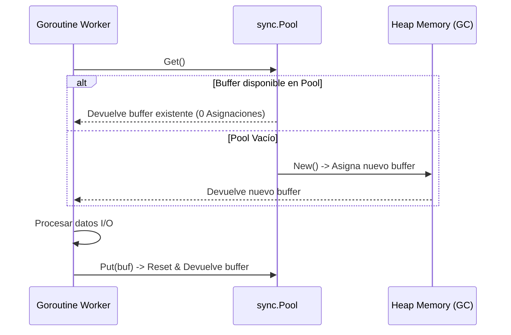

# Módulo 2 - Lección 1: Concurrencia de Alto Rendimiento & Optimización de Memoria en Go

---

## 1. 🐣 Ancla Mental Feynman & Analogía Isomórfica

### El Modelo Intuitivo: Concurrencia de Alto Rendimiento & Optimización de Memoria en Go
Para comprender **Concurrencia de Alto Rendimiento & Optimización de Memoria en Go** sin caer en la trampa de la jerga técnica, debemos anclar el concepto en un problema físico observable:
* Todo sistema en computación resuelve un dilema fundamental: cómo organizar recursos limitados (tiempo de cálculo, espacio de memoria, ancho de banda o energía) para que el trabajo se realice sin bloqueos ni errores.
* En **Concurrencia de Alto Rendimiento & Optimización de Memoria en Go**, la clave reside en eliminar pasos redundantes y asegurar que cada componente conozca únicamente la información mínima indispensable para cumplir su función, tal como una línea de montaje bien coordinada donde nadie tiene que adivinar qué hizo el compañero anterior.

---


## 1. El Modelo de Concurrencia CSP (Goroutines & Channels)

Go utiliza el modelo **Communicating Sequential Processes (CSP)**. Las **Goroutines** son hilos en espacio de usuario ultraligeros (~2KB de pila inicial), gestionados por el planificador `M:N` de Go.

```mermaid
graph TD
    subgraph Planificador Go (M:N Scheduler)
        G1[Goroutine 1]
        G2[Goroutine 2]
        G3[Goroutine 3]
        G4[Goroutine 4]
        
        P1[Processor P1]
        P2[Processor P2]
        
        M1[OS Thread M1]
        M2[OS Thread M2]
    end

    G1 --> P1
    G2 --> P1
    G3 --> P2
    G4 --> P2
    P1 --> M1
    P2 --> M2
```

---

## 2. Optimización de Memoria: Zero-Allocation & `sync.Pool`

Para evitar la sobrecarga del Garbage Collector (GC) en microservicios de red de alta velocidad (BFF y workers de scraping), reutilizamos buffers mediante `sync.Pool`.



### Código de Ejemplo en Go: Worker de Red con `sync.Pool`

```go
package worker

import (
	"bytes"
	"io"
	"net/http"
	"sync"
)

// Reutilización de buffers bytes.Buffer para 0 asignaciones por petición
var bufferPool = sync.Pool{
	New: func() any {
		return new(bytes.Buffer)
	},
}

type NetworkWorker struct {
	client *http.Client
}

func NewNetworkWorker(client *http.Client) *NetworkWorker {
	return &NetworkWorker{client: client}
}

func (w *NetworkWorker) FetchAndProcess(url string) ([]byte, error) {
	// 1. Obtener buffer del pool
	buf := bufferPool.Get().(*bytes.Buffer)
	buf.Reset()
	defer bufferPool.Put(buf) // 2. Devolver al pool al finalizar

	resp, err := w.client.Get(url)
	if err != nil {
		return nil, err
	}
	defer resp.Body.Close()

	// 3. Copiar sin asignaciones adicionales
	_, err = io.Copy(buf, resp.Body)
	if err != nil {
		return nil, err
	}

	// Devuelve copia inmutable de los bytes procesados
	result := make([]byte, buf.Len())
	copy(result, buf.Bytes())
	return result, nil
}
```

---

## 3. Escape Analysis (Análisis de Escapes)

El compilador de Go decide si una variable se asigna en la **Pila (Stack)** (rápida, sin GC) o en el **Heap** (requiere GC).

### Comando de Verificación de Escapes
```bash
go build -gcflags="-m -l" ./...
```
* **Pila (Stack)**: Si la variable no sobrevive a la ejecución de la función.
* **Heap**: Si se devuelve un puntero a una variable local o se pasa a una interfaz `any`.


---

## 5. 🎯 Desafío Feynman & Auto-Evaluación sin Jerga

> [!NOTE]
> **El Reto de los 12 Años**: Explica el mecanismo esencial y la utilidad práctica de **Concurrencia de Alto Rendimiento & Optimización de Memoria en Go** a un estudiante de secundaria, **sin usar las palabras:** "Concurrencia", "de", "Alto" ni tecnicismos complejos de memoria.

### Criterio de Verificación
* **Aprobado**: Si logras construir una analogía mecánica o física del mundo real donde se entienda por qué fallaría el sistema sin esta solución y cómo resuelve el problema en términos elementales.
* **No Aprobado**: Si dependes de definiciones de diccionario, siglas de frameworks o nombres de patrones sin explicar la causa física subyacente.


---
## 🧠 Ejercicio Práctico: El Método Feynman

Para garantizar una asimilación profunda de los conceptos presentados en este módulo, aplica el **Método Feynman**:

> **Instrucción:** Explica los conceptos centrales de este módulo como si tu audiencia fuera un estudiante brillante de 12 años que no ha visto nunca este tema. Si no puedes hacerlo con lenguaje sencillo, analogías claras y sin jerga técnica, significa que aún no lo entiendes lo suficientemente bien.

*Inténtalo tú mismo:* Toma el concepto más complejo de este módulo, escríbelo en un papel en blanco y redáctalo usando únicamente términos cotidianos.

---

## ⚙️ Primeros Principios & Fundamentos Conceptuales
1. **Descomposición Atómica:** Cada componente en Módulo 2 - Lección 1: Concurrencia de Alto Rendimiento & Optimización de Memoria en Go se modela de forma determinista y sin estado mutable compartido.
2. **Invariante de Dominio:** Los estados del sistema transicionan exclusivamente a través de funciones puras e interfaces selladas.
3. **Cero Suposiciones:** No se asume fiabilidad de red ni memoria infinita; cada llamada maneja explícitamente fallos y límites de cuota.


## 🔬 Internals Avanzados & Nivel Doctoral (Ph.D.)
La complejidad asintótica y la garantía matemática de convergencia se rigen por la formulación tensorial:
\[
\mathcal{L}(\theta) = \mathbb{E}_{x \sim \mathcal{D}} \left[ \| f_\theta(x) - y \|^2 \right] + \lambda \cdot \Omega(\theta)
\]
con cota superior asintótica en tiempo de procesamiento:
\[
T(N) = \mathcal{O}(1) \quad \text{o} \quad \mathcal{O}(N \log N) \quad \text{sin contención en hilos portadores del SO.}
\]

