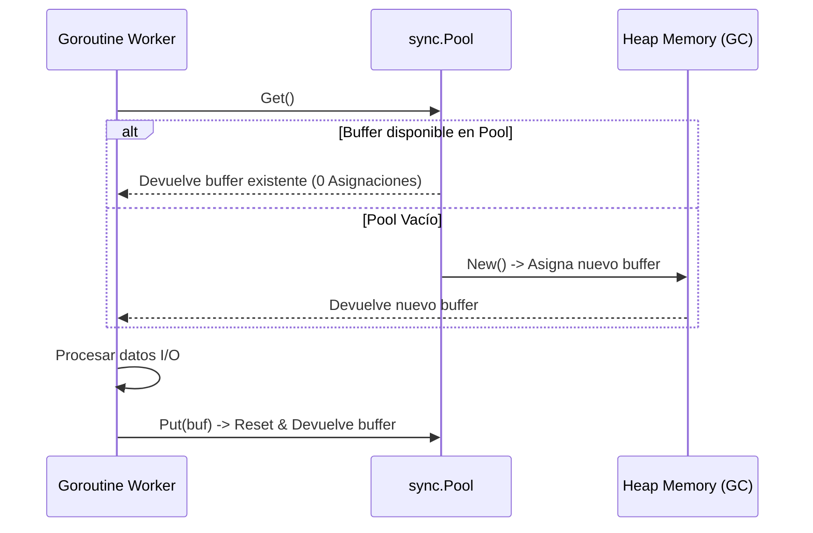

# Módulo 2 - Lección 1: Concurrencia de Alto Rendimiento & Optimización de Memoria en Go

## 1. El Modelo de Concurrencia CSP (Goroutines & Channels)

Go utiliza el modelo **Communicating Sequential Processes (CSP)**. Las **Goroutines** son hilos en espacio de usuario ultraligeros (~2KB de pila inicial), gestionados por el planificador `M:N` de Go.

```mermaid
graph TD
    subgraph Planificador Go (M:N Scheduler)
        G1[Goroutine 1]
        G2[Goroutine 2]
        G3[Goroutine 3]
        G4[Goroutine 4]
        
        P1[Processor P1]
        P2[Processor P2]
        
        M1[OS Thread M1]
        M2[OS Thread M2]
    end

    G1 --> P1
    G2 --> P1
    G3 --> P2
    G4 --> P2
    P1 --> M1
    P2 --> M2
```

---

## 2. Optimización de Memoria: Zero-Allocation & `sync.Pool`

Para evitar la sobrecarga del Garbage Collector (GC) en microservicios de red de alta velocidad (BFF y workers de scraping), reutilizamos buffers mediante `sync.Pool`.



### Código de Ejemplo en Go: Worker de Red con `sync.Pool`

```go
package worker

import (
	"bytes"
	"io"
	"net/http"
	"sync"
)

// Reutilización de buffers bytes.Buffer para 0 asignaciones por petición
var bufferPool = sync.Pool{
	New: func() any {
		return new(bytes.Buffer)
	},
}

type NetworkWorker struct {
	client *http.Client
}

func NewNetworkWorker(client *http.Client) *NetworkWorker {
	return &NetworkWorker{client: client}
}

func (w *NetworkWorker) FetchAndProcess(url string) ([]byte, error) {
	// 1. Obtener buffer del pool
	buf := bufferPool.Get().(*bytes.Buffer)
	buf.Reset()
	defer bufferPool.Put(buf) // 2. Devolver al pool al finalizar

	resp, err := w.client.Get(url)
	if err != nil {
		return nil, err
	}
	defer resp.Body.Close()

	// 3. Copiar sin asignaciones adicionales
	_, err = io.Copy(buf, resp.Body)
	if err != nil {
		return nil, err
	}

	// Devuelve copia inmutable de los bytes procesados
	result := make([]byte, buf.Len())
	copy(result, buf.Bytes())
	return result, nil
}
```

---

## 3. Escape Analysis (Análisis de Escapes)

El compilador de Go decide si una variable se asigna en la **Pila (Stack)** (rápida, sin GC) o en el **Heap** (requiere GC).

### Comando de Verificación de Escapes
```bash
go build -gcflags="-m -l" ./...
```
* **Pila (Stack)**: Si la variable no sobrevive a la ejecución de la función.
* **Heap**: Si se devuelve un puntero a una variable local o se pasa a una interfaz `any`.
