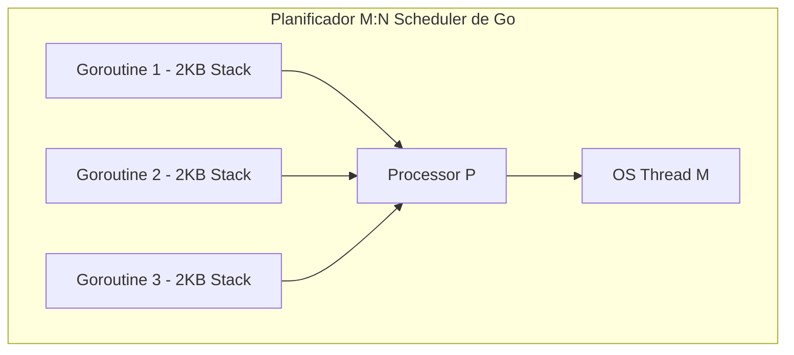

# Módulo 2 - Lección 1: Fundamentos de Go (Golang) desde Cero

---

## 1. 🐣 Rincón Junior: Conceptos desde Cero & Analogías

### ¿Qué hace a Go tan especial y rápido?
Go fue creado en Google por los diseñadores de Unix y C para resolver la lentitud de compilación y la complejidad extrema de C++ y Java.

Go se basa en la **simplicidad absoluta**:
* **No hay clases ni herencia**: Se usan `structs` y composición.
* **No hay excepciones mágicas**: Los errores son valores de retorno explícitos (`result, err := miFuncion()`).
* **Concurrencia ultra-ligera**: Las **Goroutines** consumen solo 2 KB de memoria al arrancar (frente a 1 MB en Java tradicional).

---

## 2. 📐 Arquitectura Visual & Diagrama Mermaid



---

## 3. 🚀 Guía Paso a Paso e Implementación Práctica (0 a 100)

### Programa Go Completo con Structs e Interfaces Implícitas

```go
package main

import (
	"errors"
	"fmt"
)

// 1. Definición de Struct (Modelo de Datos)
type User struct {
	ID    string
	Email string
}

// 2. Definición de Interfaz
type UserRepository interface {
	Save(u User) error
}

// 3. Struct Adaptador que implementa la interfaz de forma IMPLÍCITA
type MemoryUserRepo struct {
	data map[string]User
}

func NewMemoryUserRepo() *MemoryUserRepo {
	return &MemoryUserRepo{data: make(map[string]User)}
}

// Método receptor de pointer (*MemoryUserRepo)
func (r *MemoryUserRepo) Save(u User) error {
	if u.ID == "" {
		return errors.New("el ID no puede estar vacío")
	}
	r.data[u.ID] = u
	return nil
}

func main() {
	var repo UserRepository = NewMemoryUserRepo()
	u := User{ID: "usr-1", Email: "user@corp.com"}
	
	err := repo.Save(u)
	if err != nil {
		fmt.Println("Error:", err)
		return
	}
	fmt.Println("Usuario guardado con éxito en Go")
}
```

---

## 4. 🧠 Referencia Senior: Cheatsheet, Performance & Internals

### Layout de Memoria de Tipos Básicos en Go

| Tipo de Dato | Tamaño en Memoria (Arch. 64-bit) | Asignación Predeterminada |
| :--- | :--- | :--- |
| `int` / `uint64` | 8 bytes | Pila (Stack) |
| `string` | 16 bytes (Puntero a data 8b + Longitud 8b) | Pila (Puntero apunta a RoData) |
| `slice` (`[]T`) | 24 bytes (Puntero 8b + Len 8b + Cap 8b) | Heap si sobrevive a la función |

---

## 5. ⚠️ Errores Comunes & Anti-Patrones (Gotchas)

1. **Olvidar comprobar el error retornado (`result, _ := miFuncion()`)**:
   * *Síntoma*: Errores silenciosos y Panics en producción cuando la llamada falla y devuelve `nil`.
   * *Solución*: Evalúa siempre `if err != nil` inmediatamente después de cada invocación.


---

## 5. 🎯 Desafío Feynman & Auto-Evaluación sin Jerga

> [!NOTE]
> **El Reto de los 12 Años**: Explica el mecanismo esencial y la utilidad práctica de **Fundamentos de Go (Golang) desde Cero** a un estudiante de secundaria, **sin usar las palabras:** "Fundamentos", "de", "Go" ni tecnicismos complejos de memoria.

### Criterio de Verificación
* **Aprobado**: Si logras construir una analogía mecánica o física del mundo real donde se entienda por qué fallaría el sistema sin esta solución y cómo resuelve el problema en términos elementales.
* **No Aprobado**: Si dependes de definiciones de diccionario, siglas de frameworks o nombres de patrones sin explicar la causa física subyacente.


---
## 🧠 Ejercicio Práctico: El Método Feynman

Para garantizar una asimilación profunda de los conceptos presentados en este módulo, aplica el **Método Feynman**:

> **Instrucción:** Explica los conceptos centrales de este módulo como si tu audiencia fuera un estudiante brillante de 12 años que no ha visto nunca este tema. Si no puedes hacerlo con lenguaje sencillo, analogías claras y sin jerga técnica, significa que aún no lo entiendes lo suficientemente bien.

*Inténtalo tú mismo:* Toma el concepto más complejo de este módulo, escríbelo en un papel en blanco y redáctalo usando únicamente términos cotidianos.
