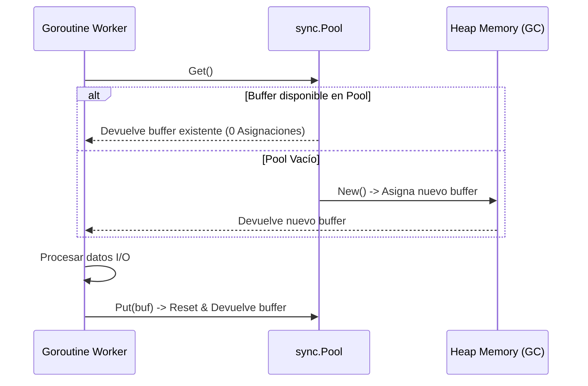

# Módulo 2 - Lección 2: Concurrencia de Alto Rendimiento & Optimización de Memoria en Go

---

## 1. 🐣 Rincón Junior: Conceptos desde Cero & Analogías

### Goroutines & Channels: El Modelo CSP
En Go no compartimos memoria modificando variables globales con cerrojos complejos. En su lugar aplicamos la máxima de Go:
> *"No te comuniques compartiendo memoria; comparte memoria comunicándote"*.

Un **Channel (Canal)** es como una cinta transportadora por la que una Goroutine envía un mensaje a otra de forma segura y sincronizada.

---

## 2. 📐 Arquitectura Visual & Diagrama Mermaid



---

## 3. 🚀 Guía Paso a Paso e Implementación Práctica (0 a 100)

### Código Worker de Red con Reutilización de Buffers (`sync.Pool`)

```go
package main

import (
	"bytes"
	"fmt"
	"io"
	"net/http"
	"sync"
)

// Reutilización de buffers bytes.Buffer para 0 asignaciones por petición
var bufferPool = sync.Pool{
	New: func() any {
		return new(bytes.Buffer)
	},
}

func fetchURL(url string) ([]byte, error) {
	// 1. Obtener buffer del pool
	buf := bufferPool.Get().(*bytes.Buffer)
	buf.Reset()
	defer bufferPool.Put(buf) // 2. Devolver al pool obligatoriamente al finalizar

	resp, err := http.Get(url)
	if err != nil {
		return nil, err
	}
	defer resp.Body.Close()

	// 3. Copiar datos sin asignaciones de heap adicionales
	_, err = io.Copy(buf, resp.Body)
	if err != nil {
		return nil, err
	}

	result := make([]byte, buf.Len())
	copy(result, buf.Bytes())
	return result, nil
}
```

---

## 4. 🧠 Referencia Senior: Cheatsheet, Performance & Internals

### Escape Analysis (Análisis de Escapes del Compilador)
Comando para inspeccionar si las variables escapan al Heap:

```bash
go build -gcflags="-m -l" main.go
```

| Resultado de Escape Analysis | Ubicación de Memoria | Coste de GC |
| :--- | :--- | :--- |
| `moved to heap` | Heap | Requiere barrido del Garbage Collector |
| `does not escape` | Pila (Stack) | **Zero GC Cost (Liberación instantánea al salir)** |

---

## 5. ⚠️ Errores Comunes & Anti-Patrones (Gotchas)

1. **Retener referencias a punteros devueltos a un `sync.Pool`**:
   * *Síntoma*: Corrupción de datos sutil cuando otra Goroutine obtiene el mismo buffer del pool y sobrescribe sus bytes en paralelo.
   * *Solución*: Haz una copia de los bytes de resultado antes de devolver el buffer al pool (`bufferPool.Put(buf)`).


---

## 5. 🎯 Desafío Feynman & Auto-Evaluación sin Jerga

> [!NOTE]
> **El Reto de los 12 Años**: Explica el mecanismo esencial y la utilidad práctica de **Concurrencia de Alto Rendimiento & Optimización de Memoria en Go** a un estudiante de secundaria, **sin usar las palabras:** "Concurrencia", "de", "Alto" ni tecnicismos complejos de memoria.

### Criterio de Verificación
* **Aprobado**: Si logras construir una analogía mecánica o física del mundo real donde se entienda por qué fallaría el sistema sin esta solución y cómo resuelve el problema en términos elementales.
* **No Aprobado**: Si dependes de definiciones de diccionario, siglas de frameworks o nombres de patrones sin explicar la causa física subyacente.


---
## 🧠 Ejercicio Práctico: El Método Feynman

Para garantizar una asimilación profunda de los conceptos presentados en este módulo, aplica el **Método Feynman**:

> **Instrucción:** Explica los conceptos centrales de este módulo como si tu audiencia fuera un estudiante brillante de 12 años que no ha visto nunca este tema. Si no puedes hacerlo con lenguaje sencillo, analogías claras y sin jerga técnica, significa que aún no lo entiendes lo suficientemente bien.

*Inténtalo tú mismo:* Toma el concepto más complejo de este módulo, escríbelo en un papel en blanco y redáctalo usando únicamente términos cotidianos.
