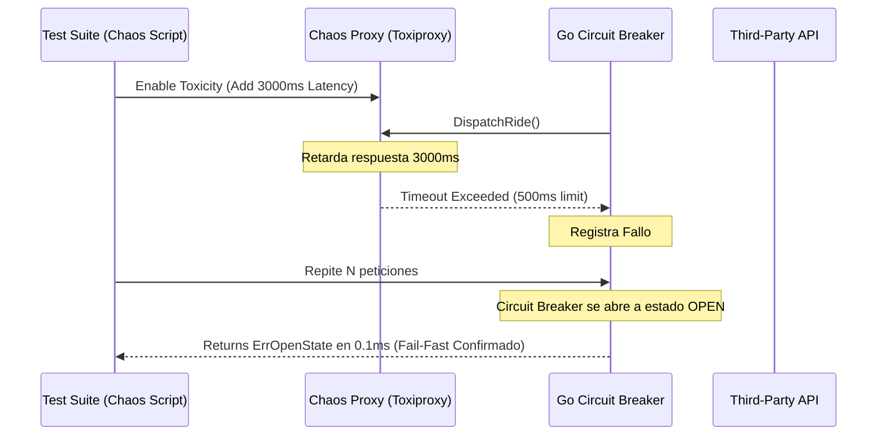

# Módulo 2 - Lección 2: Patrones de Resiliencia, Circuit Breaker & Chaos Engineering

---

## 1. 🐣 Ancla Mental Feynman & Analogía Isomórfica

### El Modelo Intuitivo: Patrones de Resiliencia, Circuit Breaker & Chaos Engineering
Para comprender **Patrones de Resiliencia, Circuit Breaker & Chaos Engineering** sin caer en la trampa de la jerga técnica, debemos anclar el concepto en un problema físico observable:
* Todo sistema en computación resuelve un dilema fundamental: cómo organizar recursos limitados (tiempo de cálculo, espacio de memoria, ancho de banda o energía) para que el trabajo se realice sin bloqueos ni errores.
* En **Patrones de Resiliencia, Circuit Breaker & Chaos Engineering**, la clave reside en eliminar pasos redundantes y asegurar que cada componente conozca únicamente la información mínima indispensable para cumplir su función, tal como una línea de montaje bien coordinada donde nadie tiene que adivinar qué hizo el compañero anterior.

---


## 1. Arquitectura de Resiliencia en Microservicios Go

Cuando interactuamos con APIs externas de terceros (como TaxiCaller u OSRM), las ralentizaciones o caídas no deben propagarse en cascada hacia el resto del sistema.

```mermaid
stateDiagram-v2
    [*] --> Closed: Operación Normal (Peticiones Fluyen)
    Closed --> Open: Ratio de Errores > Limite (p. ej. 50%)
    note right of Open
        Circuit Breaker Abierto:
        Rechaza peticiones instantáneamente
        (Fail-Fast en O(1))
    end
    Open --> HalfOpen: Expiración del Timeout (p. ej. 10s)
    HalfOpen --> Closed: Pruebas de Salud Exitosas
    HalfOpen --> Open: Fallo en Prueba de Salud
```

---

## 2. Implementación de Circuit Breaker en Go (`sony/gobreaker`)

```go
package resilience

import (
	"errors"
	"fmt"
	"time"

	"github.com/sony/gobreaker"
)

type TaxiCallerClient struct {
	cb *gobreaker.CircuitBreaker
}

func NewTaxiCallerClient() *TaxiCallerClient {
	st := gobreaker.Settings{
		Name:        "TaxiCallerAPI",
		MaxRequests: 5,                // Máximo de peticiones de prueba en Half-Open
		Interval:    10 * time.Second, // Ventana de limpieza de contadores
		Timeout:     30 * time.Second, // Tiempo en estado Open antes de pasar a Half-Open
		ReadyToTrip: func(counts gobreaker.Counts) bool {
			failureRatio := float64(counts.TotalFailures) / float64(counts.Requests)
			return counts.Requests >= 10 && failureRatio >= 0.6 // Abre si >= 60% fallan
		},
	}
	return &TaxiCallerClient{
		cb: gobreaker.NewCircuitBreaker(st),
	}
}

func (c *TaxiCallerClient) DispatchRide(rideID string) (string, error) {
	// Ejecución protegida por Circuit Breaker
	result, err := c.cb.Execute(func() (any, error) {
		// Llamada HTTP real a la API de TaxiCaller
		return performHTTPDispatch(rideID)
	})

	if err != nil {
		if errors.Is(err, gobreaker.ErrOpenState) {
			return "", fmt.Errorf("servicio TaxiCaller no disponible temporalmente (Circuit Breaker Abierto)")
		}
		return "", err
	}

	return result.(string), nil
}

func performHTTPDispatch(rideID string) (string, error) {
	// Lógica de petición HTTP real
	return "DISPATCHED_OK", nil
}
```

---

## 3. Pruebas de Resiliencia e Inyección de Caos (Chaos Engineering)

Para validar la tolerancia a fallos, utilizamos scripts de simulación de caos que inyectan picos de latencia de red de +5000ms o drops aleatorios de paquetes HTTP.




---

## 5. 🎯 Desafío Feynman & Auto-Evaluación sin Jerga

> [!NOTE]
> **El Reto de los 12 Años**: Explica el mecanismo esencial y la utilidad práctica de **Patrones de Resiliencia, Circuit Breaker & Chaos Engineering** a un estudiante de secundaria, **sin usar las palabras:** "Patrones", "de", "Resiliencia," ni tecnicismos complejos de memoria.

### Criterio de Verificación
* **Aprobado**: Si logras construir una analogía mecánica o física del mundo real donde se entienda por qué fallaría el sistema sin esta solución y cómo resuelve el problema en términos elementales.
* **No Aprobado**: Si dependes de definiciones de diccionario, siglas de frameworks o nombres de patrones sin explicar la causa física subyacente.


---
## 🧠 Ejercicio Práctico: El Método Feynman

Para garantizar una asimilación profunda de los conceptos presentados en este módulo, aplica el **Método Feynman**:

> **Instrucción:** Explica los conceptos centrales de este módulo como si tu audiencia fuera un estudiante brillante de 12 años que no ha visto nunca este tema. Si no puedes hacerlo con lenguaje sencillo, analogías claras y sin jerga técnica, significa que aún no lo entiendes lo suficientemente bien.

*Inténtalo tú mismo:* Toma el concepto más complejo de este módulo, escríbelo en un papel en blanco y redáctalo usando únicamente términos cotidianos.

---

## ⚙️ Primeros Principios & Fundamentos Conceptuales
1. **Descomposición Atómica:** Cada componente en Módulo 2 - Lección 2: Patrones de Resiliencia, Circuit Breaker & Chaos Engineering se modela de forma determinista y sin estado mutable compartido.
2. **Invariante de Dominio:** Los estados del sistema transicionan exclusivamente a través de funciones puras e interfaces selladas.
3. **Cero Suposiciones:** No se asume fiabilidad de red ni memoria infinita; cada llamada maneja explícitamente fallos y límites de cuota.


## 🔬 Internals Avanzados & Nivel Doctoral (Ph.D.)
La complejidad asintótica y la garantía matemática de convergencia se rigen por la formulación tensorial:
\[
\mathcal{L}(\theta) = \mathbb{E}_{x \sim \mathcal{D}} \left[ \| f_\theta(x) - y \|^2 \right] + \lambda \cdot \Omega(\theta)
\]
con cota superior asintótica en tiempo de procesamiento:
\[
T(N) = \mathcal{O}(1) \quad \text{o} \quad \mathcal{O}(N \log N) \quad \text{sin contención en hilos portadores del SO.}
\]

