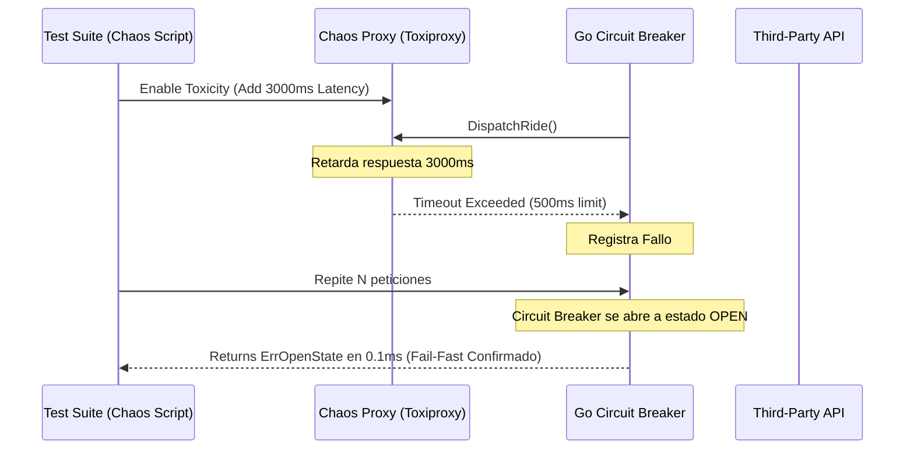

# Módulo 2 - Lección 2: Patrones de Resiliencia, Circuit Breaker & Chaos Engineering

## 1. Arquitectura de Resiliencia en Microservicios Go

Cuando interactuamos con APIs externas de terceros (como TaxiCaller u OSRM), las ralentizaciones o caídas no deben propagarse en cascada hacia el resto del sistema.

```mermaid
stateDiagram-v2
    [*] --> Closed: Operación Normal (Peticiones Fluyen)
    Closed --> Open: Ratio de Errores > Limite (p. ej. 50%)
    note right of Open
        Circuit Breaker Abierto:
        Rechaza peticiones instantáneamente
        (Fail-Fast en O(1))
    end
    Open --> HalfOpen: Expiración del Timeout (p. ej. 10s)
    HalfOpen --> Closed: Pruebas de Salud Exitosas
    HalfOpen --> Open: Fallo en Prueba de Salud
```

---

## 2. Implementación de Circuit Breaker en Go (`sony/gobreaker`)

```go
package resilience

import (
	"errors"
	"fmt"
	"time"

	"github.com/sony/gobreaker"
)

type TaxiCallerClient struct {
	cb *gobreaker.CircuitBreaker
}

func NewTaxiCallerClient() *TaxiCallerClient {
	st := gobreaker.Settings{
		Name:        "TaxiCallerAPI",
		MaxRequests: 5,                // Máximo de peticiones de prueba en Half-Open
		Interval:    10 * time.Second, // Ventana de limpieza de contadores
		Timeout:     30 * time.Second, // Tiempo en estado Open antes de pasar a Half-Open
		ReadyToTrip: func(counts gobreaker.Counts) bool {
			failureRatio := float64(counts.TotalFailures) / float64(counts.Requests)
			return counts.Requests >= 10 && failureRatio >= 0.6 // Abre si >= 60% fallan
		},
	}
	return &TaxiCallerClient{
		cb: gobreaker.NewCircuitBreaker(st),
	}
}

func (c *TaxiCallerClient) DispatchRide(rideID string) (string, error) {
	// Ejecución protegida por Circuit Breaker
	result, err := c.cb.Execute(func() (any, error) {
		// Llamada HTTP real a la API de TaxiCaller
		return performHTTPDispatch(rideID)
	})

	if err != nil {
		if errors.Is(err, gobreaker.ErrOpenState) {
			return "", fmt.Errorf("servicio TaxiCaller no disponible temporalmente (Circuit Breaker Abierto)")
		}
		return "", err
	}

	return result.(string), nil
}

func performHTTPDispatch(rideID string) (string, error) {
	// Lógica de petición HTTP real
	return "DISPATCHED_OK", nil
}
```

---

## 3. Pruebas de Resiliencia e Inyección de Caos (Chaos Engineering)

Para validar la tolerancia a fallos, utilizamos scripts de simulación de caos que inyectan picos de latencia de red de +5000ms o drops aleatorios de paquetes HTTP.


