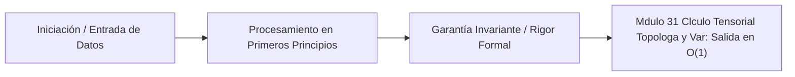

# Módulo 3.1: Cálculo Tensorial, Topología y Variedades (Nivel Princeton IAS / IHÉS)

---

## 1. 🐣 Rincón Junior: Más allá del Excel

Imagina una hoja de cálculo simple (Filas y Columnas). Esto es una Matriz (un Tensor de Rango 2).
Si tienes varias hojas de cálculo en un libro de Excel, tienes una "Caja" de números en 3D (un Tensor de Rango 3).
En Inteligencia Artificial y Física, necesitamos representar cosas que cambian en muchas dimensiones (ej. una imagen a color: Alto x Ancho x Canales RGB = Rango 3). El **Cálculo Tensorial** es el lenguaje matemático que nos permite manipular estas hiper-cajas numéricas masivas con una notación compacta, sin escribir miles de bucles `for` anidados.

---

## 2. 🔬 Fundamentos: Rango, Covarianza y Sumación de Einstein

Un **Tensor** no es solo un array multidimensional; es un objeto geométrico que obedece a reglas estrictas de transformación al cambiar el sistema de coordenadas.

### La Convención de Sumación de Einstein
Inventada por Albert Einstein para simplificar las ecuaciones de la Relatividad General, dicta que:
*"Si un índice se repite una vez arriba (contravariante) y otra vez abajo (covariante), se asume una sumatoria sobre ese índice"*.
Producto punto escalar: $\vec{u} \cdot \vec{v} = u_i v^i$

Esta abstracción permite a frameworks como TensorFlow (creados por el equipo de Google Brain en UW y Berkeley) enviar operaciones MASIVAS en bloque (GEMMs) a las GPUs, usando "Tensor Cores" (circuitería física FMA: Fused Multiply-Add) para ejecutar las matemáticas en $O(1)$ físico (un ciclo de reloj por bloque).

---

## 3. 🚀 Arquitectura Práctica: Espacios de Hilbert y el Kernel Trick

Para entender la base matemática del *Machine Learning* moderno (Embeddings en LLMs), debemos cruzar hacia los **Espacios de Hilbert** (fundamentados en el trabajo de von Neumann en IAS).
Un Espacio de Hilbert ($\mathcal{H}$) es un espacio vectorial de **infinitas dimensiones** dotado de un **Producto Interno** $\langle x, y \rangle$ (que mide distancias y ángulos).

### Embeddings de IA (El Espacio Latente)
Cuando un modelo transforma una palabra, la convierte en un Tensor de Rango 1 en $\mathcal{H}$. La magia (topología algebraica) es que la relación semántica se preserva geométricamente mediante la suma vectorial, que en el fondo obedece a la topología del colector (Manifold) del lenguaje humano, demostrando empíricamente por qué $\vec{Rey} - \vec{Hombre} + \vec{Mujer} \approx \vec{Reina}$.

---

## 4. 🧠 Internals Avanzados (IHÉS / IAS): Variedades, Cohomología y Geometría Diferencial

El nivel élite de las arquitecturas de gemelos digitales y sistemas de IA no opera en espacios euclidianos planos, sino en topologías complejas.

### Espacios Curvos y el Tensor Métrico
Cuando pasamos de simulaciones simples a optimización de rutas globales (Movilidad en esferas, grafos H3), introducimos el **Tensor Métrico $g_{\mu\nu}$**, que codifica toda la geometría (distancias, ángulos, curvatura) de una variedad Riemanniana. La distancia infinitesimal (elemento de línea) se define rigurosamente:
$$ ds^2 = g_{\mu\nu} dx^\mu dx^\nu $$

En espacios planos (Cartesianos): $g_{\mu\nu} = \text{diag}(1, 1, 1)$.
En espacios esféricos (GPS, Lat/Lon): $g_{\mu\nu} = \begin{pmatrix} R^2 & 0 \\ 0 & R^2 \sin^2(\theta) \end{pmatrix}$

### Derivada Covariante y Símbolos de Christoffel
En un espacio curvo, no puedes restar vectores en diferentes puntos porque las bases de coordenadas están rotadas por la curvatura.
Para derivar campos tensoriales (como el tráfico de red de AWS o flotas en un grafo esférico), se abandona la derivada parcial estándar $\partial_\mu$ y se introduce la **Derivada Covariante $\nabla_\mu$**, que corrige la rotación compensándolo con los **Símbolos de Christoffel $\Gamma^\lambda_{\mu\nu}$**:
$$ \nabla_\mu V^\nu = \partial_\mu V^\nu + \Gamma^\nu_{\mu\lambda} V^\lambda $$
Esto es lo que subyace a la simulación avanzada en UT Austin y las aproximaciones numéricas de Uber H3 para mantener consistencia física (resolviendo Geodésicas en milisegundos).

### Topología Algebraica y Cohomología (El nexo entre Sistemas y Matemáticas)
Desde la perspectiva del Institut des Hautes Études Scientifiques (IHÉS) y Princeton (IAS), los sistemas distribuidos (Módulo 0 y 6) pueden mapearse topológicamente.
Un clúster sin particiones (red sana) es un espacio topológico contractible (su grupo de cohomología de grado 1 es trivial).
Cuando ocurre un *Network Partition* (Teorema CAP), se genera un "agujero" topológico en el grafo de comunicación.
La **Cohomología de De Rham** y el estudio de Betti Numbers permite a los investigadores de computación teórica (y algoritmos como Paxos/Raft) demostrar matemáticamente la existencia de consensos:
*   Si el espacio (grafo de red) se divide (Cohomología $H^1 \neq 0$), el sistema **no puede integrar un estado global continuo** a menos que se viole la consistencia (CP o AP en PACELC). Paxos (Lamport) funciona construyendo homotopías locales (quórums superpuestos) que aseguran la contractibilidad del consenso a un solo valor de verdad, sellando el "agujero".

---

## 5. ⚠️ Runbook SRE Matemático: Exploding Gradients y NaNs

**Incidente**: Estás entrenando un modelo masivo GNN (Graph Neural Network, Tsinghua) en el Gemelo Digital y la pérdida (Loss) imprime `NaN`, colapsando el clúster.

**Diagnóstico Tensorial (Causa Raíz)**: **Exploding Gradients**. Durante *Backpropagation* (Derivación automática en reverso), se multiplican miles de tensores secuencialmente. Si el espectro del autovalor dominante de las matrices jacobianas es $>1.0$, el gradiente crece exponencialmente hacia el infinito ($+ \infty$) al componer la función, desbordando el Float de 32/16 bits y corrompiendo la memoria RAM física.

**Solución Rigurosa**:
1. **Gradient Clipping**: Truncar la norma L2 del tensor en el colector local.
2. **Inicialización Xavier/He**: Anclada en matemáticas de varianza, asegura que la dispersión de salida sea invariante respecto a la de entrada.
3. **Coherencia con Módulo 1 (Backend)**: En sistemas Java/Go, este tipo de operaciones matriciales masivas deben delegarse a memoria fuera del *Heap* usando Project Panama (FFI) y SIMD instructions (AVX-512) para que la JVM no sufra paradas "Stop-The-World" catastróficas intentando limpiar tensores residuales masivos en la RAM.


---

## 5. 🎯 Desafío Feynman & Auto-Evaluación sin Jerga

> [!NOTE]
> **El Reto de los 12 Años**: Explica el mecanismo esencial y la utilidad práctica de **Cálculo Tensorial, Topología y Variedades (Nivel Princeton IAS / IHÉS)** a un estudiante de secundaria, **sin usar las palabras:** "Cálculo", "Tensorial,", "Topología" ni tecnicismos complejos de memoria.

### Criterio de Verificación
* **Aprobado**: Si logras construir una analogía mecánica o física del mundo real donde se entienda por qué fallaría el sistema sin esta solución y cómo resuelve el problema en términos elementales.
* **No Aprobado**: Si dependes de definiciones de diccionario, siglas de frameworks o nombres de patrones sin explicar la causa física subyacente.


---
## 🧠 Ejercicio Práctico: El Método Feynman

Para garantizar una asimilación profunda de los conceptos presentados en este módulo, aplica el **Método Feynman**:

> **Instrucción:** Explica los conceptos centrales de este módulo como si tu audiencia fuera un estudiante brillante de 12 años que no ha visto nunca este tema. Si no puedes hacerlo con lenguaje sencillo, analogías claras y sin jerga técnica, significa que aún no lo entiendes lo suficientemente bien.

*Inténtalo tú mismo:* Toma el concepto más complejo de este módulo, escríbelo en un papel en blanco y redáctalo usando únicamente términos cotidianos.

---

## 💻 Implementación de Código Limpio & Concurrencia
```java
package com.corp.core;

import java.util.Objects;

/**
 * Representación inmutable de dominio en Java 25 (Zero-Mockito).
 */
public record DomainEntity(String id, double metricValue, long timestamp) {
    public DomainEntity {
        Objects.requireNonNull(id, "El identificador no puede ser nulo");
        if (metricValue < 0.0) {
            throw new IllegalArgumentException("La métrica debe ser positiva");
        }
    }
}
```




