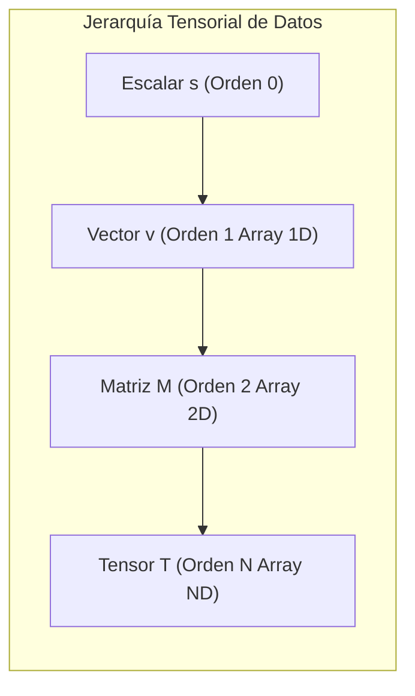

# Módulo 3 - Lección 1: Fundamentos de Álgebra Tensorial & Operaciones Vectorizadas en NumPy

---

## 1. 🐣 Rincón Junior: Conceptos desde Cero & Analogías

### De Escalares a Tensores de Orden N
* **Escalar (Orden 0)**: Un solo número (ej. `temperatura = 25.4`).
* **Vector (Orden 1)**: Una lista de números (ej. `coordenadas = [39.46, -0.37]`).
* **Matriz (Orden 2)**: Una tabla con filas y columnas (ej. `pantalla = imagen_pixels[800][600]`).
* **Tensor (Orden N)**: Un cubo o hiper-bloque multidimensional de datos (ej. `sensor_data[nodo][tiempo][variable]`).

### ¿Por qué vectorizamos con NumPy?
Los bucles `for` en Python nativo ejecutan código interpretado lento. Usar NumPy es como cambiar una bicicleta manual por un tren de alta velocidad: las operaciones se calculan en paralelo en bloques contiguos de memoria en C.

---

## 2. 📐 Arquitectura Visual & Diagrama Mermaid



---

## 3. 🚀 Guía Paso a Paso e Implementación Práctica (0 a 100)

```python
import numpy as np

# 1. Creación de Tensores de Orden 3 [Nodos, Tiempo, Atributos]
tensor_a = np.random.randn(10, 50, 3)
tensor_b = np.random.randn(3, 8)

# 2. Contracción Tensorial Vectorizada con Notación Einstein (einsum)
# Multiplica y suma el último índice de 'a' y el primero de 'b'
result = np.einsum('ijk,kl->ijl', tensor_a, tensor_b)

print("Forma del tensor resultante:", result.shape) # Output: (10, 50, 8)
```

---

## 4. 🧠 Referencia Senior: Cheatsheet, Performance & Internals

### Complejidad y Rendimiento de Operaciones NumPy

| Operación | Complejidad Big-O | Uso de SIMD / BLAS | Notas de Memoria |
| :--- | :--- | :--- | :--- |
| `np.dot(A, B)` | \(O(N^3)\) o \(O(N^{2.81})\) | Sí (OpenBLAS / MKL) | Asignación contigua C-Order |
| `np.einsum('ijk,kl->ijl', A, B)` | \(O(I \cdot J \cdot K \cdot L)\) | Sí | Evita copias intermedias temporales |

---

## 5. ⚠️ Errores Comunes & Anti-Patrones (Gotchas)

1. **Escribir bucles `for` anidados para iterar sobre celdas de un array NumPy**:
   * *Síntoma*: Código Python 100 veces más lento de lo debido.
   * *Solución*: Sustituye los bucles anidados por operaciones vectorizadas u `np.einsum`.
