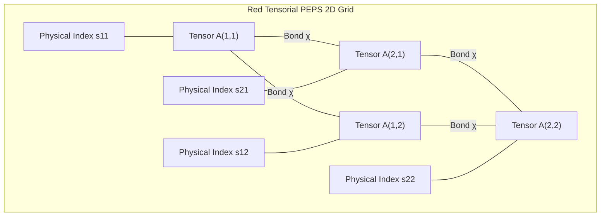

# Módulo 3 - Lección 2: Redes Tensoriales (PEPS) & Unified Tensor Graph Core

---

## 1. 🐣 Rincón Junior: Conceptos desde Cero & Analogías

### ¿Qué es el Gemelo Digital Unificado?
El **Gemelo Digital Unificado (`tensor_gnn_core.py`)** es una simulación matemática centralizada que representa todo el sistema físico y económico de la empresa. 

Si cambia el precio del combustible en movilidad (`AppViajes`) o la disponibilidad de agua en irrigación (`SaaSRegantes`), el Gemelo Digital calcula el impacto acoplado en todo el sistema sin necesidad de crear simuladores aislados para cada proyecto.

### Redes Tensoriales PEPS (Projected Entangled Pair States)
Cuando vinculas miles de variables, el espacio de datos crece exponencialmente (**La Maldición de la Dimensionalidad**). Las **Redes Tensoriales PEPS** descomponen una red 2D/3D gigante en pequeños tensores interconectados por "enlaces virtuales" (Bond Dimension $\chi$), manteniendo el consumo de memoria en un nivel razonable.

---

## 2. 📐 Arquitectura Visual & Diagrama Mermaid



---

## 3. 🚀 Guía Paso a Paso e Implementación Práctica (0 a 100)

```python
import numpy as np

class TensorGNNCore:
    def __init__(self, num_nodes: int, bond_dim: int, phys_dim: int):
        self.num_nodes = num_nodes
        self.bond_dim = bond_dim
        self.phys_dim = phys_dim
        # Tensores locales [Norte, Sur, Este, Oeste, Físico]
        self.tensors = [
            np.random.randn(bond_dim, bond_dim, bond_dim, bond_dim, phys_dim) / np.sqrt(bond_dim)
            for _ in range(num_nodes)
        ]

    def contract_local_pair(self, tensor_a: np.ndarray, tensor_b: np.ndarray) -> np.ndarray:
        return np.einsum('ijklo,mnojq->imkolnpq', tensor_a, tensor_b)

    def compute_energy_state(self, perturbations: np.ndarray) -> float:
        contracted_norm = 0.0
        for i, t in enumerate(self.tensors):
            state_vector = np.dot(t.reshape(-1, self.phys_dim), perturbations[i % len(perturbations)])
            contracted_norm += float(np.linalg.norm(state_vector))
        return contracted_norm
```

---

## 4. 🧠 Referencia Senior: Cheatsheet, Performance & Internals

### Complejidad de Contracción Tensorial PEPS

| Red Tensorial | Complejidad de Contracción | Bond Dimension (\(\chi\)) Típica | Ámbito de Uso |
| :--- | :--- | :--- | :--- |
| **MPS (Matrix Product States 1D)** | \(O(N \cdot \chi^3)\) | \(\chi \approx 16 - 64\) | Cadena 1D / Series temporales |
| **PEPS (Projected Entangled 2D)** | \(O(N \cdot \chi^5)\) aproximado | \(\chi \approx 4 - 8\) | Grafos espaciales 2D (Redes de transporte/riego) |

---

## 5. ⚠️ Errores Comunes & Anti-Patrones (Gotchas)

1. **Crear scripts `.py` aislados para modelar mecánicas físicas o económicas de un solo proyecto**:
   * *Violación*: Incumplimiento de la regla de Cero Simulaciones Aisladas.
   * *Solución*: Formula cualquier nuevo cálculo predictivo como un tensor e inyéctalo en `tensor_gnn_core.py`.
