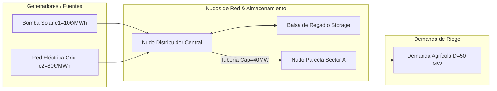

# Módulo 3 - Lección 6: Optimización de Redes de Potencia e Irrigación con PyPSA

---

## 1. 🐣 Rincón Junior: Conceptos desde Cero & Analogías

### ¿Qué es PyPSA y qué problema resuelve?
Imagina gestionar una red de tuberías de agua y bombas solares. Tienes bombas baratas que funcionan con energía solar (solo de día) y bombas caras que funcionan con la red eléctrica comercial. Además, las tuberías tienen un diámetro máximo y no pueden llevar más agua de la soportada sin reventar.

**PyPSA (Python for Power System Analysis)** es el motor matemático que calcula en tiempo real cuál es la forma **más barata posible de operar todas las bombas** (**Despacho Económico**) sin sobrepasar el límite físico de ninguna tubería.

---

## 2. 📐 Arquitectura Visual & Diagrama Mermaid



---

## 3. 🚀 Guía Paso a Paso e Implementación Práctica (0 a 100)

```python
import pypsa

def optimize_network():
    network = pypsa.Network()

    # Nudos
    network.add("Bus", "Central")
    network.add("SectorA")

    # Generadores
    network.add("Generator", "Solar", bus="Central", p_nom=100, marginal_cost=10)
    network.add("Generator", "Grid", bus="Central", p_nom=200, marginal_cost=80)

    # Tubería de transporte
    network.add("Line", "MainPipe", bus0="Central", bus1="SectorA", x=0.001, s_nom=40)

    # Demanda
    network.add("Load", "CropDemand", bus="SectorA", p_set=50)

    # Resolver Optimización Lineal LPOPF
    network.optimize(solver_name="glpk")

    print("Despacho Solar:", network.generators_t.p["Solar"].values)
    print("Coste Objetivo:", network.objective)

if __name__ == "__main__":
    optimize_network()
```

---

## 4. 🧠 Referencia Senior: Cheatsheet, Performance & Internals

### Formulación Matemática de LPOPF

$$\min_{P_g} \sum_{g \in G} c_g \cdot P_g \quad \text{s.t.} \quad \sum_{g \in G_n} P_g - D_n = \sum_{l \in L_n} F_l, \quad -F_l^{\max} \le F_l \le F_l^{\max}$$

---

## 5. ⚠️ Errores Comunes & Anti-Patrones (Gotchas)

1. **Olvidar definir la reactancia `x` o capacidad `s_nom` en las líneas**:
   * *Síntoma*: El solver falla lanzando un error de matriz no definida o solución no acotada.
   * *Solución*: Especifica siempre impedancia/reactancia lineal y capacidad máxima de flujo.
