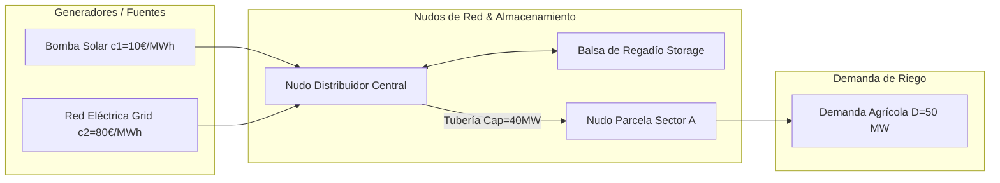

# Módulo 3 - Lección 6: Optimización de Redes de Potencia e Irrigación con PyPSA

---

## 1. 🐣 Rincón Junior: Conceptos desde Cero & Analogías

### ¿Qué es PyPSA y qué problema resuelve?
Imagina gestionar una red de tuberías de agua y bombas solares. Tienes bombas baratas que funcionan con energía solar (solo de día) y bombas caras que funcionan con la red eléctrica comercial. Además, las tuberías tienen un diámetro máximo y no pueden llevar más agua de la soportada sin reventar.

**PyPSA (Python for Power System Analysis)** es el motor matemático que calcula en tiempo real cuál es la forma **más barata posible de operar todas las bombas** (**Despacho Económico**) sin sobrepasar el límite físico de ninguna tubería.

---

## 2. 📐 Arquitectura Visual & Diagrama Mermaid



---

## 3. 🚀 Guía Paso a Paso e Implementación Práctica (0 a 100)

```python
import pypsa

def optimize_network():
    network = pypsa.Network()

    # Nudos
    network.add("Bus", "Central")
    network.add("SectorA")

    # Generadores
    network.add("Generator", "Solar", bus="Central", p_nom=100, marginal_cost=10)
    network.add("Generator", "Grid", bus="Central", p_nom=200, marginal_cost=80)

    # Tubería de transporte
    network.add("Line", "MainPipe", bus0="Central", bus1="SectorA", x=0.001, s_nom=40)

    # Demanda
    network.add("Load", "CropDemand", bus="SectorA", p_set=50)

    # Resolver Optimización Lineal LPOPF
    network.optimize(solver_name="glpk")

    print("Despacho Solar:", network.generators_t.p["Solar"].values)
    print("Coste Objetivo:", network.objective)

if __name__ == "__main__":
    optimize_network()
```

---

## 4. 🧠 Referencia Senior: Cheatsheet, Performance & Internals

### Formulación Matemática de LPOPF

$$\min_{P_g} \sum_{g \in G} c_g \cdot P_g \quad \text{s.t.} \quad \sum_{g \in G_n} P_g - D_n = \sum_{l \in L_n} F_l, \quad -F_l^{\max} \le F_l \le F_l^{\max}$$

---

## 5. ⚠️ Errores Comunes & Anti-Patrones (Gotchas)

1. **Olvidar definir la reactancia `x` o capacidad `s_nom` en las líneas**:
   * *Síntoma*: El solver falla lanzando un error de matriz no definida o solución no acotada.
   * *Solución*: Especifica siempre impedancia/reactancia lineal y capacidad máxima de flujo.


---

## 5. 🎯 Desafío Feynman & Auto-Evaluación sin Jerga

> [!NOTE]
> **El Reto de los 12 Años**: Explica el mecanismo esencial y la utilidad práctica de **Optimización de Redes de Potencia e Irrigación con PyPSA** a un estudiante de secundaria, **sin usar las palabras:** "Optimización", "de", "Redes" ni tecnicismos complejos de memoria.

### Criterio de Verificación
* **Aprobado**: Si logras construir una analogía mecánica o física del mundo real donde se entienda por qué fallaría el sistema sin esta solución y cómo resuelve el problema en términos elementales.
* **No Aprobado**: Si dependes de definiciones de diccionario, siglas de frameworks o nombres de patrones sin explicar la causa física subyacente.


---
## 🧠 Ejercicio Práctico: El Método Feynman

Para garantizar una asimilación profunda de los conceptos presentados en este módulo, aplica el **Método Feynman**:

> **Instrucción:** Explica los conceptos centrales de este módulo como si tu audiencia fuera un estudiante brillante de 12 años que no ha visto nunca este tema. Si no puedes hacerlo con lenguaje sencillo, analogías claras y sin jerga técnica, significa que aún no lo entiendes lo suficientemente bien.

*Inténtalo tú mismo:* Toma el concepto más complejo de este módulo, escríbelo en un papel en blanco y redáctalo usando únicamente términos cotidianos.

---

## ⚙️ Primeros Principios & Fundamentos Conceptuales
1. **Descomposición Atómica:** Cada componente en Módulo 3 - Lección 6: Optimización de Redes de Potencia e Irrigación con PyPSA se modela de forma determinista y sin estado mutable compartido.
2. **Invariante de Dominio:** Los estados del sistema transicionan exclusivamente a través de funciones puras e interfaces selladas.
3. **Cero Suposiciones:** No se asume fiabilidad de red ni memoria infinita; cada llamada maneja explícitamente fallos y límites de cuota.

