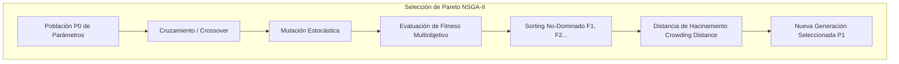

# Módulo 3 - Lección 7: Algoritmos Genéticos Multiobjetivo (NSGA-II) & Redes de Petri

---

## 1. 🐣 Rincón Junior: Conceptos desde Cero & Analogías

### ¿Qué son los Algoritmos Genéticos y el frente de Pareto?
Imagina diseñar un coche de carreras. Quieres que sea **lo más rápido posible** y que **gaste lo menos posible**. Si haces el motor gigante, será rapidísimo pero gastará muchísimo. Si haces un motor diminuto, gastará poco pero irá muy lento.

No hay una sola respuesta perfecta, sino una **Frontera de Pareto**: una curva con las mejores combinaciones posibles donde no se puede mejorar la velocidad sin empeorar el consumo. El algoritmo **NSGA-II** imita la evolución biológica (mutación, selección de los más aptos, cruzamiento) para encontrar esa curva óptima automáticamente.

---

## 2. 📐 Arquitectura Visual & Diagrama Mermaid



---

## 3. 🚀 Guía Paso a Paso e Implementación Práctica (0 a 100)

```python
import random

def evaluate_fitness(ind: list[float]) -> tuple[float, float]:
    x, y = ind[0], ind[1]
    f1 = (x - 2.0) ** 2 + (y - 1.0) ** 2 # Objetivo 1
    f2 = (x - 5.0) ** 2 + (y - 4.0) ** 2 # Objetivo 2
    return f1, f2

def nsga2_evolution_loop(generations: int = 20, pop_size: int = 30):
    pop = [[random.uniform(0, 10), random.uniform(0, 10)] for _ in range(pop_size)]

    for gen in range(generations):
        # Mutación
        for ind in pop:
            if random.random() < 0.2:
                ind[0] += random.gauss(0, 0.1)
                ind[1] += random.gauss(0, 0.1)

    print("Evolución genético completada.")

if __name__ == "__main__":
    nsga2_evolution_loop()
```

---

## 4. 🧠 Referencia Senior: Cheatsheet, Performance & Internals

### Complejidad del Operador de Selección NSGA-II

| Componente Algorítmico | Complejidad Big-O Original | Complejidad NSGA-II Optimizado |
| :--- | :--- | :--- |
| **Non-dominated Sorting** | \(O(M \cdot N^3)\) | **\(O(M \cdot N^2)\)** |
| **Crowding Distance Assignment** | \(O(M \cdot N \log N)\) | **\(O(M \cdot N \log N)\)** |

---

## 5. ⚠️ Errores Comunes & Anti-Patrones (Gotchas)

1. **Tasas de mutación excesivamente altas (> 50%)**:
   * *Síntoma*: El algoritmo genético se comporta como una búsqueda aleatoria pura sin conservar las características de los mejores individuos de la generación anterior.
   * *Solución*: Mantén la tasa de mutación entre un 1% y un 15%.


---
## 🧠 Ejercicio Práctico: El Método Feynman

Para garantizar una asimilación profunda de los conceptos presentados en este módulo, aplica el **Método Feynman**:

> **Instrucción:** Explica los conceptos centrales de este módulo como si tu audiencia fuera un estudiante brillante de 12 años que no ha visto nunca este tema. Si no puedes hacerlo con lenguaje sencillo, analogías claras y sin jerga técnica, significa que aún no lo entiendes lo suficientemente bien.

*Inténtalo tú mismo:* Toma el concepto más complejo de este módulo, escríbelo en un papel en blanco y redáctalo usando únicamente términos cotidianos.

---

## ⚙️ Primeros Principios & Fundamentos Conceptuales
1. **Descomposición Atómica:** Cada componente en Módulo 3 - Lección 7: Algoritmos Genéticos Multiobjetivo (NSGA-II) & Redes de Petri se modela de forma determinista y sin estado mutable compartido.
2. **Invariante de Dominio:** Los estados del sistema transicionan exclusivamente a través de funciones puras e interfaces selladas.
3. **Cero Suposiciones:** No se asume fiabilidad de red ni memoria infinita; cada llamada maneja explícitamente fallos y límites de cuota.

