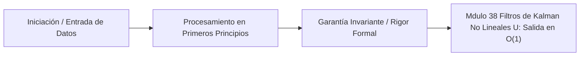

# Módulo 3.8: Filtros de Kalman No Lineales (UKF y Particle Filters)

---

## 1. 🐣 Rincón Junior: Disparando a través del Caos

Ya vimos el Filtro de Kalman Clásico (ideal para ir en línea recta) y el EnKF (usar fuerza bruta y miles de clones para predecir el clima).
Pero, ¿qué pasa si el sistema es tan caótico que usar 100 clones no es suficiente para capturar la verdadera forma de la realidad, o el ruido no forma una campana de Gauss (sino que tiene varios picos de probabilidad)?
Aquí entran las matemáticas pesadas del Siglo XXI: El **Unscented Kalman Filter (UKF)** y los **Filtros de Partículas**. Son el cerebro detrás de la navegación autónoma real (Self-Driving Cars), donde un error de no-linealidad en la predicción del sensor LiDAR significa chocar contra una pared.

---

## 2. 🔬 Fundamentos Matemáticos: La Transformación Unscented (UT)

El Extended Kalman Filter (EKF) linealiza el mundo calculando derivadas (Jacobianos). Si la función de la física es una curva salvaje, trazar una línea recta tangente (Jacobiano) en el punto actual arruinará completamente la predicción de la covarianza (la campana de Gauss se distorsionará).

El inventor del UKF (Jeffrey Uhlmann) dijo una frase lapidaria en ciencias computacionales:
*"Es más fácil aproximar una distribución de probabilidad que aproximar una función no lineal arbitraria"*.

En lugar de derivar la curva (difícil o imposible), el UKF toma la campana de Gauss inicial y elige matemáticamente a mano unos pocos puntos muy específicos llamados **Puntos Sigma (Sigma Points)**.
*   En un espacio de dimensión $L$, selecciona exactamente `$2`L + 1$ Puntos Sigma.
*   Pasa esos pocos puntos por la función no lineal diabólica pura (sin derivar, sin linealizar).
*   Mide dónde cayeron los puntos al otro lado, y reconstruye mágicamente la nueva media y covarianza (una nueva campana de Gauss, perfectamente adaptada a la curva).

**Ventaja Computacional**: El UKF no necesita que programes Jacobianos (ahorrando meses de trabajo matemático y errores), y captura la realidad con precisión de 3er orden en la serie de Taylor, siendo inmensamente superior al EKF clásico con un coste de cálculo casi idéntico.

---

## 3. 🚀 Arquitectura Teórica: Filtro de Partículas (Sequential Monte Carlo)

¿Y si la realidad no es una campana de Gauss en absoluto? 
Imagina un robot perdido en un pasillo simétrico con dos puertas idénticas. El sensor le dice "estoy frente a una puerta". La probabilidad ahora tiene dos picos iguales (Bimodal). ¡El Filtro de Kalman Estándar promediará los dos picos y dirá que el robot está en medio del pasillo (donde sabemos 100% que NO está)!

El **Filtro de Partículas (Particle Filter)** abandona las matrices y las campanas de Gauss por completo.
1.  **Muestreo (Sampling)**: Esparce 10,000 "partículas" virtuales por todo el mapa. Cada partícula es una hipótesis completa de la realidad (ej. "Estoy en X=5, Y=10").
2.  **Predicción**: Las mueve según las leyes físicas (con ruido aleatorio estocástico, SDE).
3.  **Actualización (Weighting)**: Lee el sensor real. Si el sensor dice "veo una pared a 2 metros", la matemática comprueba el mapa virtual. Toda partícula que esté a 2 metros de una pared en el mapa recibe una puntuación enorme (Peso). Las que ven vacío, reciben peso cero.
4.  **Remuestreo (Resampling)**: Las partículas con peso alto se clonan y se reproducen. Las partículas inútiles (peso cero) se borran de la memoria de la RAM para no malgastar ciclos de CPU (Supervivencia del más apto darwiniana).

El Filtro de Partículas puede modelar cualquier distribución loca del universo, pero sufre de la Maldición de la Dimensionalidad (se vuelve $O(e^N)$ en espacios de alto nivel).

---

## 4. 🧠 Internals Avanzados: Comparativa Arquitectónica en el Gemelo Digital

¿Cuándo usar qué algoritmo en el `tensor_gnn_core.py`?

1.  **Filtro de Kalman Estándar**: Para drones en espacios abiertos o sensores lineales (Acelerómetros simples). Matemáticamente exacto, rapidísimo.
2.  **EKF (Extended)**: Sistemas embebidos con poca CPU (Smartphones, GPS móvil).
3.  **UKF (Unscented)**: Navegación robótica densa (SLAM de alta precisión, Controladores de baterías de iones de litio en VEs). Cuando los Jacobianos son imposibles de derivar.
4.  **Filtro de Partículas**: Robótica autónoma en interiores (Lidar mapping 2D), localización global de robots secuestrados (Kidnapped Robot Problem).
5.  **EnKF (Ensemble)**: Meteorología, Océanos, Macro-Simulaciones de Tráfico. El *único* que puede lidiar con matrices de un billón por un billón de dimensiones usando clones paralelos, asumiendo distribuciones Gaussianas.

---

## 5. ⚠️ Runbook SRE Matemático: Degeneración de Partículas (Sample Impoverishment)

**Incidente**: Un robot autónomo en el Gemelo Digital se pierde por completo. Los logs del Filtro de Partículas muestran que de las 10,000 partículas en la RAM, 9,999 tienen peso 0.0, y solo 1 partícula tiene peso 1.0 (Concentración absoluta).

**Diagnóstico Matemático (Particle Degeneracy)**:
Tras varias iteraciones, debido al ruido de los sensores que era demasiado "limpio" (varianza muy baja), solo una hipótesis de partícula pareció remotamente realista. El sistema aniquiló (resampling) todas las demás. Ahora, en vez de tener 10,000 partículas cubriendo opciones, tenemos 1 sola partícula clonada 10,000 veces en la misma coordenada exacta (Pérdida de diversidad). Si ese único punto está ligeramente equivocado, el robot es matemáticamente incapaz de recuperarse y está ciego.

**Solución SRE/Algorítmica**:
1.  **Inyectar Ruido de Rugosidad (Roughening)**: Añadir un pequeño jitter aleatorio Gaussiano tras la fase de remuestreo a las posiciones de las partículas clonadas para esparcirlas un poco y recuperar varianza.
2.  **Métricas de Salud (Effective Sample Size - $N_{eff}$)**: Monitorizar $N_{eff} = 1 / \sum(W_i^2)$. Si cae por debajo del 50% de las partículas totales, forzar un remuestreo estructurado (Low Variance Resampling) en lugar del Multinomial tradicional para conservar mejor las partículas con bajo peso que podrían ser vitales más adelante.

---
---

# 🛑 [DEEP-DIVE] Teoría y Práctica Post-Doc / Industry Fellow

La elegancia del UKF no reside en el hardware computacional, sino en su base algebraica pura: la **Transformación Unscented (Unscented Transform - UT)**. Define un método determinista (no aleatorio) para calcular la estadística de una variable aleatoria que sufre una transformación no lineal estricta.

## 6. Matemática Pura: La Transformación Unscented

Supongamos un estado original con media $\bar{x}$ y covarianza $P_x$ de dimensión $L$. Lo pasamos por una función no lineal $y = f(x)$. Queremos la media $\bar{y}$ y la covarianza $P_y$.

En el método Monte Carlo tradicional, generaríamos `$1`,000,000$ de números aleatorios $X_i \sim \mathcal{N}(\bar{x}, P_x)$, calcularíamos $f(X_i)$ para todos y sacaríamos la media muestral. Eso es lento.
La UT garantiza que podemos capturar la Media (1er momento) y la Covarianza (2do momento) exactas de $y$ utilizando únicamente `$2`L + 1$ puntos (los Puntos Sigma $\mathcal{X}$).

### 6.1 Extracción de Puntos Sigma

Generamos los puntos alrededor de la media $\bar{x}$ utilizando la raíz cuadrada de la matriz de Covarianza (obtenida mediante Descomposición de Cholesky). Se ponderan según parámetros de escalado hiperparamétricos ($\alpha, \beta, \kappa$).

El factor de escalado compuesto es $\lambda = \alpha^2 (L + \kappa) - L$.

Los `$2`L + 1$ Puntos Sigma ($\mathcal{X}_i$) se extraen determinísticamente:
1.  $\mathcal{X}_0 = \bar{x}$  (El punto central de la media).
2.  $\mathcal{X}_i = \bar{x} + \left( \sqrt{(L + \lambda) P_x} \right)_i$ para $i = 1 \dots L$ (Puntos positivos).
3.  $\mathcal{X}_i = \bar{x} - \left( \sqrt{(L + \lambda) P_x} \right)_{i-L}$ para $i = L+1 \dots 2L$ (Puntos negativos).

*(Nota: $\left( \sqrt{A} \right)_i$ es la $i$-ésima columna de la matriz triangular inferior de Cholesky).*

### 6.2 Propagación No Lineal

Pasamos estrictamente estos `$2`L+1$ puntos a través de la caja negra física (la función no lineal diabólica $f$):
$$ \mathcal{Y}_i = f(\mathcal{X}_i) \quad \text{para todo } i = 0 \dots 2L $$

### 6.3 Reconstrucción Analítica de Momentos Estadísticos

No podemos simplemente sumar los $\mathcal{Y}_i$. Debemos pesarlos según su importancia determinista pre-calculada.

Pesos para la media ($W_m$) y covarianza ($W_c$):
*   $W_m^{(0)} = \frac{\lambda}{L + \lambda}$
*   $W_c^{(0)} = \frac{\lambda}{L + \lambda} + (1 - \alpha^2 + \beta)$ (El término $\beta$ incorpora conocimiento sobre curtosis y asimetría de orden superior de distribuciones pre-conocidas. Si la original era Gaussiana perfecta, $\beta=2$ es óptimo).
*   Para el resto de puntos ($i \ne 0$): $W_m^{(i)} = W_c^{(i)} = \frac{1}{2(L + \lambda)}$.

La nueva estimación perfecta de la media:
$$ \bar{y} = \sum_{i=0}^{2L} W_m^{(i)} \mathcal{Y}_i $$

La nueva estimación perfecta de la covarianza:
$$ P_y = \sum_{i=0}^{2L} W_c^{(i)} (\mathcal{Y}_i - \bar{y}) (\mathcal{Y}_i - \bar{y})^T + Q $$

Donde $Q$ es el ruido aditivo de proceso.

## 7. Implementación Determinista (NumPy) de Unscented Transform

```python
import numpy as np
import scipy.linalg

def unscented_transform(x_mean, P_cov, f_nonlinear_func, alpha=1e-3, kappa=0, beta=2):
    """
    Realiza la Transformación Unscented para propagar momentos estadísticos.
    """
    L = len(x_mean)
    lam = (alpha**2) * (L + kappa) - L
    
    # 1. Pesos Deterministas (Weights)
    Wm = np.full(2*L + 1, 1.0 / (2 * (L + lam)))
    Wc = np.full(2*L + 1, 1.0 / (2 * (L + lam)))
    
    Wm[0] = lam / (L + lam)
    Wc[0] = Wm[0] + (1 - alpha**2 + beta)
    
    # 2. Descomposición de Cholesky (Raíz cuadrada de la matriz)
    # factor = sqrt((L + lambda) * P_cov)
    # A_chol es triangular inferior, L_c = L_c @ L_c.T
    A_chol = scipy.linalg.cholesky((L + lam) * P_cov, lower=True)
    
    # 3. Puntos Sigma
    sigmas = np.zeros((2*L + 1, L))
    sigmas[0] = x_mean
    for i in range(L):
        sigmas[i + 1]     = x_mean + A_chol[:, i]
        sigmas[L + i + 1] = x_mean - A_chol[:, i]
        
    # 4. Propagación No Lineal a ciegas
    Y_sigmas = np.array([f_nonlinear_func(s) for s in sigmas])
    
    # 5. Reconstrucción
    y_mean_new = np.dot(Wm, Y_sigmas)
    
    # P_new = sum( Wc_i * (Y_i - y_mean_new) * (Y_i - y_mean_new)^T )
    y_diffs = Y_sigmas - y_mean_new
    P_new = np.zeros((L, L))
    for i in range(2*L + 1):
        # Outer product transpuesto en formato vector columna
        P_new += Wc[i] * np.outer(y_diffs[i], y_diffs[i])
        
    return y_mean_new, P_new, sigmas, Y_sigmas

# Para el UKF completo, esta función se llamaría dos veces por tick:
# 1 vez para el Paso Predictivo F(x).
# 1 vez para el Paso de Observación H(x) y calcular las covarianzas cruzadas.
```
Esta arquitectura garantiza que la varianza y media reconstruidas son exactas hasta derivadas de orden 3, superando de largo al EKF, que comete errores de truncamiento catastróficos ya en el 2º orden al utilizar linealizaciones tangenciales. Todo esto sin escribir ni calcular un solo Jacobiano diferencial.


---

## 5. 🎯 Desafío Feynman & Auto-Evaluación sin Jerga

> [!NOTE]
> **El Reto de los 12 Años**: Explica el mecanismo esencial y la utilidad práctica de **Filtros de Kalman No Lineales (UKF y Particle Filters)** a un estudiante de secundaria, **sin usar las palabras:** "Filtros", "de", "Kalman" ni tecnicismos complejos de memoria.

### Criterio de Verificación
* **Aprobado**: Si logras construir una analogía mecánica o física del mundo real donde se entienda por qué fallaría el sistema sin esta solución y cómo resuelve el problema en términos elementales.
* **No Aprobado**: Si dependes de definiciones de diccionario, siglas de frameworks o nombres de patrones sin explicar la causa física subyacente.


---
## 🧠 Ejercicio Práctico: El Método Feynman

Para garantizar una asimilación profunda de los conceptos presentados en este módulo, aplica el **Método Feynman**:

> **Instrucción:** Explica los conceptos centrales de este módulo como si tu audiencia fuera un estudiante brillante de 12 años que no ha visto nunca este tema. Si no puedes hacerlo con lenguaje sencillo, analogías claras y sin jerga técnica, significa que aún no lo entiendes lo suficientemente bien.

*Inténtalo tú mismo:* Toma el concepto más complejo de este módulo, escríbelo en un papel en blanco y redáctalo usando únicamente términos cotidianos.

---



