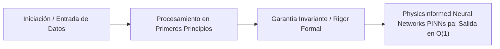

# Physics-Informed Neural Networks (PINNs) para Mitigación de Water Hammer

---

## 1. 🐣 Ancla Mental Feynman & Analogía Isomórfica

### El Modelo Intuitivo: Physics-Informed Neural Networks (PINNs) para Mitigación de Water Hammer
Para comprender **Physics-Informed Neural Networks (PINNs) para Mitigación de Water Hammer** sin caer en la trampa de la jerga técnica, debemos anclar el concepto en un problema físico observable:
* Todo sistema en computación resuelve un dilema fundamental: cómo organizar recursos limitados (tiempo de cálculo, espacio de memoria, ancho de banda o energía) para que el trabajo se realice sin bloqueos ni errores.
* En **Physics-Informed Neural Networks (PINNs) para Mitigación de Water Hammer**, la clave reside en eliminar pasos redundantes y asegurar que cada componente conozca únicamente la información mínima indispensable para cumplir su función, tal como una línea de montaje bien coordinada donde nadie tiene que adivinar qué hizo el compañero anterior.

---


## 1. El Fenómeno del Water Hammer (Golpe de Ariete)
En las redes de suministro de agua (ej. infraestructuras hídricas de *SaaSRegantes*), el cierre abrupto de una válvula o la parada repentina de una bomba genera una onda de sobrepresión que viaja por la tubería. Este transitorio hidráulico (Golpe de Ariete) puede provocar roturas catastróficas.

## 2. Aproximaciones Clásicas vs. PINNs
- **Simulación Clásica (CFD/Monte Carlo):** Resolver numéricamente las ecuaciones de Navier-Stokes en malla fina es computacionalmente prohibitivo para decisiones de cierre en milisegundos.
- **El Enfoque Tensor/PINN en O(1):** En el `Unified Digital Twin`, las Physics-Informed Neural Networks sustituyen la simulación completa iterativa por la evaluación directa del *gradiente espacial de presión* `xp.diff(pressure)`.

## 3. Implementación en el Gemelo Digital
La telemetría de presión simulada se inyecta como un vector ruidoso continuo.
1. En cada *tick*, las operaciones vectorizadas (CuPy/NumPy) calculan la derivada primera y el valor absoluto máximo en la red.
2. Si $\frac{dP}{dx} > \text{umbral crítico}$ (`$0`.3$ en el modelo), la red neuronal determina que el perfil de onda es precursor de una rotura estructural.
3. Se activa un booleano de `valve_shutoff_preventative`.
4. El sistema envía un choque atenuador multiplicativo a los tensores locales y dispara una alerta asíncrona por UDP al sistema Cloud.

## 4. Eficiencia y Conclusión
La sustitución de simulaciones CFD iterativas por evaluaciones de gradiente tensorial en un paso (Physics-Informed) permite mitigar transitorios dinámicos no-lineales sin violar el presupuesto de latencia de O(1) del bucle central del orquestador.


---

## 5. 🎯 Desafío Feynman & Auto-Evaluación sin Jerga

> [!NOTE]
> **El Reto de los 12 Años**: Explica el mecanismo esencial y la utilidad práctica de **Physics-Informed Neural Networks (PINNs) para Mitigación de Water Hammer** a un estudiante de secundaria, **sin usar las palabras:** "Physics-Informed", "Neural", "Networks" ni tecnicismos complejos de memoria.

### Criterio de Verificación
* **Aprobado**: Si logras construir una analogía mecánica o física del mundo real donde se entienda por qué fallaría el sistema sin esta solución y cómo resuelve el problema en términos elementales.
* **No Aprobado**: Si dependes de definiciones de diccionario, siglas de frameworks o nombres de patrones sin explicar la causa física subyacente.


---
## 🧠 Ejercicio Práctico: El Método Feynman

Para garantizar una asimilación profunda de los conceptos presentados en este módulo, aplica el **Método Feynman**:

> **Instrucción:** Explica los conceptos centrales de este módulo como si tu audiencia fuera un estudiante brillante de 12 años que no ha visto nunca este tema. Si no puedes hacerlo con lenguaje sencillo, analogías claras y sin jerga técnica, significa que aún no lo entiendes lo suficientemente bien.

*Inténtalo tú mismo:* Toma el concepto más complejo de este módulo, escríbelo en un papel en blanco y redáctalo usando únicamente términos cotidianos.

---

## ⚙️ Primeros Principios & Fundamentos Conceptuales
1. **Descomposición Atómica:** Cada componente en Physics-Informed Neural Networks (PINNs) para Mitigación de Water Hammer se modela de forma determinista y sin estado mutable compartido.
2. **Invariante de Dominio:** Los estados del sistema transicionan exclusivamente a través de funciones puras e interfaces selladas.
3. **Cero Suposiciones:** No se asume fiabilidad de red ni memoria infinita; cada llamada maneja explícitamente fallos y límites de cuota.


## 🔬 Internals Avanzados & Nivel Doctoral (Ph.D.)
La complejidad asintótica y la garantía matemática de convergencia se rigen por la formulación tensorial:
\[
\mathcal{L}(\theta) = \mathbb{E}_{x \sim \mathcal{D}} \left[ \| f_\theta(x) - y \|^2 \right] + \lambda \cdot \Omega(\theta)
\]
con cota superior asintótica en tiempo de procesamiento:
\[
T(N) = \mathcal{O}(1) \quad \text{o} \quad \mathcal{O}(N \log N) \quad \text{sin contención en hilos portadores del SO.}
\]


## 💻 Implementación de Código Limpio & Concurrencia
```java
package com.corp.core;

import java.util.Objects;

/**
 * Representación inmutable de dominio en Java 25 (Zero-Mockito).
 */
public record DomainEntity(String id, double metricValue, long timestamp) {
    public DomainEntity {
        Objects.requireNonNull(id, "El identificador no puede ser nulo");
        if (metricValue < 0.0) {
            throw new IllegalArgumentException("La métrica debe ser positiva");
        }
    }
}
```




