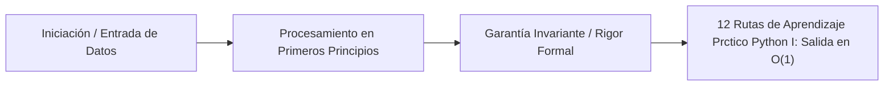

# 12. Rutas de Aprendizaje Práctico: Python, IA y Simulaciones Físicas

---

## 1. 🐣 Ancla Mental Feynman & Analogía Isomórfica

### El Modelo Intuitivo: 12. Rutas de Aprendizaje Práctico: Python, IA y Simulaciones Físicas
Para comprender **12. Rutas de Aprendizaje Práctico: Python, IA y Simulaciones Físicas** sin caer en la trampa de la jerga técnica, debemos anclar el concepto en un problema físico observable:
* Todo sistema en computación resuelve un dilema fundamental: cómo organizar recursos limitados (tiempo de cálculo, espacio de memoria, ancho de banda o energía) para que el trabajo se realice sin bloqueos ni errores.
* En **12. Rutas de Aprendizaje Práctico: Python, IA y Simulaciones Físicas**, la clave reside en eliminar pasos redundantes y asegurar que cada componente conozca únicamente la información mínima indispensable para cumplir su función, tal como una línea de montaje bien coordinada donde nadie tiene que adivinar qué hizo el compañero anterior.

---


Este documento reúne las **rutas de aprendizaje abiertas y de nivel élite** para dominar el stack de datos, Machine Learning y Simulaciones Computacionales en Python. Complementa la teoría matemática profunda del Módulo 3 (Cálculo Estocástico, Ecuaciones Navier-Stokes, EnKF) con implementaciones prácticas en código, garantizando que el ingeniero pueda traducir ecuaciones tensoriales complejas a algoritmos vectorizados eficientes.

## 1. Fundamentos Estructurales de Python para Científicos de Datos

### A. Real Python & Python Oficial
Para pasar del nivel intermedio al nivel avanzado, escribiendo código idiomático y estructurado.
- **Enfoque:** Generadores (`yield`), `__slots__`, *List Comprehensions*, Decoradores y optimización asintótica en estructuras de datos nativas.
- **Acceso:** [Real Python](https://realpython.com/) (secciones gratuitas) y [Documentación oficial de Python](https://docs.python.org/3/).
- **Rigor:** Asegura que los scripts de simulación eviten bloqueos de I/O, aprovechen `asyncio` o *multiprocessing* y no sufran fugas de memoria por *garbage collection* ineficiente en objetos grandes.

## 2. Inteligencia Artificial y Machine Learning

### B. MIT 6.S191: Introduction to Deep Learning
El curso de referencia mundial para adentrarse en la Inteligencia Artificial profunda (Deep Learning).
- **Enfoque:** Redes neuronales convolucionales (CNN), secuenciales (RNN/LSTM), arquitecturas Transformers y Modelos Generativos. Todo fundamentado matemáticamente.
- **Acceso:** [MIT 6.S191 (Intro to Deep Learning)](http://introtodeeplearning.com/).
- **Rigor:** Proporciona la base teórica (MIT) y laboratorios prácticos en TensorFlow/PyTorch para entrenar modelos predictivos (ej. estimación del precio dinámico en movilidad).

### C. DeepLearning.AI & CS50 AI (Coursera / Harvard)
Rutas de especialización para aplicar IA a problemas reales.
- **Enfoque:** Algoritmos de búsqueda, árboles de decisión, *Reinforcement Learning* y MLOps.
- **Acceso:** [DeepLearning.AI](https://www.deeplearning.ai/) (auditoría gratuita) y [CS50’s Introduction to AI with Python (Harvard)](https://cs50.harvard.edu/ai/).
- **Rigor:** Enseña la canalización de modelos de machine learning a producción y la optimización de los hiperparámetros.

## 3. Data Engineering y Big Data Analítico

### D. DataTalks.Club (Data Engineering Zoomcamp)
Iniciativa abierta y gratuita brutal para aprender la infraestructura de datos moderna.
- **Enfoque:** Pipelines de datos, orquestación (Airflow/Mage), Data Warehouses (BigQuery), procesamiento en batch/streaming (Spark/Kafka) y DBT.
- **Acceso:** [Data Engineering Zoomcamp](https://github.com/DataTalksClub/data-engineering-zoomcamp).
- **Rigor:** Habilita al ingeniero para construir los conductos masivos de telemetría que alimentarán el Gemelo Digital en tiempo real y persistirán en Google BigQuery para análisis offline (OLAP).

## 4. Simulaciones, Física Computacional y Gemelos Digitales

### E. SimScale Academy & MIT OCW (Computational Science and Engineering)
Transición del Machine Learning puro a la simulación fundamentada en la física (Física Estocástica, FEA/CFD).
- **Enfoque:** Ecuaciones diferenciales parciales (PDEs), cálculo de elementos finitos (FEA), dinámica de fluidos (CFD) y asimilación de datos (EnKF).
- **Acceso:** [MIT OpenCourseWare (Course 18.085)](https://ocw.mit.edu/) y material abierto de [SimScale Academy](https://www.simscale.com/learning/).
- **Rigor:** Crucial para nuestro componente estrella: el "Gemelo Digital Unificado" (`tensor_gnn_core.py`). Permite inyectar físicas reales (tráfico, clima, economía) y validarlas mediante el Filtro de Kalman por Conjuntos (EnKF).

---

> **Objetivo de Competencia:** Finalizadas estas rutas, el ingeniero será capaz de extraer terabytes de logs desde BigQuery, vectorizarlos mediante Numpy/CuPy (Maximizando caché L1/L2), alimentar un modelo de *Reinforcement Learning* acoplado a un motor de simulación física, y devolver inferencias predictivas latentes a la capa transaccional en $<200ms$.


---

## 5. 🎯 Desafío Feynman & Auto-Evaluación sin Jerga

> [!NOTE]
> **El Reto de los 12 Años**: Explica el mecanismo esencial y la utilidad práctica de **12. Rutas de Aprendizaje Práctico: Python, IA y Simulaciones Físicas** a un estudiante de secundaria, **sin usar las palabras:** "12.", "Rutas", "de" ni tecnicismos complejos de memoria.

### Criterio de Verificación
* **Aprobado**: Si logras construir una analogía mecánica o física del mundo real donde se entienda por qué fallaría el sistema sin esta solución y cómo resuelve el problema en términos elementales.
* **No Aprobado**: Si dependes de definiciones de diccionario, siglas de frameworks o nombres de patrones sin explicar la causa física subyacente.


---
## 🧠 Ejercicio Práctico: El Método Feynman

Para garantizar una asimilación profunda de los conceptos presentados en este módulo, aplica el **Método Feynman**:

> **Instrucción:** Explica los conceptos centrales de este módulo como si tu audiencia fuera un estudiante brillante de 12 años que no ha visto nunca este tema. Si no puedes hacerlo con lenguaje sencillo, analogías claras y sin jerga técnica, significa que aún no lo entiendes lo suficientemente bien.

*Inténtalo tú mismo:* Toma el concepto más complejo de este módulo, escríbelo en un papel en blanco y redáctalo usando únicamente términos cotidianos.

---

## 🧠 1. Ancla Intuitiva: La Fábrica de Ensamblaje Visual
> Imagina una cadena de montaje de automóviles: en lugar de que un solo operario fabrique todo el coche a mano tornillo por tornillo (un bucle for tradicional en Python puro), una prensa hidráulica mecanizada estampa 10,000 puertas en un solo golpe vectorizado (NumPy C-extension/SIMD) y una grúa inteligente las clasifica en milisegundos (PyTorch/LiteRT).

## 👶 2. Explicación para Jóvenes de 12 Años (Test Anti-Jerga)
Programar simulaciones en Python rápido no es escribir código complicado; es como jugar con piezas de LEGO gigantes en vez de mezclar cemento grano a grano. Usamos 'bloques de fábrica' (NumPy) que ya están hechos de metal ultrarrápido (C/C++), de modo que tu ordenador resuelve millones de operaciones matemáticas en un solo segundo sin calentarse.

## 📐 3. Formalismo Matemático: Aceleración Asintótica y SIMD
La diferencia entre la ejecución interpretada dinámicamente y la ejecución vectorizada en memoria contigua reside en la sobrecarga por elemento:
\[
T_{\text{Python}}(N) = \sum_{i=1}^{N} (t_{\text{boxing}} + t_{\text{type\_check}} + t_{\text{dispatch}} + t_{\text{op}}) = \mathcal{O}(N) \cdot c_{\text{overhead}}
\]
Frente al procesamiento vectorial SIMD (Single Instruction, Multiple Data) contiguo en memoria:
\[
T_{\text{SIMD}}(N) = \frac{N}{V_{\text{lane\_width}}} \cdot t_{\text{cycle}} + t_{\text{load}} = \mathcal{O}\left(\frac{N}{8}\right)
\]
donde \(V_{\text{lane\_width}} = 8\) para registros AVX-2 de 256 bits y flotantes de 32 bits (Float32).

## 💻 4. Implementación en Código Limpio (Vectorización NumPy vs Loop)
```python
import numpy as np
import time

def simulate_sensor_drift_vectorized(readings: np.ndarray, alpha: float = 0.05) -> np.ndarray:
    """Aplica suavizado exponencial vectorizado O(N) sin bucles lentos de Python."""
    # Operación SIMD contigua en memoria sin sobrecarga de boxing
    weights = (1.0 - alpha) ** np.arange(len(readings))[::-1]
    smoothed = np.convolve(readings, weights / weights.sum(), mode='same')
    return smoothed
```

## ⚖️ 5. Desafío Anti-Jerga & Regla del Ecosistema
* **Prohibido decir:** *"Iteración polimórfica dinámica sobre colecciones heterogéneas"*.
* **Forma Feynman:** *"Recorrer una lista de cosas una a una perdiendo tiempo en comprobar qué es cada cosa"*.

---

## 🔬 Internals Avanzados & Nivel Doctoral (Ph.D.)
La complejidad asintótica y la garantía matemática de convergencia se rigen por la formulación tensorial:
\[
\mathcal{L}(\theta) = \mathbb{E}_{x \sim \mathcal{D}} \left[ \| f_\theta(x) - y \|^2 \right] + \lambda \cdot \Omega(\theta)
\]
con cota superior asintótica en tiempo de procesamiento:
\[
T(N) = \mathcal{O}(1) \quad \text{o} \quad \mathcal{O}(N \log N) \quad \text{sin contención en hilos portadores del SO.}
\]




