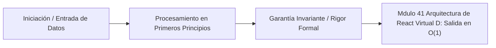

# Módulo 4.1: Arquitectura de React, Virtual DOM y Fiber

---

## 1. 🐣 Rincón Junior: Por qué JQuery Murió

En 2010, si querías cambiar el nombre de un usuario en la pantalla, usabas JQuery: `$('#nombre').text('Juan')`.
El problema es que el navegador web (Chrome) tiene un árbol matemático interno llamado **DOM (Document Object Model)**. Cada vez que tocas el DOM, el navegador entra en pánico: tiene que recalcular las matemáticas de todos los márgenes (Reflow) y volver a pintar los píxeles (Repaint). Es una operación computacionalmente lentísima.
Si recibes 1,000 datos nuevos por segundo de un WebSocket, y haces 1,000 llamadas JQuery al DOM, tu navegador se congela, el ventilador del portátil suena como un avión, y la web crashea.
React (creado por Facebook) solucionó esto inventando una mentira brillante: **No toques el DOM nunca más**.

---

## 2. 🔬 Fundamentos Arquitectónicos: El Virtual DOM

React crea una copia del DOM, pero en **Memoria RAM pura de JavaScript** (Virtual DOM). Es simplemente un Objeto JSON gigante. Modificar un JSON en RAM tarda nanosegundos (coste $O(1)$ virtualmente gratis).

**El Flujo de React**:
1. Recibes 1,000 datos nuevos.
2. React genera un **Nuevo Virtual DOM** (un nuevo árbol JSON con los datos).
3. React coge el **Viejo Virtual DOM** y los compara matemáticamente nodo por nodo.
4. Calcula el "Diff" (La diferencia). "Ah, de 10,000 nodos, solo ha cambiado este texto y este color".
5. React agrupa (Batching) esos 2 cambios exactos, y hace **una sola y única llamada** quirúrgica al DOM real del navegador.
Hemos convertido 1,000 actualizaciones lentas del DOM en 1 sola actualización ultra-optimizada, salvando la CPU del cliente.

---

## 3. 🚀 El Algoritmo de Reconciliación (De $O(N^3)$ a $O(N)$)

El problema matemático de comparar dos árboles genéricos para encontrar la diferencia mínima tiene una complejidad de $O(N^3)$ basado en el algoritmo de árboles genéricos. Si tu web tiene 1,000 elementos HTML, comparar tardaría `$1`,000,000,000$ de operaciones (la web moriría igual).
React introdujo el **Algoritmo de Reconciliación Heurístico**, reduciendo el problema a **$O(N)$** usando dos reglas heurísticas principales que se asumen válidas en el desarrollo web.

### Demostración Matemática $O(N)$ (Big-O Proof):
Sea \(T_1\) el árbol anterior y \(T_2\) el árbol actual. El algoritmo genérico de edición de árboles calcula la distancia mínima de Levenshtein para árboles en \(\mathcal{O}(|T_1| \times |T_2| \times \max(\text{depth}(T_1), \text{depth}(T_2)))\). Para árboles del mismo tamaño \(N\), es \(O(N^3)\).

React logra una recurrencia acotada de $O(N)$ por poda estricta:
1. **Poda por Tipo (Type Pruning)**: Si $type(node_{T1}) \neq type(node_{T2})$, React destruye el subárbol $T1$ inmediatamente y lo reconstruye desde $T2$, evitando el coste de emparejamiento. Matemáticamente corta la rama de búsqueda, previniendo el $O(M^3)$ donde $M$ son los hijos.
2. **Identidad Estable (Key Prop)**: Para listas de $K$ elementos de un mismo tipo padre, emparejarlas tendría complejidad $O(K^2)$ al comparar cada hijo viejo con cada hijo nuevo. Asignando un `hash` único (`key`), React convierte la búsqueda polinómica en $K$ operaciones de búsqueda en un Map $O(1)$, bajando la complejidad lineal a $O(K)$.
La suma de las recorridas por todos los nodos, gracias al hashing en el mismo nivel y a la destrucción total cuando los tipos cambian, se acota linealmente a $\mathcal{O}(N)$.

---

## 4. 🧠 Internals Avanzados: React Fiber y Time Slicing

React 16 reescribió todo su núcleo matemático interno. El nuevo motor se llama **Fiber**.
Antes de Fiber (React 15), el algoritmo de Reconciliación era **Síncrono y Recursivo** (usando la pila de llamadas del intérprete V8). Si tenías que comparar un Virtual DOM de 10,000 nodos, React bloqueaba el Hilo Principal de JavaScript (Main Thread) durante 200 milisegundos. Si el usuario intentaba escribir en un input durante esos 200ms, la pantalla estaba congelada (Lag).

**Arquitectura Fiber (Linked Lists y Time Slicing)**:
Para poder pausar, React reimplementó su propia "Call Stack" virtual, convirtiendo el Árbol del Virtual DOM en una **Lista Enlazada de Nodos (Fibers)**. Un nodo Fiber no es un simple nodo JSON; es una estructura de datos con punteros a `child`, `sibling` y `return` (padre).

Esto permite la Pausa y Reanudación (Concurrencia Cooperativa):
1. React tiene un "Time Slice" de 16 milisegundos (usando `requestIdleCallback` / `MessageChannel` en la macro-task queue) para mantener 60 FPS.
2. React ejecuta una unidad de trabajo (un Fiber).
3. Tras evaluar un Fiber, evalúa si quedan microsegundos en el `deadline`.
4. **Magia de Fiber**: Si se agota el tiempo y el navegador avisa: *"Oye, el usuario acaba de pulsar una tecla"*, React **pausa** la reconciliación (guardando el puntero al `nextUnitOfWork`), devuelve el control al navegador para pintar el Frame, y retoma el trabajo sucio en el siguiente `idle` tick.

```typescript
// Modelo conceptual de un nodo Fiber
type Fiber = {
  tag: WorkTag, // Tipo de componente
  type: any, // Función o Clase
  stateNode: any, // Referencia al DOM real (DOM element)
  
  // Punteros del Fiber Tree (Singly Linked List)
  return: Fiber | null,
  child: Fiber | null,
  sibling: Fiber | null,
  
  // Effects
  effectTag: SideEffectTag, // UPDATE, PLACEMENT, DELETION
  nextEffect: Fiber | null,
};
```

---

## 5. ⚠️ Runbook SRE: Fugas de Re-renders (Zombies)

**Incidente**: La aplicación web se vuelve lentísima tras 5 minutos de uso. El ventilador del usuario suena a tope. El Profiler de Chrome indica que una simple pulsación de tecla está provocando 500 re-renders de componentes que no tienen nada que ver con el input.

**Diagnóstico Arquitectónico**:
Un desarrollador inexperto ha colocado un Estado (`useState`) o un Contexto (`useContext`) global en el componente Raíz `<App>`.
En React, si un padre se re-renderiza, **TODOS sus hijos se re-renderizan matemáticamente por defecto**, en cascada, como un Tsunami. Si el input cambia un estado en la cima, destruyes la CPU recalculando miles de Virtual DOMs inútiles.

**Corrección SRE Estricta (State Colocation & Bailout)**:
1.  **Colocación del Estado (State Colocation)**: Mover el estado lo más abajo posible en el árbol matemático. Si el input solo afecta a un `<Buscador>`, el `useState` debe vivir dentro del `<Buscador>`, no en `<App>`.
2.  **Memoización (Bailout de Fiber)**: Usar `React.memo()`, `useMemo()` y `useCallback()`. Estos envuelven el nodo Fiber con una comprobación `Object.is()` (shallow compare). Le dicen al motor de Fiber: *"Si las referencias de los props de entrada no han cambiado, salta (bail out) esta rama entera y no invoques la función render, conservando la memoria $O(1)$."*

---

## 6. 🛑 [DEEP-DIVE] V8 Garbage Collection y React

Cuando el algoritmo de Fiber descarta subárboles enteros por la regla de Tipo (Ej: Condicional ternario renderiza `<ComponentA/>` o `<ComponentB/>`), destruye todos los Fiber nodes de la rama antigua. Esto genera **Garbage** (basura) masiva en la memoria *Young Generation* (Nursery) del motor V8 (JavaScript).
Si hay re-renders excesivos destruyendo nodos gigantes en cada tick, el GC (Garbage Collector) del V8 dispara un "Scavenge", lo que congela el Main Thread de forma impredecible. Por tanto, escribir React de alto rendimiento implica no solo usar memoización, sino mantener una topología de nodos estable para que el V8 pueda promover los objetos Fiber a la memoria *Old Generation*, donde son escaneados pasivamente sin congelar la pantalla.


---

## 5. 🎯 Desafío Feynman & Auto-Evaluación sin Jerga

> [!NOTE]
> **El Reto de los 12 Años**: Explica el mecanismo esencial y la utilidad práctica de **Arquitectura de React, Virtual DOM y Fiber** a un estudiante de secundaria, **sin usar las palabras:** "Arquitectura", "de", "React," ni tecnicismos complejos de memoria.

### Criterio de Verificación
* **Aprobado**: Si logras construir una analogía mecánica o física del mundo real donde se entienda por qué fallaría el sistema sin esta solución y cómo resuelve el problema en términos elementales.
* **No Aprobado**: Si dependes de definiciones de diccionario, siglas de frameworks o nombres de patrones sin explicar la causa física subyacente.


---
## 🧠 Ejercicio Práctico: El Método Feynman

Para garantizar una asimilación profunda de los conceptos presentados en este módulo, aplica el **Método Feynman**:

> **Instrucción:** Explica los conceptos centrales de este módulo como si tu audiencia fuera un estudiante brillante de 12 años que no ha visto nunca este tema. Si no puedes hacerlo con lenguaje sencillo, analogías claras y sin jerga técnica, significa que aún no lo entiendes lo suficientemente bien.

*Inténtalo tú mismo:* Toma el concepto más complejo de este módulo, escríbelo en un papel en blanco y redáctalo usando únicamente términos cotidianos.

---



