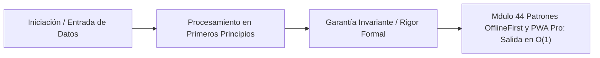

# Módulo 4.4: Patrones Offline-First y PWA (Progressive Web Apps)

---

## 1. 🐣 Rincón Junior: El Dinosaurio del Navegador

A todos nos ha pasado: estás rellenando un formulario web gigantesco en el tren, pasas por un túnel, pierdes cobertura (4G a Edge o sin red), le das al botón de "Enviar", el navegador se queda en blanco intentando cargar, y te muestra la pantalla del Dinosaurio de Chrome. Has perdido tus 20 minutos de trabajo.
El modelo clásico de la Web asume que la red es perfecta e infinita.
El paradigma **Offline-First** asume matemáticamente que la red no existe (está rota por defecto). Tu aplicación web debe arrancar instantáneamente, permitir al usuario trabajar, navegar y crear datos sin conexión a internet, y luego sincronizarse mágicamente con el servidor cuando la cobertura vuelva, comportándose como una App nativa. A esto le llamamos una **PWA**.

---

## 2. 🔬 Fundamentos Arquitectónicos: Service Workers

El corazón de una PWA es un proxy de red programable directamente instalado en el ordenador o móvil del usuario: El **Service Worker**.

1.  Es un archivo JavaScript que corre en un hilo secundario (separado de tu React o de tu web).
2.  Tiene poder absoluto: **Intercepta físicamente el 100% de las peticiones de red** (`fetch`) que salen de tu pestaña antes de que toquen Internet.
3.  Si la web pide un `logo.png`, el Service Worker detiene la petición HTTP, la analiza, y dice: *"Oye, tengo este logo guardado en la memoria caché del disco duro desde ayer. Te lo devuelvo inmediatamente"*. 
4.  La red ni siquiera es consultada. La web carga en 10 milisegundos en el túnel sin cobertura.

**Ciclo de Vida Inmortal**: El Service Worker puede despertar y ejecutar código (por ejemplo, para procesar Notificaciones Push) incluso cuando la pestaña de tu aplicación web está cerrada.

---

## 3. 🚀 Arquitectura Práctica: Estrategias de Caché Matemáticas

Diseñar el Service Worker requiere elegir algoritmos lógicos para interceptar peticiones. Las más usadas (ej. vía Google Workbox):

1.  **Cache-First (Caché Primero)**: 
    *   *Uso*: Fuentes tipográficas, Logos, CSS. Archivos inmutables que nunca cambian.
    *   *Lógica*: Intercepta la petición. Mira la Caché. Si el archivo está ahí, lo devuelve al instante ($O(1)$ red). Si no está, lo descarga de internet, lo guarda en la caché para la próxima vez, y lo devuelve. 
2.  **Network-First (Red Primero)**:
    *   *Uso*: Un timeline de noticias, saldo bancario. Datos que cambian rápido.
    *   *Lógica*: Intenta descargar el JSON fresco de internet. Si hay internet y es rápido, te lo da fresco, y guarda una copia oculta en la Caché. Si vas en un túnel y la red falla (Timeout o error), intercepta el error, busca en la Caché, y devuelve el JSON de ayer. "Es mejor mostrar noticias viejas que un dinosaurio".
3.  **Stale-While-Revalidate (El Patrón Rey)**:
    *   *Uso*: Avatares de usuario, listado de productos de una tienda.
    *   *Lógica de dos tiempos*: Intercepta la petición. Devuelve la versión de la Caché (vieja) **instantáneamente** para que el usuario no vea pantallas de carga. Simultáneamente y de forma asíncrona (Background), se conecta a internet, baja la versión nueva, actualiza la caché silente, y la pantalla se refrescará con los datos nuevos (si hubo cambios). Máxima velocidad y eventual consistencia.

---

## 4. 🧠 Internals Avanzados: IndexedDB y Background Sync

La Caché del Service Worker es para archivos estáticos (JS, CSS, Imágenes).
¿Dónde guardamos en el móvil del usuario los gigabytes de datos complejos (el Gemelo Digital, miles de filas de viajes, mensajes de chat) de forma segura y rápida?
**Local Storage no sirve** (máximo 5 MB y bloquea el hilo principal porque es síncrono).
Usamos **IndexedDB**. Una base de datos NoSQL real integrada en el Kernel de Chrome/Safari. Permite almacenar gigabytes de datos, tiene transacciones e índices matemáticos de búsqueda, y es 100% asíncrona.

**Background Sync (Sincronización en Segundo Plano)**:
El usuario rellena un formulario de Inspección (15 fotos) sin cobertura en un sótano.
1. Tu JS detecta que no hay red. Guarda los datos en IndexedDB.
2. Usas la API de Service Worker para registrar una etiqueta: `navigator.serviceWorker.ready.then(sw => sw.sync.register('subir-inspeccion'))`.
3. El usuario cierra el móvil y se va.
4. Dos horas después, el móvil pilla WiFi. El Sistema Operativo (Android) detecta la red, "despierta" a tu Service Worker cerrado.
5. El Service Worker saca los datos de IndexedDB y los envía a tu API por POST. ¡Magia! El dato nunca se pierde.

---

## 5. ⚠️ Runbook SRE: El Apocalipsis de la PWA Inmortal (Cache Poisoning Accidental)

**Incidente**: Has desplegado la Versión 2.0 de tu web (con nueva API). Tus desarrolladores locales ven la versión nueva, pero los clientes te llaman furiosos diciendo que la web está rota y siguen viendo el diseño viejo, a pesar de que han recargado la pestaña 50 veces y reiniciado el ordenador.

**Diagnóstico Arquitectónico (El Anti-Patrón Cache-First del Service Worker)**:
Configuraste mal la regla del Service Worker y aplicaste `Cache-First` también al archivo principal `index.html` o al propio archivo `service-worker.js`.
El navegador del usuario tiene el código de la Versión 1.0. Cuando pulsa F5, el Service Worker intercepta y dice: "Tengo `index.html` en la Caché, toma viejo!".
**Tu aplicación se ha vuelto inmortal en las máquinas de tus clientes**. La web está desconectada para siempre de tus servidores, y nunca descargará la Versión 2.0 porque su propio escudo (Service Worker) impide que los usuarios contacten contigo.

**Solución SRE/Arquitectónica de Emergencia**:
1.  **Regla de Oro Inviolable**: El archivo `service-worker.js` y el `index.html` **JAMÁS** deben estar oxidados en la caché del Service Worker. Deben servirse con cabeceras HTTP de red estrictas `Cache-Control: no-cache` y tener el patrón `Network-First`.
2.  Si cometiste el error y tus usuarios están "infectados", debes enviar a soporte técnico para pedirles que abran las *DevTools de Chrome $\rightarrow$ Application $\rightarrow$ Clear Site Data $\rightarrow$ Unregister Service Worker*. (Es un desastre reputacional masivo de nivel 1). 
3.  Implementar siempre librerías como Google Workbox que controlan la limpieza asíncrona de cachés obsoletas y fuerzan el reciclaje del Service Worker viejo cuando detectan un hash distinto.

---
---

# 🛑 [DEEP-DIVE] Sincronización Matemática Distribuida (CRDTs en IndexedDB)

El verdadero reto Offline-First no es guardar datos offline, sino la **Reconciliación de Conflictos** cuando vuelve la conexión a red. Si Alice (offline en Nueva York) y Bob (offline en Madrid) modifican el mismo documento JSON, ¿qué versión aplasta a la otra cuando ambos recuperan la señal de red? 
Locking de base de datos no es posible porque los nodos están offline.

## 6. Conflict-free Replicated Data Types (CRDTs)

Para lograr una consistencia eventual garantizada sin servidor maestro (peer-to-peer / descentralizada), utilizamos estructuras matemáticas CRDT (tipos de datos replicados libres de conflictos) inyectadas sobre IndexedDB.

Un CRDT garantiza que si dos nodos asimilan el mismo conjunto de actualizaciones matemáticas, sin importar el orden asíncrono o la latencia de la red en la que llegaron, el estado final convergerá exactamente al mismo resultado determinista.

### Propiedades Algebraicas Esenciales:
El estado debe evolucionar mediante una operación de "merge" ($\sqcup$) que cumpla en semirretículos (semi-lattice):
1. **Conmutatividad**: $A \sqcup B = B \sqcup A$ (El orden en que llegan los paquetes de red no altera el documento).
2. **Asociatividad**: $(A \sqcup B) \sqcup C = A \sqcup (B \sqcup C)$ (El enrutamiento intermedio no afecta).
3. **Idempotencia**: $A \sqcup A = A$ (Reenviar el mismo paquete por un re-intento de Background Sync no duplica ni corrompe los datos).

### LWW-Element-Set (Last-Writer-Wins) 

En IndexedDB, en lugar de guardar filas de SQL mutables, construimos un modelo lógico en base a eventos inmutables (Event Sourcing) acompañados de un *Reloj Lógico Híbrido (HLC)* o un *Reloj Vectorial (Vector Clock)*.

```json
// En lugar de guardar esto en IndexedDB:
{ "id": 1, "status": "APPROVED" }

// Un CRDT de LWW guardará:
{
  "id": 1,
  "status": {
    "value": "APPROVED",
    "timestamp": 1691234567, // HLC (Hybrid Logical Clock)
    "peer_id": "alice_device_99"
  }
}
```

**Algoritmo de Fusión (Merge Function)**
Cuando la conexión vuelve, el Service Worker lanza un Web Socket de sincronización enviando todos los deltas almacenados en IndexedDB hacia la base de datos distribuida (Ej: Cloud Firestore / Yjs / Automerge).
El algoritmo de resolución nunca bloquea (No Locks). Resuelve determinísticamente:
$$
\text{Merge}(V_A, V_B) = 
\begin{cases} 
V_A & \text{si } V_A.\text{timestamp} > V_B.\text{timestamp} \\
V_B & \text{si } V_B.\text{timestamp} > V_A.\text{timestamp} \\
\text{Sort}(V_A.\text{peer\_id}, V_B.\text{peer\_id}) & \text{si } V_A.\text{timestamp} == V_B.\text{timestamp} 
\end{cases}
$$

El uso de CRDTs en PWA sobre WebAssembly e IndexedDB es el estándar oro corporativo para arquitecturas verdaderamente desconectadas.


---

## 5. 🎯 Desafío Feynman & Auto-Evaluación sin Jerga

> [!NOTE]
> **El Reto de los 12 Años**: Explica el mecanismo esencial y la utilidad práctica de **Patrones Offline-First y PWA (Progressive Web Apps)** a un estudiante de secundaria, **sin usar las palabras:** "Patrones", "Offline-First", "y" ni tecnicismos complejos de memoria.

### Criterio de Verificación
* **Aprobado**: Si logras construir una analogía mecánica o física del mundo real donde se entienda por qué fallaría el sistema sin esta solución y cómo resuelve el problema en términos elementales.
* **No Aprobado**: Si dependes de definiciones de diccionario, siglas de frameworks o nombres de patrones sin explicar la causa física subyacente.


---
## 🧠 Ejercicio Práctico: El Método Feynman

Para garantizar una asimilación profunda de los conceptos presentados en este módulo, aplica el **Método Feynman**:

> **Instrucción:** Explica los conceptos centrales de este módulo como si tu audiencia fuera un estudiante brillante de 12 años que no ha visto nunca este tema. Si no puedes hacerlo con lenguaje sencillo, analogías claras y sin jerga técnica, significa que aún no lo entiendes lo suficientemente bien.

*Inténtalo tú mismo:* Toma el concepto más complejo de este módulo, escríbelo en un papel en blanco y redáctalo usando únicamente términos cotidianos.

---



