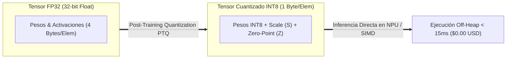

# 🤖 Cátedra de Edge AI, LiteRT INT8 & Razonamiento Neuro-Simbólico (Nivel MIT 6.S191 / Stanford AI)
## *Facultad VI: Cuantización INT8 con Google LiteRT, Operadores Off-Heap y Verificación Formal con SMT Solvers (Z3)*

---

### 🏛️ 1. Inferencia Local en Edge con Google LiteRT (INT8 Quantization)

El despliegue de modelos de Inteligencia Artificial en dispositivos periféricos (móviles Flutter en [`AppViajes`](file:///home/jaruiz/Desarrollo/AppViajes) y micro-controladores en [`SaaSRegantes`](file:///home/jaruiz/Desarrollo/SaaSRegantes)) exige latencias inferiores a \(15\text{ ms}\) y coste de infraestructura de `$0.00 USD/mes`.

#### Formulación Matemática de la Cuantización Afín Asimétrica (INT8)
La transformación de tensores de punto flotante \(x \in \mathbb{R}\) (FP32) a enteros de 8 bits \(q \in [-128, 127]\) (INT8) se rige por:

$$q = \text{round}\left(\frac{x}{S}\right) + Z$$

Donde:
- \(S \in \mathbb{R}^+\) es el **Factor de Escala (*Scale*)**:
  $$S = \frac{x_{\max} - x_{\min}}{q_{\max} - q_{\min}} = \frac{x_{\max} - x_{\min}}{255}$$
- \(Z \in \mathbb{Z}\) es el **Punto Cero (*Zero-Point*)**:
  $$Z = \text{round}\left(\frac{-x_{\min}}{S}\right) + q_{\min}$$



---

### 🔬 2. Razonamiento Neuro-Simbólico (Fusión de LLMs y SMT Solvers)

La arquitectura de la IA en Google Antigravity no confía ciegamente en salidas estocásticas de LLMs generativos. Se implementa un **Bucle Neuro-Simbólico de Dos Fases**:

1. **Fase 1 (Generación Probabilística con SLM / LLM)**:
   - El modelo local (ej. `deepseek-r1:8b` o `qwen2.5-coder:7b`) propone una solución, código o asignación logística.
2. **Fase 2 (Validación Deductiva Determinista con Z3 SMT Solver)**:
   - Las precondiciones, poscondiciones y restricciones de capacidad se traducen a fórmulas lógicas de primer orden (SMT-LIB2).
   - Si el solver `Z3` devuelve `UNSAT` (inviable o contradicción), la propuesta se veta automáticamente sin alucinaciones.

#### Ejemplo de Verificación SMT en Python (Z3 Solver)
```python
from z3 import Solver, Real, And, sat

# Verificar asignación de potencia en microred sin sobrecarga
s = Solver()
p_solar = Real('p_solar')
p_battery = Real('p_battery')
p_grid = Real('p_grid')
load_demand = 150.0  # kW

# Restricciones físicas inviolables (Leyes de Kirchhoff)
s.add(p_solar >= 0.0, p_solar <= 80.0)
s.add(p_battery >= -50.0, p_battery <= 50.0)
s.add(p_grid >= 0.0, p_grid <= 100.0)
s.add(p_solar + p_battery + p_grid == load_demand)

if s.check() == sat:
    m = s.model()
    print(f"✓ Solución formalmente verificada: Solar={m[p_solar]}, Battery={m[p_battery]}, Grid={m[p_grid]}")
else:
    print("❌ Inviable (VETO Neuro-Simbólico)")
```

---

### 💡 3. Analogía Feynman (El Arquitecto y el Inspector Estructural)

* **Metáfora del Arquitecto y el Inspector:**
  El modelo de IA generativo es como un arquitecto creativo que diseña un puente hermoso e innovador en papel (propuesta probabilística). El SMT Solver (Z3) es el inspector de cálculo de estructuras con las leyes de la física y la estática de Newton en la mano (verificador deductivo). El puente solo se construye si el inspector demuestra matemáticamente que los pilares soportan el peso sin colapsar. La creatividad está acotada por la infalibilidad de la lógica formal.

---

### 📚 Bibliografía de Cátedra
- De Moura, L., & Bjørner, N. (2008). *Z3: An efficient SMT solver*. TACAS.
- Jacob, B., et al. (2018). *Quantization and Training of Neural Networks for Efficient Integer-Arithmetic-Only Inference*. CVPR.
- Marcus, G. (2020). *The Next Decades in AI: Four Steps Towards Robust Artificial Intelligence*.
- Google AI (2024). *LiteRT: High-Performance On-Device AI Runtime*.
