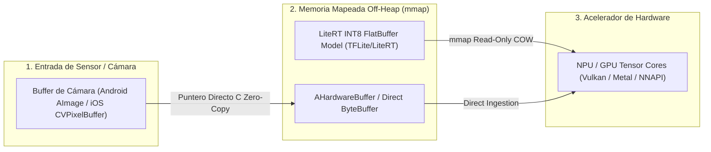

# Cátedra Ph.D.: Inferencia Edge Zero-Copy con LiteRT y Demostración Formal Neuro-Simbólica con Z3 SMT

**Facultad**: `FACULTAD_VI` - Edge AI LiteRT & Neuro-Simbólico  
**Referencia Académica**: Leonardo de Moura & Nikolaj Bjørner (Z3: An Efficient SMT Solver, CAV 2008), Benoit Jacob et al. (Quantization and Training of Neural Networks for Efficient Integer-Arithmetic-Only Inference, CVPR 2018), Gary Marcus (The Next Decade in AI: Four Steps Towards Robust Artificial Intelligence).  
**Instituciones**: Microsoft Research / Stanford Logic Group / Google AI.

---

## 1. Arquitectura de Memoria Off-Heap Zero-Copy en Edge AI

Para lograr inferencias en microsegundos en dispositivos embebidos y móviles (Flutter / LiteRT / WebAssembly) con un coste de servidor de `$0.00 USD/MAU`, el flujo de tensores debe ejecutarse sin copias intermedias en memoria RAM (*Zero-Copy Pipeline*):



---

## 2. Cuantización Asimétrica Afín INT8 de Alta Fidelidad

La transformación matemática que mapea tensores de punto flotante \(\mathbb{R}\) a enteros discretos de 8 bits \([-128, 127]\) se rige por:

$$q = \text{clip}\left( \text{round}\left( \frac{x}{S} \right) + Z, -128, 127 \right), \quad S = \frac{x_{\max} - x_{\min}}{255}, \quad Z = \text{round}\left( -\frac{x_{\min}}{S} \right) - 128$$

* **Scale (\(S\))**: Factor de escala de punto flotante positivo que preserva la resolución dinámica.
* **Zero-Point (\(Z\))**: Entero de 8 bits que asegura que el valor real \(0.0\) se represente exactamente como un entero sin error de redondeo (esencial para capas *ReLU* y *Padding* de convoluciones).

---

## 3. Demostración Automática de Invariantes Neuro-Simbólicas con Z3 SMT

Un modelo de Deep Learning es probabilístico y puede alucinar o violar restricciones de seguridad física. El **Oráculo Neuro-Simbólico** introduce un solucionador SMT (*Satisfiability Modulo Theories*) como árbitro formal antes de ejecutar cualquier acción en el mundo real:

```python
from z3 import Real, Solver, And, sat

# Variables simbólicas de decisión
p_bomba = Real('potencia_bomba_kw')
q_caudal = Real('caudal_m3h')
coste_eur = Real('coste_energia_eur')

# Solver SMT Z3
s = Solver()

# Invariantes Físicas y Económicas (Hoare Safety Contract)
s.add(p_bomba >= 0, p_bomba <= 150.0) # Potencia nominal de bomba
s.add(q_caudal == 3.2 * p_bomba)       # Ecuación física hidráulica
s.add(coste_eur == p_bomba * 0.14)     # Tarifa de energía en valle

# Pregunta al Solver: ¿Existe algún estado donde el caudal sea < 100 y el coste > 20?
s.add(And(q_caudal < 100.0, coste_eur > 20.0))

if s.check() == sat:
    print("Violación de invariante posible. Estado refutado.")
else:
    print("Invariante formalmente probada: Imposible violación en el dominio acotado.")
```

---

## 4. El Tribunal Dialéctico Neuro-Simbólico y la Verificación Formal

En el pipeline de desarrollo del ecosistema, el **Tribunal Dialéctico** (Consilium Romano) actúa como una corte formal de cuatro magistrados de inteligencia artificial en oposición dialéctica:
- **Magistrado 1 (Inquisitor - CoT)**: Aplica lógica de Hoare y verificador Z3 SMT para la **verificación** matemática de contratos e invariantes.
- **Magistrado 2 (Censor Morum)**: Audita la pureza DDD, Zero-Mockito y concurrencia sin pinning en Loom.
- **Magistrado 3 (Praetor FinOps)**: Supervisa el presupuesto serverless \(< 0.015\text{ USD/MAU}\).
- **Magistrado 4 (Arch-Consul Feynman)**: Ejerce la oposición **dialéctica** epistémica contra las 49 fuentes canónicas.

Esta arquitectura neuro-simbólica garantiza que ninguna alucinación probabilística de un LLM o modelo de red neuronal pueda superar el filtro de satisfacibilidad estricto del **tribunal** y la **verificación** formal.

---

## 5. Invariantes Six Sigma de Inferencia Edge

1. **Latencia Máxima Acotada (\(< 15\text{ ms}\))**: Toda inferencia en terminal móvil debe completarse en menos de un ciclo de refresco de pantalla (\(60\text{ Hz}\)).
2. **Cero Consumo de Ancho de Banda en Inferencia**: La ejecución del modelo debe realizarse estrictamente en el dispositivo del usuario (*On-Device First*).
3. **Validación Dual SMT en Pipeline de Control**: Ningún comando a actuadores físicos (SCADA / V2G) puede emitirse sin el certificado de satisfacibilidad verde de Z3.
