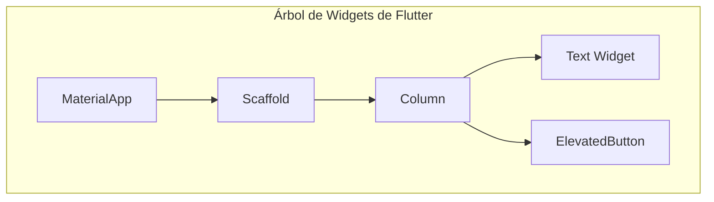

# Módulo 4 - Lección 2: Fundamentos de Dart & Flutter desde Cero

---

## 1. 🐣 Rincón Junior: Conceptos desde Cero & Analogías

### ¿Qué es Flutter y cómo funciona su árbol de Widgets?
En Flutter **"Todo es un Widget"**. Una pantalla no es más que un árbol de piezas cuadradas, redondas o con texto ensambladas unas dentro de otras.

Dart es el lenguaje cliente optimizado para Flutter que compila a código máquina nativo ARM64 tanto en Android como en iOS, logrando animaciones extremadamente fluidas a 60/120 imágenes por segundo.

---

## 2. 📐 Arquitectura Visual & Diagrama Mermaid



---

## 3. 🚀 Guía Paso a Paso e Implementación Práctica (0 a 100)

```dart
import 'package:flutter/material.dart';

// Definición de Widget inmutable en Flutter
class StatusBannerWidget extends StatelessWidget {
  final String title;
  final bool isOnline;
  final VoidCallback onTap;

  const StatusBannerWidget({
    Key? key,
    required this.title,
    required this.isOnline,
    required this.onTap,
  }) : super(key: key);

  @override
  Widget build(BuildContext context) {
    return Container(
      padding: const EdgeInsets.all(16.0),
      decoration: BoxDecoration(
        color: isOnline ? Colors.green.shade100 : Colors.red.shade100,
        borderRadius: BorderRadius.circular(8.0),
      ),
      child: Row(
        mainAxisAlignment: MainAxisAlignment.spaceBetween,
        children: [
          Text(title, style: const TextStyle(fontWeight: FontWeight.bold)),
          InkWell(
            onTap: onTap,
            child: Icon(isOnline ? Icons.check_circle : Icons.offline_bolt),
          ),
        ],
      ),
    );
  }
}
```

---

## 4. 🧠 Referencia Senior: Cheatsheet, Performance & Internals

### Flutter Render Pipeline & Engine

| Fase de Renderizado | Responsabilidad del Engine | Optimización |
| :--- | :--- | :--- |
| **Widget Tree** | Declaración inmutable de la UI | Usar constructores `const` para evitar reconstrucciones |
| **Element Tree** | Gestión del ciclo de vida e identidad (`Key`) | Reutilización de elementos DOM / Impeller |
| **RenderObject Tree** | Cálculo de geometrías, constraints y painting | Evitar layouts desbordados (Unbounded Height) |

---

## 5. ⚠️ Errores Comunes & Anti-Patrones (Gotchas)

1. **Reconstruir árboles de widgets pesados dentro del método `build()` sin `const`**:
   * *Síntoma*: Caídas de frames (Jank) durante el scroll de listas largas.
   * *Solución*: Utiliza siempre constructores `const` en los widgets estáticos.
