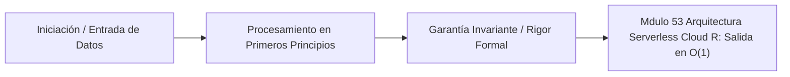

# Módulo 5.3: Arquitectura Serverless, Cloud Run y Knative

---

## 1. 🐣 Rincón Junior: Servidores que se apagan solos

Si alquilas una Máquina Virtual o un nodo de Kubernetes en Google Cloud, vas a pagar dinero (ej. 50€ al mes) las 24 horas del día. Si a las 4:00 AM tu web no tiene ninguna visita, estás tirando dinero a la basura porque el procesador está encendido sin hacer nada (Idle).
La arquitectura **Serverless (Sin Servidor)** no significa que no haya ordenadores físicos, significa que *tú no los gestionas y no los pagas cuando no se usan*.
Si tienes 0 usuarios, tienes 0 servidores encendidos y pagas `$0.00`. 
Cuando entra 1 usuario de golpe, Google enciende un contenedor en $<0.1$ segundos para atenderle, y te cobra solo por esos 50 milisegundos de uso. A este milagro matemático se le conoce como **Cloud Run (GCP)** o AWS Lambda.

---

## 2. 🔬 Fundamentos Arquitectónicos: Knative y Scale to Zero

Google Cloud Run es un producto comercial, pero por debajo es tecnología Open Source. Está construido sobre **Knative**, un componente que se instala encima de Kubernetes.

Knative tiene una característica matemática revolucionaria: el **Scale to Zero (Escalado a Cero)**.
1.  Si tu contenedor (Revisión) lleva 15 minutos sin recibir peticiones HTTP, Knative apaga físicamente tu aplicación de Spring Boot. K8s mata el Pod.
2.  **El Activador (Activator)**: Al apagarse tu app, Knative pone un pequeño proxy inverso (El Activador) en tu URL pública.
3.  Un usuario despistado entra a tu web. La petición choca contra el Activador.
4.  El Activador pone en pausa la petición HTTP (La retiene sin devolver error).
5.  Ordena a Kubernetes: *"¡Alarma! Arranca el contenedor de Spring Boot inmediatamente"*.
6.  En cuanto arranca, el Activador le pasa la petición al contenedor, que responde al usuario.

El usuario experimentó una lentitud de $\sim1$ segundo (Cold Start), pero tú te ahorraste cientos de euros en servidores ociosos.

---

## 3. 🚀 Arquitectura Práctica: Aislamiento (Sandboxing) Multi-Tenant

En Google Cloud Run, tu contenedor y el contenedor de un hacker malvado podrían estar corriendo en el mismo procesador físico de Google (Multi-Tenancy denso).
Vimos en el Módulo 5.1 que los contenedores (Cgroups, Namespaces) comparten el **Mismo Kernel de Linux** subyacente. Si hay un bug (Zero-Day) en el Kernel de Linux, el hacker podría escapar de su contenedor de Docker usando un *Privilege Escalation*, espiar tu memoria RAM, y robar las tarjetas de crédito de tus clientes.

Por lo tanto, la "Magia" Serverless de Cloud Run es imposible con contenedores Docker crudos. Requiere un blindaje criptográfico e interceptación de bajo nivel a nivel Kernel para ser comercialmente viable.

---

## 4. 🧠 Internals Avanzados: Mitigación del Cold Start

El gran enemigo del Serverless es el **Cold Start (Arranque en Frío)**.
Si tienes una app en Java Spring Boot, puede tardar 4 segundos en inicializarse (cargar clases, reflexión, Hibernate). Si el Activador de Knative la despierta, el usuario tiene que esperar 4 segundos mirando una pantalla en blanco. Es inaceptable comercialmente.

**Soluciones SRE/Arquitectónicas (Project Leyden / GraalVM)**:
1.  **AOT Compilation (GraalVM Native Image)**: Eliminar el compilador JIT (Just-In-Time) de Java. Compilar todo el código de Spring Boot a lenguaje Ensamblador nativo (.exe binario) en el momento de crear la imagen Docker. El tiempo de arranque baja de 4,000ms a **50ms**.
2.  **CDS (Class Data Sharing) / Project Leyden**: Una técnica donde Java pre-procesa las clases (que suelen ser inmutables) y guarda un archivo temporal `.jsa` en el disco duro. Al arrancar el contenedor en Cloud Run, la JVM mapea mágicamente ese archivo de disco directamente a la RAM en milisegundos, sin tener que analizar miles de archivos `.class`, acelerando el arranque masivamente.
3.  **CPU Boost de Cloud Run**: Una función matemática de GCP. Google detecta que tu contenedor acaba de nacer, y durante los primeros 5 segundos de vida, te "presta" 4 núcleos extra de CPU gratis, acelerando la inicialización del Framework al máximo de la física del servidor.

---

## 5. ⚠️ Runbook SRE: El Patrón State Exhaustion (Throttling)

**Incidente**: Tienes un Worker en Go desplegado en Cloud Run. Recibe 1,000 peticiones, crea 1,000 Goroutines para procesarlas en Background de forma asíncrona (escribiendo en base de datos), y **responde al usuario "OK, recibido"** de inmediato para ser rápido.
Sin embargo, notas en la base de datos que solo el 10% de los datos se procesan. El 90% se pierde en silencio, sin errores en los logs.

**Diagnóstico SRE Arquitectónico (El estrangulamiento de CPU)**:
El contrato legal de Cloud Run dice: *"Solo te cobro la CPU mientras estés procesando una petición HTTP activa"*.
Si tu código envía la respuesta `200 OK` al usuario en el milisegundo 10... para Google, la petición ha terminado.
Si tus Goroutines siguen trabajando en el milisegundo 11 (fuera del ciclo de vida de la petición), **Google estrangula físicamente la CPU de tu contenedor al `$1`\%$ (casi cero absoluto)**. Tus Goroutines se congelan matemáticamente, y el contenedor es apagado antes de que terminen de guardar en la BBDD.

**Solución SRE Estricta**:
*   En plataformas Serverless puras, el contenedor **NUNCA** debe hacer trabajo asíncrono o hilos en background después de devolver la respuesta HTTP (a menos que habilites el modo *CPU Always Allocated*, que rompe el ahorro de costes del 100%).
*   Si necesitas trabajo asíncrono, debes meter el mensaje en **Google Cloud Tasks o Pub/Sub**, y que Cloud Tasks despierte a OTRO contenedor de Cloud Run para que haga el trabajo de forma síncrona.

---
---

# 🛑 [DEEP-DIVE] gVisor y la Interceptación de System Calls (ptrace/KVM)

Para lograr el multi-tenancy masivo, Google creó **gVisor**. Es una reimplementación del Kernel de Linux escrita puramente en el lenguaje de programación **Go**, enfocada en la seguridad arquitectónica (Memory Safety).

En un sistema normal, si tu aplicación de Spring Boot o Go (Guest) quiere abrir un archivo (una operación altamente privilegiada), ejecuta una interrupción de CPU para invocar la llamada al sistema (`open()`), transfiriendo el control directamente al anillo más profundo del núcleo operativo físico (Host OS Kernel Ring 0). Un exploit en ese punto corrompe el servidor entero.

## 6. Arquitectura Dual de gVisor (Sentry y Gofer)
gVisor interpone una frontera estricta entre la Aplicación y el Kernel del Host.
1. **Sentry (El Kernel de User-Space)**: Emula el núcleo de Linux (archivos, red TCP/IP). Cuando la App emite una llamada al sistema (Syscall), el Sentry la atrapa.
2. **Gofer (Proxy de Archivos)**: Un demonio secundario altamente restringido (usando seccomp) que es el único que negocia I/O directo con el disco físico vía sockets RPC (Plan 9, 9P2000.L). 

## 7. Interceptación: `ptrace` vs KVM (Ring 0 vs Ring 3)

¿Cómo atrapa el Sentry la invocación a la llamada al sistema sin que el kernel físico se entere primero? gVisor soporta plataformas de interceptación especializadas.

### El Plataforma Ptrace (Legado / Alta latencia)
1. El Sentry se adjunta (attaches) al hilo de la aplicación de usuario usando la clásica llamada de debugteo `ptrace(PTRACE_SYSEMU)`.
2. Cuando el contenedor hace una *Syscall*, el CPU dispara una interrupción de *Context Switch* al Host OS.
3. El Host OS nota el flag `ptrace`, suspende al contenedor, y despierta al Sentry.
4. El Sentry inspecciona la llamada, emula el resultado matemático del sistema de archivos, y se lo devuelve a la aplicación.
*Peaje de Rendimiento*: Este mecanismo requiere incontables cambios de contexto perjudiciales (Boundary Crossings) entre User-Space (Ring 3) y Kernel-Space (Ring 0), resultando en altas latencias para cargas pesadas en I/O o red (bases de datos, gRPC).

### El Plataforma KVM (Cloud Run Moderno / Baja latencia)
Para evitar el cruce al Kernel del Host físico, Cloud Run utiliza la virtualización asistida por hardware (KVM - Kernel-based Virtual Machine).
1. El Sentry de gVisor actúa simultáneamente como Sistema Operativo Invitado y VMM (Virtual Machine Monitor).
2. El contenedor (tu código) corre en Modo Invitado no-privilegiado (Ring 3 virtual).
3. Cuando la App emite una *Syscall*, el hardware del procesador activa un *VM Exit* interceptado de forma inmediata por el Sentry que corre en el Ring 0 virtual (Root-mode).
4. El Sentry resuelve el 99% de las llamadas (memoria virtual, scheduling, threads, TCP/IP stack interno escrito en Go llamado *netstack*) sin jamás transferir el control al Kernel de Host de Google.
Esta intercepción hiper-rápida (amortizada en nanosegundos) permite que Cloud Run tenga el aislamiento militar de las Máquinas Virtuales combinadas con la agilidad (Cold Starts $O(1)$) de los contenedores OCI estándar.


---

## 5. 🎯 Desafío Feynman & Auto-Evaluación sin Jerga

> [!NOTE]
> **El Reto de los 12 Años**: Explica el mecanismo esencial y la utilidad práctica de **Arquitectura Serverless, Cloud Run y Knative** a un estudiante de secundaria, **sin usar las palabras:** "Arquitectura", "Serverless,", "Cloud" ni tecnicismos complejos de memoria.

### Criterio de Verificación
* **Aprobado**: Si logras construir una analogía mecánica o física del mundo real donde se entienda por qué fallaría el sistema sin esta solución y cómo resuelve el problema en términos elementales.
* **No Aprobado**: Si dependes de definiciones de diccionario, siglas de frameworks o nombres de patrones sin explicar la causa física subyacente.


---
## 🧠 Ejercicio Práctico: El Método Feynman

Para garantizar una asimilación profunda de los conceptos presentados en este módulo, aplica el **Método Feynman**:

> **Instrucción:** Explica los conceptos centrales de este módulo como si tu audiencia fuera un estudiante brillante de 12 años que no ha visto nunca este tema. Si no puedes hacerlo con lenguaje sencillo, analogías claras y sin jerga técnica, significa que aún no lo entiendes lo suficientemente bien.

*Inténtalo tú mismo:* Toma el concepto más complejo de este módulo, escríbelo en un papel en blanco y redáctalo usando únicamente términos cotidianos.

---

## 💻 Implementación de Código Limpio & Concurrencia
```java
package com.corp.core;

import java.util.Objects;

/**
 * Representación inmutable de dominio en Java 25 (Zero-Mockito).
 */
public record DomainEntity(String id, double metricValue, long timestamp) {
    public DomainEntity {
        Objects.requireNonNull(id, "El identificador no puede ser nulo");
        if (metricValue < 0.0) {
            throw new IllegalArgumentException("La métrica debe ser positiva");
        }
    }
}
```




