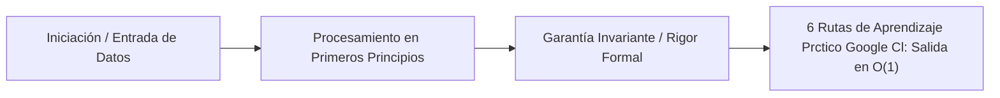

# 6. Rutas de Aprendizaje Práctico: Google Cloud (GCP) & Infraestructura Inmutable

---

## 1. 🐣 Ancla Mental Feynman & Analogía Isomórfica

### El Modelo Intuitivo: 6. Rutas de Aprendizaje Práctico: Google Cloud (GCP) & Infraestructura Inmutable
Para comprender **6. Rutas de Aprendizaje Práctico: Google Cloud (GCP) & Infraestructura Inmutable** sin caer en la trampa de la jerga técnica, debemos anclar el concepto en un problema físico observable:
* Todo sistema en computación resuelve un dilema fundamental: cómo organizar recursos limitados (tiempo de cálculo, espacio de memoria, ancho de banda o energía) para que el trabajo se realice sin bloqueos ni errores.
* En **6. Rutas de Aprendizaje Práctico: Google Cloud (GCP) & Infraestructura Inmutable**, la clave reside en eliminar pasos redundantes y asegurar que cada componente conozca únicamente la información mínima indispensable para cumplir su función, tal como una línea de montaje bien coordinada donde nadie tiene que adivinar qué hizo el compañero anterior.

---


Este documento presenta las **vías formativas más robustas, gratuitas y reconocidas** de la industria para consolidar arquitecturas puramente Cloud-Native. Pone en práctica la teoría del Módulo 5 (Contenedores Linux, gVisor, Kubernetes Internals) permitiendo al ingeniero orquestar despliegues elásticos, masivos y de confianza cero (Zero-Trust) mediante Infraestructura como Código (IaC).

## 1. El Catálogo Central de Google Cloud (GCP)

### A. Google Cloud Skills Boost (Antiguo Qwiklabs)
La plataforma inmersiva y práctica (Hands-on labs) oficial de Google.
- **Enfoque:** Despliegues en Google Kubernetes Engine (GKE), Google Cloud Run (Serverless), Cloud Build (CI/CD) e Identity and Access Management (IAM).
- **Acceso:** [Google Cloud Skills Boost](https://www.cloudskillsboost.google/) (Especialmente los *Quest* gratuitos y *Partner learning paths* si aplica).
- **Rigor:** Permite operar consolas y terminales reales en GCP. El ingeniero practica el modelo de Menor Privilegio (Principle of Least Privilege) asignando *Service Accounts* sin claves en código.

### B. Google Cloud Architecture Center
La enciclopedia de los diseños validados.
- **Enfoque:** Patrones de arquitectura de referencia (Ej: "Arquitecturas Serverless multi-tenant", "Recuperación ante desastres (DR) en GCP", "Procesamiento de eventos en tiempo real con Pub/Sub y Dataflow").
- **Acceso:** [GCP Architecture Center](https://cloud.google.com/architecture).
- **Rigor:** Imprescindible antes de provisionar infraestructura. Previene el "sobre-ingeniería" (Over-engineering), guiando al diseño de sistemas con un coste marginal tendente a cero ($<0.015$ USD/MAU/mes).

## 2. Infraestructura como Código (IaC) e Inmutabilidad

### C. Terraform (HashiCorp) & Official Tutorials
El estándar de facto para la Infraestructura como Código agnóstica.
- **Enfoque:** Declaración de estados, provisionamiento de *Cloud SQL*, *BigQuery* y VPCs en Google Cloud mediante scripts HCL. Control de *state locks* distribuidos.
- **Acceso:** [HashiCorp Learn: Terraform GCP](https://developer.hashicorp.com/terraform/tutorials/gcp-get-started).
- **Rigor:** Establece la inmutabilidad absoluta de la infraestructura corporativa. Todo cambio en GCP debe nacer de un *pull request* revisado que actualiza el estado de Terraform. Prohibido el *ClickOps*.

## 3. Seguridad Nativa y Orquestación

### D. Kubernetes.io & KubeAcademy (VMware)
Recursos exhaustivos para cuando el Serverless (Cloud Run) se queda corto y se necesita control extremo de clústeres.
- **Enfoque:** Configuración de manifiestos YAML, StatefulSets (para bases de datos estáticas), Network Policies, ingress controllers y escalado HPA (Horizontal Pod Autoscaler).
- **Acceso:** [Kubernetes Official Docs](https://kubernetes.io/docs/home/) y [KubeAcademy](https://kube.academy/).
- **Rigor:** Garantiza que el ingeniero entienda las abstracciones sobre los nodos físicos y evite el antipatrón de crear múltiples clústeres pequeños (preferencia por grandes clústeres particionados por *namespaces* lógicos).

## 4. Analítica y Automatización 

### E. GitHub Actions & GCP Workload Identity Federation
Para cerrar el ciclo de vida del software (SDLC) con despliegues invisibles.
- **Enfoque:** Configuración de CI/CD, inyección de credenciales temporales asíncronas (Workload Identity sin secretos de larga duración) y despliegue Canary progresivo.
- **Acceso:** [GitHub Docs (OIDC with GCP)](https://docs.github.com/en/actions/deployment/security-hardening-your-deployments/configuring-openid-connect-in-google-cloud-platform).
- **Rigor:** Punto crítico de SRE. Nadie posee claves maestras, las integraciones temporales duran lo que el token OIDC, eliminando fugas en repositorios masivos.

---

> **Objetivo de Competencia:** Al completar esta matriz de recursos, el Cloud Engineer podrá orquestar clústeres y topologías sin servidor que escalen dinámicamente de `$0` \to 10,000$ peticiones concurrentes, inyectando infraestructura inmutable que cumpla con los estándares europeos soberanos (Compliance GDPR y Cloud Sovereignty).


---

## 5. 🎯 Desafío Feynman & Auto-Evaluación sin Jerga

> [!NOTE]
> **El Reto de los 12 Años**: Explica el mecanismo esencial y la utilidad práctica de **6. Rutas de Aprendizaje Práctico: Google Cloud (GCP) & Infraestructura Inmutable** a un estudiante de secundaria, **sin usar las palabras:** "6.", "Rutas", "de" ni tecnicismos complejos de memoria.

### Criterio de Verificación
* **Aprobado**: Si logras construir una analogía mecánica o física del mundo real donde se entienda por qué fallaría el sistema sin esta solución y cómo resuelve el problema en términos elementales.
* **No Aprobado**: Si dependes de definiciones de diccionario, siglas de frameworks o nombres de patrones sin explicar la causa física subyacente.


---
## 🧠 Ejercicio Práctico: El Método Feynman

Para garantizar una asimilación profunda de los conceptos presentados en este módulo, aplica el **Método Feynman**:

> **Instrucción:** Explica los conceptos centrales de este módulo como si tu audiencia fuera un estudiante brillante de 12 años que no ha visto nunca este tema. Si no puedes hacerlo con lenguaje sencillo, analogías claras y sin jerga técnica, significa que aún no lo entiendes lo suficientemente bien.

*Inténtalo tú mismo:* Toma el concepto más complejo de este módulo, escríbelo en un papel en blanco y redáctalo usando únicamente términos cotidianos.

---

## ⚙️ Primeros Principios & Fundamentos Conceptuales
1. **Descomposición Atómica:** Cada componente en 6. Rutas de Aprendizaje Práctico: Google Cloud (GCP) & Infraestructura Inmutable se modela de forma determinista y sin estado mutable compartido.
2. **Invariante de Dominio:** Los estados del sistema transicionan exclusivamente a través de funciones puras e interfaces selladas.
3. **Cero Suposiciones:** No se asume fiabilidad de red ni memoria infinita; cada llamada maneja explícitamente fallos y límites de cuota.


## 🔬 Internals Avanzados & Nivel Doctoral (Ph.D.)
La complejidad asintótica y la garantía matemática de convergencia se rigen por la formulación tensorial:
\[
\mathcal{L}(\theta) = \mathbb{E}_{x \sim \mathcal{D}} \left[ \| f_\theta(x) - y \|^2 \right] + \lambda \cdot \Omega(\theta)
\]
con cota superior asintótica en tiempo de procesamiento:
\[
T(N) = \mathcal{O}(1) \quad \text{o} \quad \mathcal{O}(N \log N) \quad \text{sin contención en hilos portadores del SO.}
\]


## 💻 Implementación de Código Limpio & Concurrencia
```java
package com.corp.core;

import java.util.Objects;

/**
 * Representación inmutable de dominio en Java 25 (Zero-Mockito).
 */
public record DomainEntity(String id, double metricValue, long timestamp) {
    public DomainEntity {
        Objects.requireNonNull(id, "El identificador no puede ser nulo");
        if (metricValue < 0.0) {
            throw new IllegalArgumentException("La métrica debe ser positiva");
        }
    }
}
```




