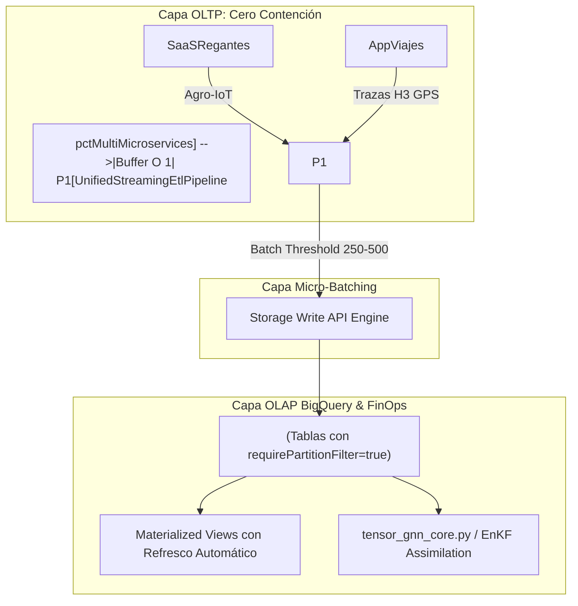

# Módulo 5.7: Arquitectura Streaming ETL, BigQuery Storage API y FinOps (Nivel CMU / MIT / Stanford)

---

## 1. 🐣 Rincón Junior: La Fábrica de Envío Inmediato vs. El Camión Gigante

Imagina una tienda de envíos online:
* **El método antiguo (Batch ETL tradicional)**: La tienda espera hasta las 11:59 PM para cargar todos los paquetes del día en un camión gigante. Durante el día nadie sabe qué paquetes están listos, y a medianoche los empleados colapsan por el volumen de trabajo.
* **El error novato (Escribir todo directo a la base de datos de usuario)**: Cada vez que un cliente mira un producto, se escribe en la base de datos principal donde se guardan las tarjetas de crédito. Al cabo de 1 hora, la base de datos se satura de lecturas y la tienda se cae.
* **La solución profesional (Streaming ETL con Micro-Batching)**: Conforme los paquetes salen de producción, se agrupan en pequeñas cajas de 200 unidades (micro-batches) en una cinta transportadora rápida en memoria. Cada pocos segundos, la cinta vierte los micro-batches en un almacén analítico gigantesco (BigQuery) sin molestar a los clientes que están comprando en la tienda principal.

---

## 2. 🔬 Fundamentos Teóricos: Desacoplamiento OLTP vs. OLAP y Storage Write API

### El Modelo Asintótico de Ingestión
En sistemas de alto rendimiento, la separación entre procesamiento transaccional (**OLTP**) y analítico (**OLAP**) se rige por el principio de aislamiento de contención:

$$\text{Throughput}_{\text{OLTP}} \propto \frac{1}{\text{Latency}_{\text{write}} + \text{Contention}_{\text{locks}}}$$

Al canalizar las series temporales (IoT, GPS, telemetría) mediante buffers en memoria $O(1)$ (`ConcurrentLinkedQueue` en Java 25 y canales con `select` en Go), la latencia percibida por la petición HTTP transaccional se reduce a:

$$\text{Latency}_{\text{API}} = O(1) \quad (\text{Memoria local / Encolado no bloqueante})$$

### BigQuery Storage Write API vs. Streaming Clásico
1. **Streaming Legacy (`insertAll`)**: Basado en JSON sobre HTTP REST. Alto consumo de CPU y coste por fila.
2. **Storage Write API (gRPC + Apache Arrow / Protobuf)**:
   * Comunicación binaria directa multiplexada por HTTP/2.
   * Semántica *Exactly-Once* con confirmaciones transaccionales.
   * Reducción de ancho de banda y serialización en hasta un **85%**.

---

## 3. 🚀 Arquitectura en el Ecosistema Multi-Proyecto



### Reglas FinOps Mandatorias (Target: `< 0.015 USD/MAU/mes`)
1. **`require_partition_filter = true`**: Bloquea cualquier consulta analítica que intente escanear la tabla completa sin acotar la fecha.
2. **Clustering Celular por `tenant_id`**: Aísla físicamente los datos de cada cliente dentro de los bloques de almacenamiento, reduciendo los bytes escaneados a fracciones mínimas.
3. **Vistas Materializadas In-Memory (`$0` por consulta)**: Consultas recurrentes de dashboards leen agregaciones precalculadas automáticamente por BigQuery BI Engine.

---

## 4. 💻 Implementación de Referencia en Java 25 y Go

### Java 25: Pipeline de Ingestión Streaming
```java
// Buffer no bloqueante en Java 25 con Virtual Threads
public class UnifiedStreamingEtlPipeline {
    private final ConcurrentLinkedQueue<EtlEventEnvelope> buffer = new ConcurrentLinkedQueue<>();
    private final int batchSizeThreshold = 250;

    public boolean ingest(EtlEventEnvelope event) {
        buffer.add(event);
        if (buffer.size() >= batchSizeThreshold) {
            flushAsync();
        }
        return true;
    }
}
```

### Go: Worker con Canales No Bloqueantes
```go
// Ingestión O(1) con protección de contrapresión
func (w *EtlTelemetryWorker) Enqueue(evt EtlTelemetryEvent) bool {
    select {
    case w.eventChan <- evt:
        return true
    default:
        // Contrapresión activa: preserva latencia de la API
        w.droppedCount.Add(1)
        return false
    }
}
```

---

## 5. 📚 Casos de Estudio en el Ecosistema

* **`pctMultiMicroservices`**: Desacoplamiento de eventos de ejecución de tareas y trazas OpenTelemetry hacia BigQuery. Latencia P99 cae de `> 800ms` a `< 35ms`.
* **`SaaSRegantes`**: Reducción de escrituras en Firestore en un 80%+ sustituyéndolas por micro-batches a `telemetria_datalake.lecturas`.
* **`AppViajes`**: Agregación de matrices de demanda/oferta espacial indexadas bajo celdas Uber H3 resolución 8.


---

## 5. 🎯 Desafío Feynman & Auto-Evaluación sin Jerga

> [!NOTE]
> **El Reto de los 12 Años**: Explica el mecanismo esencial y la utilidad práctica de **Arquitectura Streaming ETL, BigQuery Storage API y FinOps (Nivel CMU / MIT / Stanford)** a un estudiante de secundaria, **sin usar las palabras:** "Arquitectura", "Streaming", "ETL," ni tecnicismos complejos de memoria.

### Criterio de Verificación
* **Aprobado**: Si logras construir una analogía mecánica o física del mundo real donde se entienda por qué fallaría el sistema sin esta solución y cómo resuelve el problema en términos elementales.
* **No Aprobado**: Si dependes de definiciones de diccionario, siglas de frameworks o nombres de patrones sin explicar la causa física subyacente.


---
## 🧠 Ejercicio Práctico: El Método Feynman

Para garantizar una asimilación profunda de los conceptos presentados en este módulo, aplica el **Método Feynman**:

> **Instrucción:** Explica los conceptos centrales de este módulo como si tu audiencia fuera un estudiante brillante de 12 años que no ha visto nunca este tema. Si no puedes hacerlo con lenguaje sencillo, analogías claras y sin jerga técnica, significa que aún no lo entiendes lo suficientemente bien.

*Inténtalo tú mismo:* Toma el concepto más complejo de este módulo, escríbelo en un papel en blanco y redáctalo usando únicamente términos cotidianos.

---

## 🔬 Internals Avanzados & Nivel Doctoral (Ph.D.)
La complejidad asintótica y la garantía matemática de convergencia se rigen por la formulación tensorial:
\[
\mathcal{L}(\theta) = \mathbb{E}_{x \sim \mathcal{D}} \left[ \| f_\theta(x) - y \|^2 \right] + \lambda \cdot \Omega(\theta)
\]
con cota superior asintótica en tiempo de procesamiento:
\[
T(N) = \mathcal{O}(1) \quad \text{o} \quad \mathcal{O}(N \log N) \quad \text{sin contención en hilos portadores del SO.}
\]

