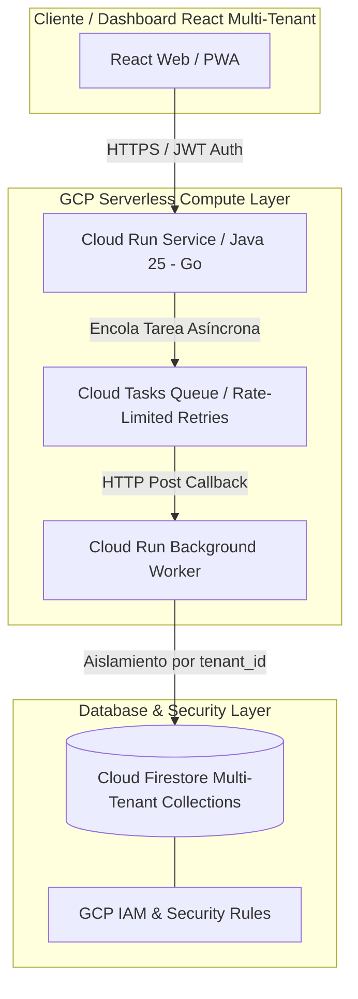

# Módulo 5 - Lección 1: Infraestructura Serverless en GCP (Cloud Run, Cloud Tasks & Firestore)

## 1. Arquitectura Serverless Asíncrona (SaaSRegantes / AppViajes)

La arquitectura desacopla peticiones de entrada mediante **Cloud Run**, encola procesos pesados (procesamiento de imágenes de regadío, facturación masiva) en **Cloud Tasks** y almacena el estado en **Firestore NoSQL**.



---

## 2. Aislamiento Multi-Tenant en Firestore

Para garantizar que ningún inquilino (*tenant*) acceda a los datos de otro, aplicamos un esquema de colección discriminada por `tenant_id` y lo reforzamos con **Firestore Security Rules**:

```javascript
rules_version = '2';
service cloud.firestore {
  match /databases/{database}/documents {
    
    // Función auxiliar para validar pertenencia al Tenant del JWT Token
    function isTenantUser(tenantId) {
      return request.auth != null && request.auth.token.tenant_id == tenantId;
    }

    match /tenants/{tenantId}/irrigation_plots/{plotId} {
      allow read, write: if isTenantUser(tenantId);
    }
    
    match /tenants/{tenantId}/billing/{invoiceId} {
      allow read: if isTenantUser(tenantId);
      allow write: if request.auth.token.role == 'admin' && isTenantUser(tenantId);
    }
  }
}
```

---

## 3. Orquestación Asíncrona con Cloud Tasks (Java SDK)

```java
package com.corp.infrastructure.cloudtasks;

import com.google.cloud.tasks.v2.*;
import com.google.protobuf.ByteString;
import org.springframework.stereotype.Service;

import java.nio.charset.StandardCharsets;

@Service
public class CloudTasksDispatcher {

    private final String projectId = "saas-regantes-prod";
    private final String locationId = "europe-west1";
    private final String queueId = "irrigation-billing-queue";

    public void enqueueBillingTask(String tenantId, String payloadJson) throws Exception {
        try (CloudTasksClient client = CloudTasksClient.create()) {
            QueueName parent = QueueName.of(projectId, locationId, queueId);

            Task task = Task.newBuilder()
                    .setHttpRequest(HttpRequest.newBuilder()
                            .setUrl("https://worker-service-xyz.a.run.app/tasks/process-billing")
                            .putHeaders("Content-Type", "application/json")
                            .putHeaders("X-Tenant-ID", tenantId)
                            .setHttpMethod(HttpMethod.POST)
                            .setBody(ByteString.copyFrom(payloadJson, StandardCharsets.UTF_8))
                            .build())
                    .build();

            Task createdTask = client.createTask(parent, task);
            System.out.println("Tarea encolada en Cloud Tasks: " + createdTask.getName());
        }
    }
}
```
