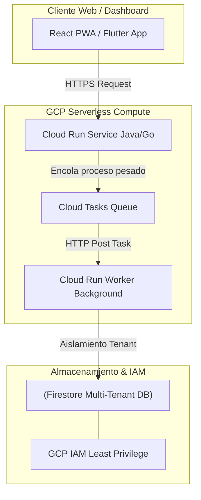

# Módulo 5 - Lección 1: Fundamentos de GCP (Cloud Run, Cloud Tasks & Firestore) desde Cero

---

## 1. 🐣 Rincón Junior: Conceptos desde Cero & Analogías

### ¿Qué son Cloud Run, Cloud Tasks y Firestore?
Imagina un parque de atracciones:
* **Cloud Run**: Las atracciones que se encienden solo cuando entra una persona y se apagan automáticamente cuando no hay nadie (**Escalado a Cero**).
* **Cloud Tasks**: El empleado de la entrada organizando la fila de personas repartiendo tickets en orden para que la atracción no se desborde.
* **Firestore**: El archivo central NoSQL en la nube guardando instantáneamente la ficha de cada visitante sin requerir servidores de base de datos tradicionales.

---

## 2. 📐 Arquitectura Visual & Diagrama Mermaid



---

## 3. 🚀 Guía Paso a Paso e Implementación Práctica (0 a 100)

```bash
# Despliegue en Cloud Run con escalado a cero
gcloud run deploy saas-backend-service \
    --image=europe-west1-docker.pkg.dev/saas-prod/repo/service:latest \
    --region=europe-west1 \
    --platform=managed \
    --min-instances=0 \
    --max-instances=10 \
    --concurrency=80
```

---

## 4. 🧠 Referencia Senior: Cheatsheet, Performance & Internals

### Cloud Run Concurrency vs CPU Allocation

| Configuración GCP | Comportamiento de Instancia | Impacto en Costes |
| :--- | :--- | :--- |
| `--no-cpu-throttling` | CPU dedicada 100% activa fuera de peticiones | Mayor coste / Ideal para tareas background |
| `concurrency = 80` | Procesamiento de 80 peticiones concurrentes por contenedor | **Máxima eficiencia FinOps / Menor coste** |

---

## 5. ⚠️ Errores Comunes & Anti-Patrones (Gotchas)

1. **Guardar archivos en el sistema de archivos local `/tmp` del contenedor Cloud Run asumiendo persistencia**:
   * *Síntoma*: Los archivos desaparecen cuando Cloud Run escala a cero la instancia.
   * *Solución*: Utiliza siempre **Google Cloud Storage (GCS)** o Firestore para persistir archivos o estado.


---

## 5. 🎯 Desafío Feynman & Auto-Evaluación sin Jerga

> [!NOTE]
> **El Reto de los 12 Años**: Explica el mecanismo esencial y la utilidad práctica de **Fundamentos de GCP (Cloud Run, Cloud Tasks & Firestore) desde Cero** a un estudiante de secundaria, **sin usar las palabras:** "Fundamentos", "de", "GCP" ni tecnicismos complejos de memoria.

### Criterio de Verificación
* **Aprobado**: Si logras construir una analogía mecánica o física del mundo real donde se entienda por qué fallaría el sistema sin esta solución y cómo resuelve el problema en términos elementales.
* **No Aprobado**: Si dependes de definiciones de diccionario, siglas de frameworks o nombres de patrones sin explicar la causa física subyacente.


---
## 🧠 Ejercicio Práctico: El Método Feynman

Para garantizar una asimilación profunda de los conceptos presentados en este módulo, aplica el **Método Feynman**:

> **Instrucción:** Explica los conceptos centrales de este módulo como si tu audiencia fuera un estudiante brillante de 12 años que no ha visto nunca este tema. Si no puedes hacerlo con lenguaje sencillo, analogías claras y sin jerga técnica, significa que aún no lo entiendes lo suficientemente bien.

*Inténtalo tú mismo:* Toma el concepto más complejo de este módulo, escríbelo en un papel en blanco y redáctalo usando únicamente términos cotidianos.
