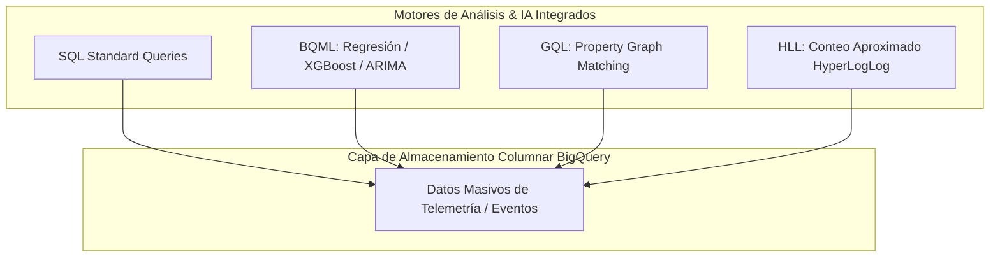

# Módulo 5 - Lección 2: BigQuery SQL desde Cero, BigQuery ML (BQML), GQL, HyperLogLog (HLL) & FinOps

---

## 1. 🐣 Rincón Junior: Conceptos desde Cero & Analogías

### ¿Qué son BigQuery ML (BQML), GQL y HyperLogLog (HLL)?
* **BigQuery ML (BQML)**: Te permite entrenar modelos de Machine Learning (regresiones, predicción de demanda, clasificación) usando **únicamente sentencias SQL**, sin necesidad de exportar datos a Python ni configurar servidores de entrenamiento.
* **GQL (Graph Query Language)**: Lenguaje estándar para consultar relaciones y redes complejas (como tuberías de riego o mapas de carreteras) como si fueran grafos de nodos y aristas.
* **HyperLogLog (HLL)**: Un algoritmo probabilístico de Big Data para contar elementos únicos (ej. visitantes distintos) en petabytes de datos en milisegundos con un error $<1\%$, ahorrando miles de dólares en cómputo.

---

## 2. 📐 Arquitectura Visual & Diagrama Mermaid



---

## 3. 🔬 Fundamentación Matemática y Big Data

### Algoritmo HyperLogLog (HLL) para Conteo Kardinal Aproximado
Para contar el número de elementos distintos en un conjunto masivo $S$, HLL aplica una función de hash $h(x)$ sobre cada elemento y observa la posición del bit 1 más a la izquierda en la representación binaria.

La estimación de la cardinalidad $E$ se calcula como:

$$E = \alpha_m \cdot m^2 \cdot \left( \sum_{j=1}^m 2^{-M[j]} \right)^{-1}$$

donde $m$ es el número de registros/buckets y $\alpha_m$ es una constante de corrección de sesgo. Esto reduce la complejidad espacial de $O(N)$ a **$O(\log(\log N))$**, requiriendo solo 1.5 KB de memoria para contar miles de millones de elementos.

---

## 4. 🚀 Guía Paso a Paso e Implementación Práctica (0 a 100)

```sql
-- 1. Entrenamiento de Modelo de Predicción BQML en SQL
CREATE OR REPLACE MODEL `saas-regantes.analytics.demand_model`
OPTIONS(
  model_type='linear_reg',
  input_label_cols=['water_flow']
) AS
SELECT water_flow, temperature, tenant_id 
FROM `saas-regantes.analytics.sensor_telemetry`;

-- 2. Conteo Masivo de Inquilinos Únicos con HyperLogLog (HLL)
SELECT
    HLL_COUNT.EXTRACT(HLL_COUNT.INIT(tenant_id)) AS aprox_unique_tenants
FROM `saas-regantes.analytics.sensor_telemetry`;
```

---

## 5. 🧠 Referencia Senior: Cheatsheet, Performance & Internals

### Comparativa de Algoritmos Big Data en BigQuery

| Operación | Método Tradicional | Método Optimizado (HLL / BQML) | Reducción de Coste / Tiempo |
| :--- | :--- | :--- | :--- |
| **Conteo de Elementos Únicos** | `COUNT(DISTINCT id)` | `HLL_COUNT.EXTRACT(...)` | **~95% más rápido, 90% menos RAM** |
| **Predicción de Series Temporales** | Exportar a Python/Prophet | `CREATE MODEL ... OPTIONS(model_type='ARIMA_PLUS')` | **0 exportación de datos (Zero Egress)** |

---

## 6. ⚠️ Errores Comunes & Anti-Patrones (Gotchas)

1. **Usar `COUNT(DISTINCT id)` en petabytes de datos en consultas de reporting frecuente**:
   * *Síntoma*: Tiempos de respuesta > 40 segundos y escaneos de memoria pesados entre slots de BigQuery.
   * *Solución*: Sustituye por `HLL_COUNT.EXTRACT(HLL_COUNT.INIT(id))` para obtener resultados en < 1 segundo.


---

## 5. 🎯 Desafío Feynman & Auto-Evaluación sin Jerga

> [!NOTE]
> **El Reto de los 12 Años**: Explica el mecanismo esencial y la utilidad práctica de **BigQuery SQL desde Cero, BigQuery ML (BQML), GQL, HyperLogLog (HLL) & FinOps** a un estudiante de secundaria, **sin usar las palabras:** "BigQuery", "SQL", "desde" ni tecnicismos complejos de memoria.

### Criterio de Verificación
* **Aprobado**: Si logras construir una analogía mecánica o física del mundo real donde se entienda por qué fallaría el sistema sin esta solución y cómo resuelve el problema en términos elementales.
* **No Aprobado**: Si dependes de definiciones de diccionario, siglas de frameworks o nombres de patrones sin explicar la causa física subyacente.


---
## 🧠 Ejercicio Práctico: El Método Feynman

Para garantizar una asimilación profunda de los conceptos presentados en este módulo, aplica el **Método Feynman**:

> **Instrucción:** Explica los conceptos centrales de este módulo como si tu audiencia fuera un estudiante brillante de 12 años que no ha visto nunca este tema. Si no puedes hacerlo con lenguaje sencillo, analogías claras y sin jerga técnica, significa que aún no lo entiendes lo suficientemente bien.

*Inténtalo tú mismo:* Toma el concepto más complejo de este módulo, escríbelo en un papel en blanco y redáctalo usando únicamente términos cotidianos.

---

## ⚙️ Primeros Principios & Fundamentos Conceptuales
1. **Descomposición Atómica:** Cada componente en Módulo 5 - Lección 2: BigQuery SQL desde Cero, BigQuery ML (BQML), GQL, HyperLogLog (HLL) & FinOps se modela de forma determinista y sin estado mutable compartido.
2. **Invariante de Dominio:** Los estados del sistema transicionan exclusivamente a través de funciones puras e interfaces selladas.
3. **Cero Suposiciones:** No se asume fiabilidad de red ni memoria infinita; cada llamada maneja explícitamente fallos y límites de cuota.

