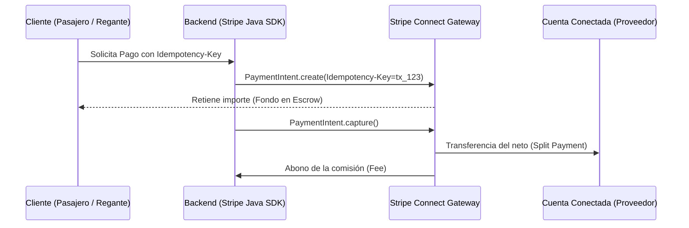

# Módulo 5 - Lección 3: Stripe Connect Multi-Tenant, Idempotencia Transaccional & Escrow

---

## 1. 🐣 Rincón Junior: Conceptos desde Cero & Analogías

### ¿Qué son Stripe Connect, Escrow e Idempotencia?
* **Stripe Connect**: La infraestructura de cobro que permite a tu plataforma recibir un pago del cliente final, quedarse con una comisión de la plataforma y transferir el resto al proveedor real (ej. al conductor en `AppViajes` o a la comunidad en `SaaSRegantes`).
* **Escrow**: Retener el dinero cobrado en un "depósito seguro" hasta que el servicio sea prestado con éxito antes de entregárselo al proveedor.
* **Idempotencia**: Garantizar que aunque el usuario presione el botón de "Pagar" 10 veces por culpa de una mala conexión a internet, **solo se le cobre 1 vez exacta en su tarjeta de crédito**.

---

## 2. 📐 Arquitectura Visual & Diagrama Mermaid



---

## 3. 🚀 Guía Paso a Paso e Implementación Práctica (0 a 100)

```java
package com.corp.fintech;

import com.stripe.Stripe;
import com.stripe.model.PaymentIntent;
import com.stripe.net.RequestOptions;
import com.stripe.param.PaymentIntentCreateParams;
import java.util.UUID;

public class StripePaymentService {

    public PaymentIntent processSplitPayment(String accountId, long amountCents, long feeCents, UUID orderId) throws Exception {
        Stripe.apiKey = System.getenv("STRIPE_SECRET_KEY");

        PaymentIntentCreateParams params = PaymentIntentCreateParams.builder()
                .setAmount(amountCents)
                .setCurrency("eur")
                .setApplicationFeeAmount(feeCents)
                .setTransferData(PaymentIntentCreateParams.TransferData.builder().setDestination(accountId).build())
                .setCaptureMethod(PaymentIntentCreateParams.CaptureMethod.MANUAL) // Escrow
                .build();

        // Idempotency Key determinista basada en el ID del pedido
        String idempotencyKey = "tx_order_" + orderId.toString();

        RequestOptions requestOptions = RequestOptions.builder()
                .setIdempotencyKey(idempotencyKey)
                .build();

        return PaymentIntent.create(params, requestOptions);
    }
}
```

---

## 4. 🧠 Referencia Senior: Cheatsheet, Performance & Internals

### Mecanismo de Idempotencia de Stripe Gateway

| Parámetro HTTP Header | Duración de Caché en Stripe | Comportamiento en Reintento |
| :--- | :--- | :--- |
| `Idempotency-Key: tx_order_123` | **24 Horas** | Devuelve exactamente la misma respuesta HTTP precargada sin reacceder a la red de procesado de tarjetas |

---

## 5. ⚠️ Errores Comunes & Anti-Patrones (Gotchas)

1. **Generar un `Idempotency-Key` aleatorio (`UUID.randomUUID()`) en cada reintento de llamada HTTP**:
   * *Síntoma*: Un reintento por timeout vuelve a cobrar la tarjeta del cliente 2 o 3 veces.
   * *Solución*: Utiliza siempre un identificador único determinista basado en el ID de la transacción (`"tx_order_" + order.getId()`).
