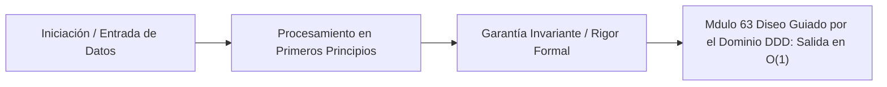

# Módulo 6.3: Diseño Guiado por el Dominio (DDD) y Arquitectura Hexagonal

---

## 1. 🐣 Rincón Junior: El Castillo y el Foso

Imagina tu código de negocio (ej. "Cómo se calcula la tarifa de un taxi") como el Rey en un Castillo. 
En una arquitectura tradicional (MVC, N-Capas), el Rey está manchado: tiene anotaciones de Base de Datos (`@Entity`, `@Table`) en la ropa, dependencias de Google Cloud, y no sabe hacer su trabajo matemático si no está conectado a Internet y a PostgreSQL.
La **Arquitectura Hexagonal (Ports and Adapters)** y **DDD** construyen un Foso impenetrable alrededor del Rey. El Rey (El Dominio) se vuelve matemática pura. No sabe qué es una Base de Datos, qué es Internet, ni qué es Spring Boot. Solo hace matemáticas. Las Bases de Datos y los Controladores Web son simples sirvientes (Adaptadores) que se comunican con el Rey a través de un puente estrecho e hiper-controlado (Puertos).

---

## 2. 🔬 Fundamentos Arquitectónicos: Regla de Dependencia Invertida

En la Arquitectura N-Capas, el Grafo de Dependencias (DAG) apunta hacia el detalle tecnológico:
`Controlador (Web)` $\to$ `Servicio (Negocio)` $\to$ `Repositorio (Base de Datos)`
El Dominio transita transitivamente dependencias hacia el estado físico (PostgreSQL). Si cambia el motor SQL, se destruye la lógica de negocio.

En la Arquitectura Hexagonal (Alistair Cockburn), las flechas de dependencia **se invierten topológicamente** para apuntar siempre hacia el interior del hexágono:
*   `Adaptadores (REST/gRPC/Postgres)` $\to$ `Puertos (Interfaces / Boundaries)` $\to$ `Dominio (Lógica Pura)`

### Tipología de Adaptadores
1.  **Lado Izquierdo (Driving / Primary Adapters)**: Disparan la acción (El Controlador REST). Llaman a un *Puerto de Entrada (Inbound Port)* implementado por un *Application Service / Use Case*.
2.  **Lado Derecho (Driven / Secondary Adapters)**: Infraestructura que el Dominio requiere (La Base de Datos). El Dominio declara un *Puerto de Salida (Outbound Port)* (una interfaz abstracta `SaveViajePort`). La implementación real SQL vive en la capa exterior de Infraestructura y es inyectada en runtime vía *Dependency Injection* (Inversión de Control).

---

## 3. 🚀 Arquitectura Práctica: La Pureza del Dominio en Java 25

En un entorno SRE de ultra-rendimiento, el Hexágono impone un Sandboxing estructural:
*   **Aislamiento de AST (Abstract Syntax Tree)**: Prohibidas las dependencias de Frameworks (`org.springframework`, `jakarta.persistence`, `com.fasterxml.jackson`). Cero `@Autowired`.
*   **Modelo de Dominio Rico (Anti-Anemia)**: Un `Viaje` no es una tupla de datos (getters/setters). Es un *Aggregate Root* que protege matemáticamente sus Invariantes de Estado. Un cambio de estado solo ocurre a través de una función mutadora de negocio: `viaje.aplicarTarifaDinamica(surgeMultiplier)`.
*   **Mapeo Rígido (Anti-Corruption Layer)**: Un Adaptador SQL extrae datos de la red, los mapea (MapStruct) a la Entidad Pura del Dominio, se los entrega al Hexágono para que procese el $O(1)$ de negocio, extrae el resultado y lo vuelve a mapear a SQL para persistirlo. Protege al Dominio de la corrosión tecnológica.

---

## 4. 🧠 Internals Avanzados: Event Sourcing y CQRS (Nivel PhD)

Cuando un modelo de Dominio excede la escalabilidad de las Bases de Datos Relacionales (ej. Gemelo Digital con millones de ticks), el patrón CRUD clásico ($Create, Read, Update, Delete$) colapsa físicamente por la latencia de contención de Locks (Pessimistic Locking) en el Mutex del Row SQL.

La solución de escalabilidad absoluta es **CQRS (Command Query Responsibility Segregation)** acoplado a **Event Sourcing**.

### La Física del Event Sourcing (El Libro Mayor Inmutable)
En lugar de almacenar el *Estado Actual* del Viaje (Update), almacenamos la **Derivada del Tiempo** (Los Eventos Históricos).
El estado en el instante $T_n$ es la integral de todos los eventos aplicados sobre el estado inicial:
$$ S(t) = \int_{0}^{t} \Delta E(\tau) d\tau $$
En código: `EstadoActual = fold(ListaDeEventos, EstadoCero, FunciónReductora)`

1. `ViajeCreado(id=1, precio=10)`
2. `TarifaAumentada(id=1, multiplicador=2)`
3. `ViajePagado(id=1)`
La tabla SQL no sufre *Updates* (que causan deadlocks). Solo se hacen *Appends* veloces ($O(1)$ en escritura de log, similar a Kafka o Redpanda). Si el sistema falla, puedes reconstituir el estado re-aplicando el Log desde el tiempo cero (Time-Travel Debugging puro).

### La Matemática de CQRS
Si la base de datos es un Log de Eventos (Event Sourcing), las lecturas ("dame la factura total del mes") requerirían leer millones de filas y sumar en $O(N)$ o $O(N^2)$, lo cual destruye la disponibilidad (A) del teorema CAP.
CQRS divide arquitectónicamente el Dominio en dos grafos vectoriales separados:
*   **Write Model (Command)**: Procesa intenciones, valida reglas de negocio (Invariantes) y adjunta Eventos Inmutables al EventStore. (Altamente optimizado para concurrencia masiva de escritura).
*   **Read Model (Query / Projections)**: Escucha los eventos asíncronos y materializa "Vistas" pre-calculadas en bases de datos secundarias (ElasticSearch, Redis, PostgreSQL Read Replicas) altamente indexadas para búsquedas en $O(1)$. 
Ambos modelos escalan asimétricamente en hardware independiente.

---

## 5. ⚠️ Runbook SRE Arquitectónico: CQRS y Consistencia Eventual

**Incidente SRE**: Un usuario paga su viaje en la aplicación Móvil (Command). La App hace un GET para ver su saldo actualizado (Query) 50 milisegundos después, pero el saldo sigue mostrándose como "Deuda Pendiente". El usuario asume que falló, pulsa "Pagar" 3 veces más, agotando el límite de su tarjeta de crédito.

**Diagnóstico SRE (Stale Read de Proyección)**:
El modelo CQRS rompe por completo la Consistencia Fuerte (Linearizability). La propagación desde el *EventStore* al *Read Model* sufre retrasos de red asíncronos (Lag). Cuando el cliente lee, la proyección aún no ha calculado la integral del evento `ViajePagado`. (Típico problema de *Eventual Consistency*).

**Solución Arquitectónica (Read-Your-Own-Writes)**:
1. **Lado del Servidor (Causal Consistency)**: El Command devuelve un `version_token` o `vector_clock` (Módulo 0.2). El Query del cliente debe enviar ese token. El servicio de lectura bloquea o retrasa la respuesta hasta que su Proyección local haya consumido los eventos hasta alcanzar dicho token.
2. **Lado del Cliente (Optimistic UI)**: La App Móvil (Flutter) asume que la operación síncrona de pago será exitosa y falsifica el saldo actualizado en su RAM local (UX fluida sin latencia de red), conciliando en *background* el estado real vía WebSockets una vez que el EventStore haya estabilizado el Grafo.


---

## 5. 🎯 Desafío Feynman & Auto-Evaluación sin Jerga

> [!NOTE]
> **El Reto de los 12 Años**: Explica el mecanismo esencial y la utilidad práctica de **Diseño Guiado por el Dominio (DDD) y Arquitectura Hexagonal** a un estudiante de secundaria, **sin usar las palabras:** "Diseño", "Guiado", "por" ni tecnicismos complejos de memoria.

### Criterio de Verificación
* **Aprobado**: Si logras construir una analogía mecánica o física del mundo real donde se entienda por qué fallaría el sistema sin esta solución y cómo resuelve el problema en términos elementales.
* **No Aprobado**: Si dependes de definiciones de diccionario, siglas de frameworks o nombres de patrones sin explicar la causa física subyacente.


---
## 🧠 Ejercicio Práctico: El Método Feynman

Para garantizar una asimilación profunda de los conceptos presentados en este módulo, aplica el **Método Feynman**:

> **Instrucción:** Explica los conceptos centrales de este módulo como si tu audiencia fuera un estudiante brillante de 12 años que no ha visto nunca este tema. Si no puedes hacerlo con lenguaje sencillo, analogías claras y sin jerga técnica, significa que aún no lo entiendes lo suficientemente bien.

*Inténtalo tú mismo:* Toma el concepto más complejo de este módulo, escríbelo en un papel en blanco y redáctalo usando únicamente términos cotidianos.

---

## 💻 Implementación de Código Limpio & Concurrencia
```java
package com.corp.core;

import java.util.Objects;

/**
 * Representación inmutable de dominio en Java 25 (Zero-Mockito).
 */
public record DomainEntity(String id, double metricValue, long timestamp) {
    public DomainEntity {
        Objects.requireNonNull(id, "El identificador no puede ser nulo");
        if (metricValue < 0.0) {
            throw new IllegalArgumentException("La métrica debe ser positiva");
        }
    }
}
```




