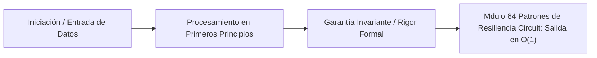

# Módulo 6.4: Patrones de Resiliencia, Circuit Breakers y Cascading Failures

---

## 1. 🐣 Rincón Junior: El Efecto Dominó

Imagina que tienes una aplicación de Taxis (Microservicio A) que para mostrar la pantalla de inicio tiene que preguntarle el precio a un servidor de Precios externo (Microservicio B).
Un día, el servidor B se vuelve lentísimo. Empieza a tardar 30 segundos en responder. 
Si miles de usuarios abren tu app, tu servidor A enviará miles de peticiones a B. Como B no responde rápido, el servidor A se queda esperando con miles de hilos (Threads) atascados. En un minuto, el servidor A se queda sin memoria y muere.
**Un servidor lento (B) acaba de matar a un servidor sano (A)**. Esto es un Fallo en Cascada (Cascading Failure). En arquitecturas de microservicios, si no te proteges activamente de tus vecinos, morirás con ellos.

---

## 2. 🔬 Fundamentos Arquitectónicos: State Machine del Circuit Breaker

Inspirado en la ingeniería eléctrica, un **Circuit Breaker** (ej. Resilience4j) es un patrón de diseño que envuelve llamadas de red potencialmente peligrosas en un autómata finito (Máquina de Estados) definido por transiciones matemáticas rigurosas basadas en ventanas de tiempo (Sliding Windows) o conteo de ejecuciones.

### La Máquina de Estados (State Machine)
El autómata $M$ tiene tres estados principales $\{ \text{CLOSED}, \text{OPEN}, \text{HALF\_OPEN} \}$:

1.  **CLOSED (Estado Normal)**: Se asume que el sistema remoto está sano. Todas las peticiones de red fluyen libremente. El autómata registra el resultado en un Buffer Circular (ej. de 100 posiciones).
    *   *Transición Matemática (CLOSED $\to$ OPEN)*: Si la tasa de fallos $P(\text{Fallo}) \ge \text{failureRateThreshold}$ (ej. 50%), o si la latencia promedio supera el umbral configurado en el buffer, se corta la corriente.
2.  **OPEN (Cortocircuito)**: El sistema remoto está sufriendo. Para evitar colapsar los recursos locales (y darle a B un respiro para recuperarse de su DDoS interno), **se prohíbe toda ejecución**. Toda petición local falla instantáneamente (Fail-Fast) arrojando una excepción `CallNotPermittedException`. 
    *   *Transición (OPEN $\to$ HALF\_OPEN)*: Se produce exclusivamente mediante un Timer ($\Delta t$, e.g., 10 segundos). Al expirar, se asume que B podría haberse curado.
3.  **HALF-OPEN (Prueba Asintótica)**: Se permite pasar un volumen controlado microscópico de tráfico $N$ (ej. 5 peticiones). 
    *   Si el % de fallos de esas 5 peticiones es aceptable, el estado vuelve a **CLOSED** (Curación exitosa).
    *   Si el % de fallos sigue rompiendo el umbral, vuelve a **OPEN** (B sigue caído).

---

## 3. 🚀 Arquitectura Práctica: Retry, Backoff Exponencial y Jitter

Cuando un Circuit Breaker no está involucrado y ocurre un fallo efímero (Glitch TCP), la reacción local es reintentar.

**El Problema Matemático de la Manada (Thundering Herd)**:
Si un clúster de Base de Datos se reinicia ($T=2s$), 10,000 workers recibirán una excepción simultáneamente. Si todos tienen configurado `retry(delay=1s)`, exactamente un segundo después, la base de datos recibirá una onda de choque estocástica de 10,000 conexiones que la matará inmediatamente de un OOM (Out Of Memory).

**La Solución SRE: Exponential Backoff & Decorrelación (Jitter)**:
Nunca reintentes de forma constante. La función del retardo $\tau$ para el intento $k$ debe crecer exponencialmente para vaciar la presión, sumando una variable aleatoria uniforme (Jitter) para destruir la resonancia en el tiempo:
$$ \tau_k = \text{base\_delay} \times 2^k + \text{random}(0, \text{jitter\_max}) $$
El Jitter rompe la sincronización destructiva. La "manada de elefantes" se dispersa en un frente de onda suave, permitiendo que la base de datos respire.

---

## 4. 🧠 Internals Avanzados: Teoría de Colas y el Patrón Bulkhead

En Teoría de Colas y Sistemas Concurrentes, la Ley de Little ($L = \lambda W$) demuestra que si el tiempo de espera ($W$) tiende a infinito, la cantidad de clientes en el sistema ($L$) satura la memoria física.

El Patrón **Bulkhead** (Mamparos del barco) mitiga la sobresaturación segregando recursos matemáticamente.
En lugar de tener un *Global Thread Pool* de 100 Hilos para Tomcat, particionamos el pool:
*   $\text{Pool}_A$ (Emails): 20 Hilos Max.
*   $\text{Pool}_B$ (Logins): 80 Hilos Max.

Si la API externa de correos colapsa y sus hilos se bloquean (Blocked state), el sistema satura $\text{Pool}_A$ (los correos empezarán a lanzar *RejectedExecutionException*). Sin embargo, $\text{Pool}_B$ sigue matemáticamente inafectado, sirviendo peticiones críticas (Logins) con 80 hilos operativos. "Si un compartimento del barco se inunda, el agua no cruza la partición".
*Nota: Con el advenimiento de los Virtual Threads en Java 25 (Loom), el Bulkhead ya no se gestiona con hilos pesados del SO (Thread pools), sino que se implementa mediante límites de Semaforización estricta (`Semaphore(20)`) rodeando el recurso crítico de red.*

---

## 5. ⚠️ Runbook SRE: Retry Storms y Amplificación de Carga

**Incidente SRE**: Una Arquitectura de 3 capas. El Gateway (A) tiene un Retry de 3. El Microservicio B tiene un Retry de 3. La Base de Datos (C) se satura 5 segundos por un volcado analítico.
*   Petición original desde A $\rightarrow$ Falla (Timeout de B hacia C).
*   B reintenta 3 veces hacia C.
*   Como B tarda mucho, el Timeout de A salta. A reintenta, obligando a B a volver a lanzar el árbol recursivo de llamadas.

**Cálculo de Amplificación**: 
Para un Grafo de Profundidad $D$, con configuración de retry $R$, el tráfico parasitario emitido hacia la capa base es $\mathcal{O}(R^D)$.
1 petición de Gateway $\to 3^2 = 9$ peticiones en Base de datos.
Si un usuario humano recarga la página desesperadamente 5 veces, tienes 45 peticiones. El sistema ha multiplicado la carga por 45X durante una ventana de degradación, transformando un *spike* menor en una **Caída Auto-Infligida Severa (Self-inflicted DDoS)**.

**Solución Arquitectónica (SRE)**:
1. **Delegación Topológica de Retries**: Los Retries solo deben existir en la frontera exterior del sistema (El Edge API o el cliente Mobile/Web). Los nodos internos (B) jamás deben reintentar; deben fallar rápido y propagar el error causal (Fail-Fast).
2. **Circuit Breakers Agresivos**: Cortar de raíz la propagación de fallos en cascada en $D=2$.
3. **Deadlines Distribuidos (Context Cancellation)**: Usar telemetría y encabezados gRPC (`grpc-timeout`) u OpenTelemetry para cancelar propagaciones de red si el padre original (Gateway) ya ha abandonado la petición.


---

## 5. 🎯 Desafío Feynman & Auto-Evaluación sin Jerga

> [!NOTE]
> **El Reto de los 12 Años**: Explica el mecanismo esencial y la utilidad práctica de **Patrones de Resiliencia, Circuit Breakers y Cascading Failures** a un estudiante de secundaria, **sin usar las palabras:** "Patrones", "de", "Resiliencia," ni tecnicismos complejos de memoria.

### Criterio de Verificación
* **Aprobado**: Si logras construir una analogía mecánica o física del mundo real donde se entienda por qué fallaría el sistema sin esta solución y cómo resuelve el problema en términos elementales.
* **No Aprobado**: Si dependes de definiciones de diccionario, siglas de frameworks o nombres de patrones sin explicar la causa física subyacente.


---
## 🧠 Ejercicio Práctico: El Método Feynman

Para garantizar una asimilación profunda de los conceptos presentados en este módulo, aplica el **Método Feynman**:

> **Instrucción:** Explica los conceptos centrales de este módulo como si tu audiencia fuera un estudiante brillante de 12 años que no ha visto nunca este tema. Si no puedes hacerlo con lenguaje sencillo, analogías claras y sin jerga técnica, significa que aún no lo entiendes lo suficientemente bien.

*Inténtalo tú mismo:* Toma el concepto más complejo de este módulo, escríbelo en un papel en blanco y redáctalo usando únicamente términos cotidianos.

---

## 💻 Implementación de Código Limpio & Concurrencia
```java
package com.corp.core;

import java.util.Objects;

/**
 * Representación inmutable de dominio en Java 25 (Zero-Mockito).
 */
public record DomainEntity(String id, double metricValue, long timestamp) {
    public DomainEntity {
        Objects.requireNonNull(id, "El identificador no puede ser nulo");
        if (metricValue < 0.0) {
            throw new IllegalArgumentException("La métrica debe ser positiva");
        }
    }
}
```




