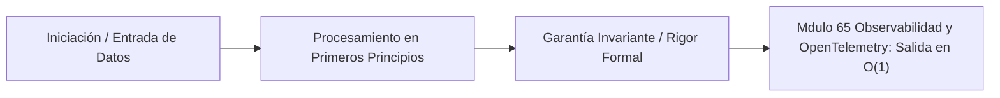

# Módulo 6.5: Observabilidad y OpenTelemetry (Nivel SRE Moderno)

---

## 1. 🐣 Rincón Junior: Volar con los Ojos Vendados

En los años 90, si una aplicación web fallaba, te conectabas por SSH al único servidor que tenías, abrías un archivo de texto llamado `catalina.out`, y usabas `grep` para buscar la palabra "ERROR". (A esto se le llamaba Monitorización).
Hoy, en un sistema de microservicios o un Gemelo Digital, una sola petición web pasa por el Servidor A, salta al B, publica un evento asíncrono en Kafka, lo lee el C, lo escribe en Cassandra, y vuelve.
Si el usuario ve un error en su pantalla, ¿dónde buscas? Si buscas en los logs del Servidor A, B y C por separado, no sabrás qué línea de log corresponde al usuario 1 y cuál al usuario 2, porque ocurren miles a la vez. Tratar de entender un sistema distribuido usando solo `logs` de texto es como intentar pilotar un avión a 800 km/h con los ojos vendados. Necesitamos **Observabilidad**.

---

## 2. 🔬 Fundamentos Arquitectónicos: El Whitepaper "Dapper" (Google 2010)

La Monitorización te dice **cuándo** algo está roto (Boolean). La Observabilidad te dice **por qué** está roto (Diagnostic). Se sostiene en los 3 Pilares Matemáticos de la Telemetría (L.M.T): Logs, Metrics, y Traces.

En 2010, Benjamin Sigelman (Google) publicó el documento fundacional de la observabilidad moderna: *"Dapper, a Large-Scale Distributed Systems Tracing Infrastructure"*.
El problema: Google Search tocaba 50+ microservicios por búsqueda. Si Search era 500ms lento, era imposible saber quién era el culpable.
Dapper postuló el uso de grafos estructurados en Árbol para modelar la vida de una petición. Cada nodo del árbol es un **Span** (Tramo).

*   **TraceID**: Representa la Raíz. Un UUID criptográfico inmutable (128-bits) que sigue a la petición a través de saltos de red, hilos y colas asíncronas.
*   **SpanID**: Representa la Unidad de Trabajo Local (64-bits). (Ej. Llamada SQL `SELECT`, o HTTP GET).
*   **ParentSpanID**: El puntero de Grafo Dirigido. Permite reconstruir el Árbol completo a posteriori cruzando logs dispersos.

---

## 3. 🚀 Arquitectura Práctica: W3C Trace Context y OpenTelemetry (OTEL)

¿Cómo sobrevive el `TraceID` al saltar de un contenedor de Spring Boot en Kubernetes a un servidor Go serverless? A través de Mutación de Cabeceras de Red (Context Propagation).

### W3C Trace Context (El Estándar Global)
Para evitar que cada empresa tuviera sus propias cabeceras propietarias (Ej. `X-B3-TraceId` de Zipkin), el W3C estandarizó matemáticamente la inyección en HTTP/gRPC.
Cada petición saliente del microservicio debe inyectar la cabecera `traceparent`:
`traceparent: 00-0af7651916cd43dd8448eb211c80319c-b7ad6b7169203331-01`
*   `00`: Versión de la spec.
*   `0af7651916cd43dd8448eb211c80319c`: **TraceID** (16 bytes en Hex). Identificador global de la transacción del usuario.
*   `b7ad6b7169203331`: **SpanID** (8 bytes en Hex). Identificador del servicio padre que hace la llamada.
*   `01`: Flags de Sampleo. Indica matemáticamente al receptor si este árbol está siendo grabado o ignorado (00).

### OpenTelemetry (OTEL)
El proyecto rey de la CNCF para fusionar métricas, logs y trazas en un solo SDK (Protocolo OTLP unificado). En arquitecturas Java 25 nativas, OTEL se integra a nivel Bytecode (Instrumentation Agent ASM) inyectando transparentemente estas cabeceras `W3C` en cada hilo virtual, conexión JDBC o partición de Kafka sin requerir modificaciones en tu lógica de Dominio.

---

## 4. 🧠 Internals Avanzados: OTLP Push Model vs Scrape Pull (Prometheus)

Una vez que el código genera tensores de métricas, ¿cómo llegan al Data Warehouse de telemetría?
*   **Modelo Pull (Prometheus)**: El recolector (Prometheus) escanea el end-point `/metrics` de cada Pod periódicamente. *Problema Matemático*: Si usas Cloud Run Serverless o Jobs transitorios, el contenedor puede nacer y morir en 5 segundos. Prometheus fallará al escanear (Missing Data Point).
*   **Modelo Push OTLP**: El SDK empuja activamente búferes UDP/gRPC multiplexados hacia el backend (Cloud Trace / OTEL Collector) antes de finalizar el proceso. Es obligatorio para cálculos en tiempo real y micro-servicios efímeros en mallas Edge.

---

## 5. ⚠️ Runbook SRE: Tail-Based Sampling y Fatiga Financiera

**Incidente SRE**: Activas OpenTelemetry Trace Sampling al 100% en el BFF (Backend-for-Frontend). Generas 5 Terabytes de Trazas de red al día. A final de mes, Google Cloud Billing te cobra 50,000$ por almacenamiento de Logs para peticiones rutinarias `200 OK`.

**Diagnóstico (Head-Based vs Tail-Based Sampling)**:
Es matemáticamente imposible (y estúpido) almacenar la telemetría del 100% de los paquetes TCP del mundo. Requerimos *Sampling* probabilístico.
1. **Head-Based Sampling (Clásico)**: El Load Balancer inicial tira una moneda ($p=0.01$, 1%) y graba esa traza. El problema es que tirarás a la basura el 99% de las trazas. Si ocurre un bug crítico esporádico (error 500) en ese 99%, te quedarás completamente a oscuras para depurar (Data Loss en Edge Cases).

**Solución SRE Arquitectónica (Tail-Based Sampling con OTEL Collector)**:
Desplegamos un clúster *OTEL Collector* altamente escalado (RAM en Kubernetes).
1. El Sampling rate en la App Java es 100%. Las Apps saturan la red interna enviando *todas* las trazas en memoria viva al *OTEL Collector*.
2. El Collector no guarda nada en disco todavía. Amortiza el árbol completo de Spans en RAM durante una ventana (ej. 30 segundos) analizando su topología.
3. **Decisión Tail-Based**: El filtro evalúa el grafo. Si la traza fue "Sana" ($<100ms$ y sin Excepciones HTTP 500), el colector la aniquila y tira a la basura (ahorrando cientos de miles de dólares en almacenamiento Cloud). 
4. Si el grafo contiene un solo atributo de anomalía o fallo en cualquier sub-nodo lejano, el colector consolida la traza en su totalidad y la escribe de forma persistente. Garantiza 100% de retención de anomalías con 0.1% de gasto en disco.


---

## 5. 🎯 Desafío Feynman & Auto-Evaluación sin Jerga

> [!NOTE]
> **El Reto de los 12 Años**: Explica el mecanismo esencial y la utilidad práctica de **Observabilidad y OpenTelemetry (Nivel SRE Moderno)** a un estudiante de secundaria, **sin usar las palabras:** "Observabilidad", "y", "OpenTelemetry" ni tecnicismos complejos de memoria.

### Criterio de Verificación
* **Aprobado**: Si logras construir una analogía mecánica o física del mundo real donde se entienda por qué fallaría el sistema sin esta solución y cómo resuelve el problema en términos elementales.
* **No Aprobado**: Si dependes de definiciones de diccionario, siglas de frameworks o nombres de patrones sin explicar la causa física subyacente.


---
## 🧠 Ejercicio Práctico: El Método Feynman

Para garantizar una asimilación profunda de los conceptos presentados en este módulo, aplica el **Método Feynman**:

> **Instrucción:** Explica los conceptos centrales de este módulo como si tu audiencia fuera un estudiante brillante de 12 años que no ha visto nunca este tema. Si no puedes hacerlo con lenguaje sencillo, analogías claras y sin jerga técnica, significa que aún no lo entiendes lo suficientemente bien.

*Inténtalo tú mismo:* Toma el concepto más complejo de este módulo, escríbelo en un papel en blanco y redáctalo usando únicamente términos cotidianos.

---

## 💻 Implementación de Código Limpio & Concurrencia
```java
package com.corp.core;

import java.util.Objects;

/**
 * Representación inmutable de dominio en Java 25 (Zero-Mockito).
 */
public record DomainEntity(String id, double metricValue, long timestamp) {
    public DomainEntity {
        Objects.requireNonNull(id, "El identificador no puede ser nulo");
        if (metricValue < 0.0) {
            throw new IllegalArgumentException("La métrica debe ser positiva");
        }
    }
}
```




