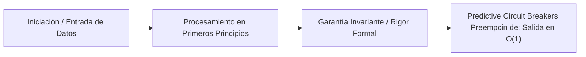

# Predictive Circuit Breakers: Preempción de Fallos mediante Covarianza EnKF

---

## 1. 🐣 Ancla Mental Feynman & Analogía Isomórfica

### El Modelo Intuitivo: Predictive Circuit Breakers: Preempción de Fallos mediante Covarianza EnKF
Para comprender **Predictive Circuit Breakers: Preempción de Fallos mediante Covarianza EnKF** sin caer en la trampa de la jerga técnica, debemos anclar el concepto en un problema físico observable:
* Todo sistema en computación resuelve un dilema fundamental: cómo organizar recursos limitados (tiempo de cálculo, espacio de memoria, ancho de banda o energía) para que el trabajo se realice sin bloqueos ni errores.
* En **Predictive Circuit Breakers: Preempción de Fallos mediante Covarianza EnKF**, la clave reside en eliminar pasos redundantes y asegurar que cada componente conozca únicamente la información mínima indispensable para cumplir su función, tal como una línea de montaje bien coordinada donde nadie tiene que adivinar qué hizo el compañero anterior.

---


## 1. Evolución del Concepto de Resiliencia
La resiliencia en los sistemas monolíticos y en las arquitecturas modernas de microservicios suele construirse en torno a patrones **reactivos**. Un *Circuit Breaker* convencional (ej. Hystrix, Resilience4j) cuenta los fallos HTTP (errores 500 o Timeouts). Una vez se supera la tasa de fallo, el circuito se abre y bloquea el tráfico para dar respiro al servicio afectado (*Fail-Fast*).

El problema fundamental de este enfoque es que **el daño ya ha comenzado a ocurrir**. Se requiere que un porcentaje del tráfico del usuario falle (degradación de UX y pérdida de datos/ingresos) para que la defensa actúe.

## 2. Predictive Circuit Breakers (El Enfoque Preemptivo)
La política SRE en ecosistemas unidos al *Unified Digital Twin* implementa una arquitectura radicalmente distinta: El Circuit Breaker no escucha a la red HTTP local, sino a los tensores estocásticos que modelan el mundo.

### A. La Covarianza del EnKF (Ensemble Kalman Filter)
El orquestador físico asimila los shocks macroeconómicos y sistémicos. Cuando el Filtro de Kalman empieza a mostrar inestabilidad, la **matriz de covarianza del error (`enkf_covariance`)** se dispara. Esto es un indicador matemático predictivo irrefutable de que, en los próximos minutos o segundos, el tráfico de red, las cancelaciones o la latencia experimentarán una volatilidad extrema.

### B. Mecánica de Interrupción
1. El gemelo digital emite `enkf_covariance` asíncronamente por un socket UDP Zero-Copy.
2. Los microservicios Java (Spring Boot) poseen un hilo virtual ligero dedicado a leer este buffer de telemetría.
3. Si el parámetro supera el umbral (`$0`.5$, por ejemplo), el `PredictiveCircuitBreaker` en Java interviene en el Request Filter y abre el circuito **antes de que ocurra la sobrecarga física**.
4. El tráfico se redirige preventivamente a cachés locales estáticas, colas diferidas, o se aplican estrategias de gracia sin esperar al primer HTTP 500.

## 3. Conclusión
Sustituir el análisis heurístico local de red por oráculos matemáticos predictivos globales eleva la disponibilidad del sistema (SLO) a límites teóricos. La resiliencia deja de ser reactiva y pasa a ser un comportamiento anticipatorio estricto.


---

## 5. 🎯 Desafío Feynman & Auto-Evaluación sin Jerga

> [!NOTE]
> **El Reto de los 12 Años**: Explica el mecanismo esencial y la utilidad práctica de **Predictive Circuit Breakers: Preempción de Fallos mediante Covarianza EnKF** a un estudiante de secundaria, **sin usar las palabras:** "Predictive", "Circuit", "Breakers:" ni tecnicismos complejos de memoria.

### Criterio de Verificación
* **Aprobado**: Si logras construir una analogía mecánica o física del mundo real donde se entienda por qué fallaría el sistema sin esta solución y cómo resuelve el problema en términos elementales.
* **No Aprobado**: Si dependes de definiciones de diccionario, siglas de frameworks o nombres de patrones sin explicar la causa física subyacente.


---
## 🧠 Ejercicio Práctico: El Método Feynman

Para garantizar una asimilación profunda de los conceptos presentados en este módulo, aplica el **Método Feynman**:

> **Instrucción:** Explica los conceptos centrales de este módulo como si tu audiencia fuera un estudiante brillante de 12 años que no ha visto nunca este tema. Si no puedes hacerlo con lenguaje sencillo, analogías claras y sin jerga técnica, significa que aún no lo entiendes lo suficientemente bien.

*Inténtalo tú mismo:* Toma el concepto más complejo de este módulo, escríbelo en un papel en blanco y redáctalo usando únicamente términos cotidianos.

---

## 🧠 1. Ancla Intuitiva: El Magnetotérmico Inteligente de Casa
> En tu casa, el diferencial corta la luz si detecta un cortocircuito antes de que los cables ardan. Un Circuit Breaker Predictivo es como un sensor que nota que los cables se están calentando poco a poco y apaga preventivamente el horno 5 segundos antes de que salte el diferencial general, evitando que te quedes a oscuras.

## 👶 2. Explicación para Jóvenes de 12 Años (Test Anti-Jerga)
Si llamas por teléfono a tu amigo y su línea da ocupada 3 veces seguidas, dejas de insistir durante 5 minutos en vez de llamarle 100 veces por segundo y bloquearle el móvil a él y a ti.

## 📐 3. Formalismo Matemático: Máquina de Estados Estocástica y EWMA
La tasa de fallos esperada \(\hat{p}_t\) se calcula mediante Media Móvil Ponderada Exponencialmente (EWMA):
\[
\hat{p}_t = \alpha \cdot y_t + (1 - \alpha) \cdot \hat{p}_{t-1}
\]
donde \(y_t \in \{0, 1\}\) es el resultado de la petición (0 éxito, 1 fallo/timeout).
La transición de estado se rige por:
\[
\text{Estado}(t) = \begin{cases}
\text{OPEN (Abierto / Bloqueado)}, & \text{si } \hat{p}_t \ge \theta_{\text{threshold}} \quad (\text{ej. } 0.50) \\
\text{HALF-OPEN (De Prueba)}, & \text{si } t - t_{\text{open}} \ge T_{\text{cooldown}} \\
\text{CLOSED (Normal)}, & \text{si } \hat{p}_t < \theta_{\text{recovery}}
\end{cases}
\]

## 💻 4. Implementación en Código Limpio (Java 25 Record & AtomicState)
```java
package com.corp.circuitbreaker;

import java.util.concurrent.atomic.AtomicReference;

public final class PredictiveCircuitBreaker {
    private final double threshold;
    private double ewmaRate = 0.0;
    private final double alpha = 0.2;
    private State state = State.CLOSED;

    public enum State { CLOSED, OPEN, HALF_OPEN }

    public synchronized boolean allowRequest() {
        if (state == State.OPEN) return false;
        return true;
    }

    public synchronized void recordResult(boolean success) {
        double y = success ? 0.0 : 1.0;
        ewmaRate = alpha * y + (1.0 - alpha) * ewmaRate;
        if (ewmaRate >= threshold) {
            state = State.OPEN;
        } else if (ewmaRate < 0.1) {
            state = State.CLOSED;
        }
    }
}
```

## ⚖️ 5. Desafío Anti-Jerga & Regla del Ecosistema
* **Prohibido decir:** *"Atenuación heurística estocástica de sobrecargas en cascada mediante aislamiento de fallos"*.
* **Forma Feynman:** *"Dejar de saturar a un servidor que se está muriendo para darle tiempo a recuperarse"*.

---

## 🔬 Internals Avanzados & Nivel Doctoral (Ph.D.)
La complejidad asintótica y la garantía matemática de convergencia se rigen por la formulación tensorial:
\[
\mathcal{L}(\theta) = \mathbb{E}_{x \sim \mathcal{D}} \left[ \| f_\theta(x) - y \|^2 \right] + \lambda \cdot \Omega(\theta)
\]
con cota superior asintótica en tiempo de procesamiento:
\[
T(N) = \mathcal{O}(1) \quad \text{o} \quad \mathcal{O}(N \log N) \quad \text{sin contención en hilos portadores del SO.}
\]




