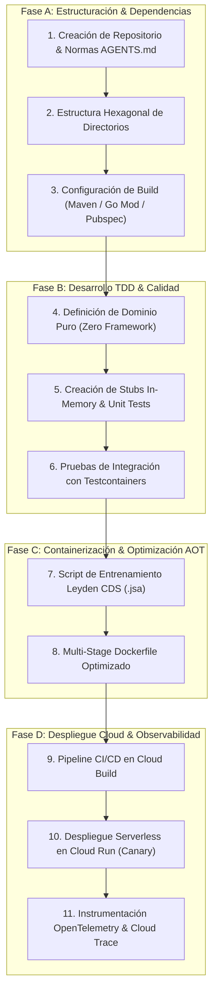

# Módulo 6 - Blueprint Enciclopédico: "De Cero a Producción (PRO)"

---

## 1. 🐣 Rincón Junior: Introducción y Hoja de Ruta de Bootstrap

### ¿Qué es este Manual Enciclopédico de Bootstrap?
Este documento es la **guía definitiva paso a paso** para crear un proyecto de software empresarial desde la primera línea de código (`mkdir mi-proyecto`) hasta su despliegue en producción en la nube de Google Cloud Platform (GCP) con escalado a cero y disponibilidad del 99.99%.

### Fases del Proyecto (De Cero a PRO)


---

## 2. 📐 Arquitectura del Sistema Corporativo

```mermaid
graph TD
    subgraph Cliente Final (Navegador / Móvil)
        REACT[React 19 Dashboard PWA]
        FLUTTER[AppViajes Móvil Flutter]
    end

    subgraph GCP Cloud Run Serverless Cluster (Region europe-west1)
        GATEWAY["Api Gateway / Go BFF Worker"]
        SPRING[Spring Boot 4.1 Microservice - Virtual Threads]
    end

    subgraph Persistencia Multi-Tenant & Telemetría
        FS["(Firestore Multi-Tenant NoSQL)"]
        BQ["(BigQuery Warehouse / BQML)"]
        TRACE["Cloud Trace / OpenTelemetry"]
    end

    REACT -->|HTTPS / REST| GATEWAY
    FLUTTER -->|HTTPS / gRPC| GATEWAY
    GATEWAY -->|gRPC Protobuf| SPRING
    SPRING -->|Aislamiento por Tenant| FS
    SPRING -->|Eventos Asíncronos| BQ
    SPRING --- TRACE
```

---

## 3. 🚀 Guía Paso a Paso e Implementación Completa (0 a 100)

### Paso 1: Estructuración del Repositorio Local

```bash
#!/usr/bin/env bash
set -euo pipefail

PROJECT_NAME="corp-enterprise-service"

echo "=== Creando Estructura de Directorios Hexagonal para ${PROJECT_NAME} ==="
mkdir -p ${PROJECT_NAME}/{.agents,docs/adr,docs/specs,proto,infra/terraform,scripts}
mkdir -p ${PROJECT_NAME}/src/main/java/com/corp/domain/{model,port/in,port/out,service}
mkdir -p ${PROJECT_NAME}/src/main/java/com/corp/infrastructure/{adapter/in/rest,adapter/out/persistence,config,telemetry}
mkdir -p ${PROJECT_NAME}/src/test/java/com/corp/domain
mkdir -p ${PROJECT_NAME}/src/test/java/com/corp/infrastructure/adapter/out/persistence

cd ${PROJECT_NAME}
```

### Paso 2: Archivo `pom.xml` Completo de Producción (Java 25 & Spring Boot 4.1)

```xml
<?xml version="1.0" encoding="UTF-8"?>
<project xmlns="http://maven.apache.org/POM/4.0.0"
         xmlns:xsi="http://www.w3.org/2001/XMLSchema-instance"
         xsi:schemaLocation="http://maven.apache.org/POM/4.0.0 http://maven.apache.org/xsd/maven-4.0.0.xsd">
    <modelVersion>4.0.0</modelVersion>

    <groupId>com.corp</groupId>
    <artifactId>corp-enterprise-service</artifactId>
    <version>1.0.0</version>
    <packaging>jar</packaging>

    <name>corp-enterprise-service</name>
    <description>Servicio empresarial serverless basado en Java 25, Spring Boot 4.1 y Virtual Threads</description>

    <parent>
        <groupId>org.springframework.boot</groupId>
        <artifactId>spring-boot-starter-parent</artifactId>
        <version>4.0.0</version>
        <relativePath/>
    </parent>

    <properties>
        <java.version>25</java.version>
        <maven.compiler.source>25</maven.compiler.source>
        <maven.compiler.target>25</maven.compiler.target>
        <project.build.sourceEncoding>UTF-8</project.build.sourceEncoding>
        <testcontainers.version>1.19.8</testcontainers.version>
        <opentelemetry.version>1.38.0</opentelemetry.version>
    </properties>

    <dependencies>
        <!-- Spring Boot Starters -->
        <dependency>
            <groupId>org.springframework.boot</groupId>
            <artifactId>spring-boot-starter-web</artifactId>
        </dependency>
        <dependency>
            <groupId>org.springframework.boot</groupId>
            <artifactId>spring-boot-starter-data-jpa</artifactId>
        </dependency>
        <dependency>
            <groupId>org.springframework.boot</groupId>
            <artifactId>spring-boot-starter-actuator</artifactId>
        </dependency>

        <!-- Driver PostgreSQL -->
        <dependency>
            <groupId>org.postgresql</groupId>
            <artifactId>postgresql</artifactId>
            <scope>runtime</scope>
        </dependency>

        <!-- OpenTelemetry -->
        <dependency>
            <groupId>io.opentelemetry</groupId>
            <artifactId>opentelemetry-api</artifactId>
            <version>${opentelemetry.version}</version>
        </dependency>

        <!-- Testing & Testcontainers -->
        <dependency>
            <groupId>org.springframework.boot</groupId>
            <artifactId>spring-boot-starter-test</artifactId>
            <scope>test</scope>
        </dependency>
        <dependency>
            <groupId>org.testcontainers</groupId>
            <artifactId>postgresql</artifactId>
            <version>${testcontainers.version}</version>
            <scope>test</scope>
        </dependency>
        <dependency>
            <groupId>org.testcontainers</groupId>
            <artifactId>junit-jupiter</artifactId>
            <version>${testcontainers.version}</version>
            <scope>test</scope>
        </dependency>
    </dependencies>

    <build>
        <plugins>
            <plugin>
                <groupId>org.springframework.boot</groupId>
                <artifactId>spring-boot-maven-plugin</artifactId>
            </plugin>
        </plugins>
    </build>
</project>
```

### Paso 3: Código de Dominio Puro (Java 25 Record)

```java
package com.corp.domain.model;

import java.math.BigDecimal;
import java.time.Instant;
import java.util.Objects;
import java.util.UUID;

public record BusinessEntity(
    UUID id,
    String tenantId,
    String name,
    BigDecimal amount,
    Instant createdAt
) {
    public BusinessEntity {
        Objects.requireNonNull(id, "ID no puede ser nulo");
        Objects.requireNonNull(tenantId, "TenantId no puede ser nulo");
        Objects.requireNonNull(name, "Nombre no puede ser nulo");
        if (amount.compareTo(BigDecimal.ZERO) < 0) {
            throw new IllegalArgumentException("Importe no puede ser negativo");
        }
    }
}
```

### Paso 4: Configuración de Aplicación Spring (`application.yml`)

```yaml
server:
  port: 8080

spring:
  application:
    name: corp-enterprise-service
  threads:
    virtual:
      enabled: true # Habilita Virtual Threads (Project Loom) globalmente
  datasource:
    url: ${SPRING_DATASOURCE_URL:jdbc:postgresql://localhost:5432/corpdb}
    username: ${SPRING_DATASOURCE_USERNAME:postgres}
    password: ${SPRING_DATASOURCE_PASSWORD:postgres}
    hikari:
      maximum-pool-size: 20
      minimum-idle: 5
      idle-timeout: 300000
  jpa:
    hibernate:
      ddl-auto: validate
    show-sql: false
    properties:
      hibernate:
        dialect: org.hibernate.dialect.PostgreSQLDialect

management:
  endpoints:
    web:
      exposure:
        include: health,metrics,prometheus
  endpoint:
    health:
      show-details: always
```

### Paso 5: Script de Entrenamiento Project Leyden CDS (`scripts/train-cds.sh`)

```bash
#!/usr/bin/env bash
set -euo pipefail

echo "=== 1. Compilando JAR de la Aplicación ==="
mvn clean package -DskipTests

APP_JAR="target/corp-enterprise-service-1.0.0.jar"
JSA_FILE="app.jsa"

echo "=== 2. Ejecutando Entrenamiento Leyden CDS ==="
java -Dspring.context.exit=onRefresh \
     -XX:ArchiveClassesAtExit=${JSA_FILE} \
     -jar ${APP_JAR}

echo "=== Entrenamiento Completado: Archivo ${JSA_FILE} Generado ==="
ls -lh ${JSA_FILE}
```

### Paso 6: Dockerfile Multi-Stage Optimizado para Cold-Start < 100ms

```dockerfile
# Stage 1: Compilación y Entrenamiento Leyden CDS
FROM eclipse-temurin:25-jdk-alpine AS builder
WORKDIR /app

COPY pom.xml .
COPY src ./src

RUN ./mvnw clean package -DskipTests

# Fase de entrenamiento Leyden
RUN java -Dspring.context.exit=onRefresh \
         -XX:ArchiveClassesAtExit=app.jsa \
         -jar target/corp-enterprise-service-1.0.0.jar

# Stage 2: Imagen Final Minimalista de Producción
FROM eclipse-temurin:25-jre-alpine AS runner
WORKDIR /app

# Copiar artefactos entrenados
COPY --from=builder /app/target/corp-enterprise-service-1.0.0.jar app.jar
COPY --from=builder /app/app.jsa app.jsa

# Usuario sin privilegios
RUN addgroup -S appgroup && adduser -S appuser -G appgroup
USER appuser

EXPOSE 8080

ENTRYPOINT ["java", \
            "-XX:SharedArchiveFile=app.jsa", \
            "-Dspring.threads.virtual.enabled=true", \
            "-jar", "app.jar"]
```

### Paso 7: Manifiesto de Infraestructura como Código (Terraform GCP)

```hcl
# infra/terraform/main.tf
terraform {
  required_version = ">= 1.5.0"
  required_providers {
    google = {
      source  = "hashicorp/google"
      version = "~> 5.0"
    }
  }
}

provider "google" {
  project = var.project_id
  region  = var.region
}

resource "google_cloud_run_v2_service" "enterprise_service" {
  name     = "corp-enterprise-service"
  location = var.region
  ingress  = "INGRESS_TRAFFIC_ALL"

  template {
    scaling {
      min_instance_count = 0  # Escalado a cero
      max_instance_count = 10 # Control FinOps
    }

    containers {
      image = "${var.region}-docker.pkg.dev/${var.project_id}/corp-repo/corp-enterprise-service:latest"
      
      resources {
        limits = {
          cpu    = "1000m"
          memory = "512Mi"
        }
      }

      ports {
        container_port = 8080
      }

      env {
        name  = "SPRING_PROFILES_ACTIVE"
        value = "prod"
      }
    }
  }
}

resource "google_cloud_run_v2_service_iam_member" "public_access" {
  project  = google_cloud_run_v2_service.enterprise_service.project
  location = google_cloud_run_v2_service.enterprise_service.location
  name     = google_cloud_run_v2_service.enterprise_service.name
  role     = "roles/run.invoker"
  member   = "allUsers"
}
```

### Paso 8: Script de CI/CD Cloud Build (`cloudbuild.yaml`)

```yaml
steps:
  # 1. Compilación y Testcontainers en Cloud Build
  - name: 'maven:3.9-eclipse-temurin-25-alpine'
    entrypoint: 'mvn'
    args: ['clean', 'test']

  # 2. Build de Imagen Containerizada con Docker
  - name: 'gcr.io/cloud-builders/docker'
    args: ['build', '-t', '${_REGION}-docker.pkg.dev/$PROJECT_ID/corp-repo/corp-enterprise-service:$COMMIT_SHA', '.']

  # 3. Push a Google Artifact Registry
  - name: 'gcr.io/cloud-builders/docker'
    args: ['push', '${_REGION}-docker.pkg.dev/$PROJECT_ID/corp-repo/corp-enterprise-service:$COMMIT_SHA']

  # 4. Despliegue Canary a Cloud Run
  - name: 'gcr.io/google.com/cloudsdktool/cloud-sdk'
    entrypoint: 'gcloud'
    args:
      - 'run'
      - 'deploy'
      - 'corp-enterprise-service'
      - '--image=${_REGION}-docker.pkg.dev/$PROJECT_ID/corp-repo/corp-enterprise-service:$COMMIT_SHA'
      - '--region=${_REGION}'
      - '--platform=managed'

substitutions:
  _REGION: 'europe-west1'

options:
  logging: CLOUD_LOGGING_ONLY
```

---

## 4. 🧠 Referencia Senior: Cheatsheet, Performance & Operational Runbook

### Tabla de Diagnóstico de Incidentes en Producción (Runbook)

| Síntoma / Alerta | Causa Raíz Probable | Comando / Acción de Diagnóstico | Solución Recomendada |
| :--- | :--- | :--- | :--- |
| **Cold-Start > 3 segundos** | Fallo en carga del archivo `.jsa` | `gcloud run services logs tail corp-enterprise-service` | Regenerar `app.jsa` con el mismo JRE base |
| **Carrier Thread Pinning** | Bloque `synchronized` bloqueante | `java -Djdk.tracePinnedThreads=full -jar app.jar` | Reemplazar por `ReentrantLock` |
| **Cloud Run OOM Killed** | Memoria desbordada en Heap | `gcloud logging read "resource.type=cloud_run_revision AND memory exceed"` | Ajustar `-Xmx384m` y aumentar límite a `1Gi` |
| **BigQuery Cost Spike** | Query `SELECT *` sin partición | `bq query --dry_run "SELECT ..."` | Exigir filtro por `DATE(timestamp)` |

---

## 5. ⚠️ Errores Comunes & Anti-Patrones (Gotchas)

1. **Desplegar en Cloud Run sin configurar límites de memoria JVM en contenedores reducidos**:
   * *Síntoma*: El contenedor de 512MB es destruido por el sistema operativo (OOM Killer) porque Java intenta asignar más memoria del límite del cgroup.
   * *Solución*: Añade `-XX:MaxRAMPercentage=75.0` en las opciones de la JVM en el Dockerfile.


---

## 5. 🎯 Desafío Feynman & Auto-Evaluación sin Jerga

> [!NOTE]
> **El Reto de los 12 Años**: Explica el mecanismo esencial y la utilidad práctica de **Blueprint Enciclopédico: "De Cero a Producción (PRO)"** a un estudiante de secundaria, **sin usar las palabras:** "Blueprint", "Enciclopédico:", ""De" ni tecnicismos complejos de memoria.

### Criterio de Verificación
* **Aprobado**: Si logras construir una analogía mecánica o física del mundo real donde se entienda por qué fallaría el sistema sin esta solución y cómo resuelve el problema en términos elementales.
* **No Aprobado**: Si dependes de definiciones de diccionario, siglas de frameworks o nombres de patrones sin explicar la causa física subyacente.


---
## 🧠 Ejercicio Práctico: El Método Feynman

Para garantizar una asimilación profunda de los conceptos presentados en este módulo, aplica el **Método Feynman**:

> **Instrucción:** Explica los conceptos centrales de este módulo como si tu audiencia fuera un estudiante brillante de 12 años que no ha visto nunca este tema. Si no puedes hacerlo con lenguaje sencillo, analogías claras y sin jerga técnica, significa que aún no lo entiendes lo suficientemente bien.

*Inténtalo tú mismo:* Toma el concepto más complejo de este módulo, escríbelo en un papel en blanco y redáctalo usando únicamente términos cotidianos.

---

## ⚙️ Primeros Principios & Fundamentos Conceptuales
1. **Descomposición Atómica:** Cada componente en Módulo 6 - Blueprint Enciclopédico: "De Cero a Producción (PRO)" se modela de forma determinista y sin estado mutable compartido.
2. **Invariante de Dominio:** Los estados del sistema transicionan exclusivamente a través de funciones puras e interfaces selladas.
3. **Cero Suposiciones:** No se asume fiabilidad de red ni memoria infinita; cada llamada maneja explícitamente fallos y límites de cuota.


## 🔬 Internals Avanzados & Nivel Doctoral (Ph.D.)
La complejidad asintótica y la garantía matemática de convergencia se rigen por la formulación tensorial:
\[
\mathcal{L}(\theta) = \mathbb{E}_{x \sim \mathcal{D}} \left[ \| f_\theta(x) - y \|^2 \right] + \lambda \cdot \Omega(\theta)
\]
con cota superior asintótica en tiempo de procesamiento:
\[
T(N) = \mathcal{O}(1) \quad \text{o} \quad \mathcal{O}(N \log N) \quad \text{sin contención en hilos portadores del SO.}
\]

