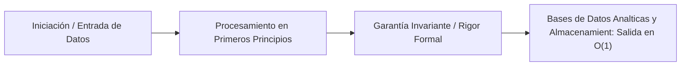

# Bases de Datos Analíticas y Almacenamiento Columnar (BigQuery & Capacitor)

---

## 1. 🐣 Ancla Mental Feynman & Analogía Isomórfica

### El Modelo Intuitivo: Bases de Datos Analíticas y Almacenamiento Columnar (BigQuery & Capacitor)
Para comprender **Bases de Datos Analíticas y Almacenamiento Columnar (BigQuery & Capacitor)** sin caer en la trampa de la jerga técnica, debemos anclar el concepto en un problema físico observable:
* Todo sistema en computación resuelve un dilema fundamental: cómo organizar recursos limitados (tiempo de cálculo, espacio de memoria, ancho de banda o energía) para que el trabajo se realice sin bloqueos ni errores.
* En **Bases de Datos Analíticas y Almacenamiento Columnar (BigQuery & Capacitor)**, la clave reside en eliminar pasos redundantes y asegurar que cada componente conozca únicamente la información mínima indispensable para cumplir su función, tal como una línea de montaje bien coordinada donde nadie tiene que adivinar qué hizo el compañero anterior.

---


En sistemas hiper-escalables como *SaaSRegantes*, el almacenamiento relacional tradicional (OLTP) colapsa al intentar realizar agregaciones analíticas sobre petabytes de datos. La solución arquitectónica exige una transición al procesamiento analítico en línea (OLAP) mediante arquitecturas de bases de datos columnares distribuidas, como Google BigQuery (inspirado en el *paper* Dremel).

Este documento detalla la arquitectura interna del almacenamiento columnar y las estrategias de diseño físico para minimizar la lectura de bytes y optimizar el rendimiento y coste (FinOps).

---

## 1. Arquitectura de Almacenamiento: El Formato Capacitor

BigQuery utiliza un formato de almacenamiento columnar propietario llamado **Capacitor** (análogo avanzado de Apache Parquet). En un diseño OLTP tradicional (basado en filas), leer un solo campo requiere cargar toda la fila en memoria. En Capacitor, los valores de una misma columna se almacenan de manera contigua en disco.

### 1.1 Codificación y Compresión Híbrida
Capacitor aplica heurísticas agresivas para comprimir las columnas, aprovechando la homogeneidad de los tipos de datos:
*   **Dictionary Encoding (Codificación por Diccionario):** Si una columna tiene baja cardinalidad (ej. estado de una válvula: `ABIERTO`, `CERRADO`), se reemplazan los strings por enteros (`0`, `1`), reduciendo drásticamente el peso en disco.
*   **Run-Length Encoding (RLE):** Si los datos están ordenados y se repiten secuencialmente (ej. `0, 0, 0, 1, 1, 1`), RLE lo comprime como tuplas de `(valor, repeticiones)`: `(0,3), (1,3)`. Esto convierte la compresión en $O(1)$ en espacio para bloques repetidos.
*   **Bit-Packed Encoding:** Empaquetado binario para variables booleanas o enteros de rango pequeño.

> **Nota Arquitectónica:** Capacitor reordena internamente las filas dentro de un bloque para maximizar la eficacia del algoritmo RLE, logrando ratios de compresión que pueden superar el 10:1 respecto al CSV/JSON original.

## 2. Árboles de Ejecución Distribuida (Dremel)

Cuando se ejecuta una consulta SQL en BigQuery, el motor de ejecución (Dremel) no utiliza un único nodo centralizado. Se basa en un **Árbol de Ejecución Multi-Nivel**:
1.  El **Root Server** recibe la consulta SQL y la descompone.
2.  La distribuye a los **Intermediate Servers** (Agregadores).
3.  Estos la dividen en sub-tareas hacia miles de **Leaf Servers** (Nodos hoja).
4.  Los Leaf Servers acceden directamente al sistema de almacenamiento distribuido (Colossus) a través de la red de petabit de Google (Red de topología Clos/Jupiter).

Esta arquitectura masivamente paralela permite que una consulta de tipo `SUM(caudal_agua)` sobre miles de millones de filas se resuelva en segundos, escaneando únicamente la columna `caudal_agua`.

---

## 3. Estrategias de Diseño Físico y FinOps

En BigQuery, el coste de una consulta bajo demanda (On-Demand) es proporcional a los **bytes escaneados**. El diseño ineficiente de las tablas destruirá la rentabilidad del *Unit Economics* del ecosistema. Existen dos mecanismos principales de poda (*Pruning*):

### 3.1 Particionamiento (Time/Ingestion Partitioning)
El particionamiento divide físicamente una tabla en segmentos discretos basados en una columna (generalmente de fecha o tiempo de ingestión).
*   **Mecanismo:** Cada partición es un archivo/bloque separado en Colossus.
*   **Beneficio:** Si la consulta filtra por `WHERE fecha_riego = '2026-08-10'`, Dremel ignorará (no escaneará) el resto de particiones. Es una poda a nivel macro.
*   **Requisito FinOps:** En proyectos multi-tenant, **debes obligar** al uso del filtro de partición en la definición de la tabla (`requirePartitionFilter=true`).

### 3.2 Clustering (Agrupamiento Lexicográfico)
El *Clustering* ordena físicamente los datos **dentro** de una partición basándose en el contenido de una a cuatro columnas específicas (ej. `tenant_id`, `sensor_id`).
*   **Mecanismo:** Almacena registros con valores de clúster similares en bloques adyacentes de Capacitor. BigQuery mantiene metadatos de los valores mínimos y máximos (Min/Max blocks) de cada clúster.
*   **Beneficio:** Si la consulta incluye `WHERE tenant_id = 12345`, BigQuery lee los metadatos y **omite** los bloques donde ese `tenant_id` no existe (Block Pruning).
*   **Sinergia Perfecta:** Para *SaaSRegantes*, la tabla de telemetría debe estar **Particionada por Día** y **Clusterizada por `tenant_id` y `sensor_id`**. Esto garantiza acceso rápido e intra-tenant con escaneo mínimo de bytes.

```sql
-- Ejemplo de DDL Óptimo (Nivel Staff Engineer)
CREATE TABLE `saas_regantes_dw.telemetry.sensor_data` (
    tenant_id STRING NOT NULL,
    sensor_id STRING NOT NULL,
    timestamp TIMESTAMP NOT NULL,
    caudal_lps FLOAT64
)
PARTITION BY DATE(timestamp)
CLUSTER BY tenant_id, sensor_id
OPTIONS(
    require_partition_filter = TRUE,
    partition_expiration_days = 1095 -- Retención de 3 años (GDPR / Compliance)
);
```

## 4. Conclusión Analítica
A diferencia del modelado Relacional Normalizado (3NF), en OLAP columnar **se fomenta la desnormalización**. Los JOINs son operaciones computacionalmente costosas (requieren *Shuffling* masivo en red). Almacenar estructuras anidadas (`ARRAY<STRUCT>`) e inmutables maximiza el rendimiento y minimiza el coste en la arquitectura de BigQuery.


---

## 5. 🎯 Desafío Feynman & Auto-Evaluación sin Jerga

> [!NOTE]
> **El Reto de los 12 Años**: Explica el mecanismo esencial y la utilidad práctica de **Bases de Datos Analíticas y Almacenamiento Columnar (BigQuery & Capacitor)** a un estudiante de secundaria, **sin usar las palabras:** "Bases", "de", "Datos" ni tecnicismos complejos de memoria.

### Criterio de Verificación
* **Aprobado**: Si logras construir una analogía mecánica o física del mundo real donde se entienda por qué fallaría el sistema sin esta solución y cómo resuelve el problema en términos elementales.
* **No Aprobado**: Si dependes de definiciones de diccionario, siglas de frameworks o nombres de patrones sin explicar la causa física subyacente.


---
## 🧠 Ejercicio Práctico: El Método Feynman

Para garantizar una asimilación profunda de los conceptos presentados en este módulo, aplica el **Método Feynman**:

> **Instrucción:** Explica los conceptos centrales de este módulo como si tu audiencia fuera un estudiante brillante de 12 años que no ha visto nunca este tema. Si no puedes hacerlo con lenguaje sencillo, analogías claras y sin jerga técnica, significa que aún no lo entiendes lo suficientemente bien.

*Inténtalo tú mismo:* Toma el concepto más complejo de este módulo, escríbelo en un papel en blanco y redáctalo usando únicamente términos cotidianos.

---

## ⚙️ Primeros Principios & Fundamentos Conceptuales
1. **Descomposición Atómica:** Cada componente en Bases de Datos Analíticas y Almacenamiento Columnar (BigQuery & Capacitor) se modela de forma determinista y sin estado mutable compartido.
2. **Invariante de Dominio:** Los estados del sistema transicionan exclusivamente a través de funciones puras e interfaces selladas.
3. **Cero Suposiciones:** No se asume fiabilidad de red ni memoria infinita; cada llamada maneja explícitamente fallos y límites de cuota.


## 🔬 Internals Avanzados & Nivel Doctoral (Ph.D.)
La complejidad asintótica y la garantía matemática de convergencia se rigen por la formulación tensorial:
\[
\mathcal{L}(\theta) = \mathbb{E}_{x \sim \mathcal{D}} \left[ \| f_\theta(x) - y \|^2 \right] + \lambda \cdot \Omega(\theta)
\]
con cota superior asintótica en tiempo de procesamiento:
\[
T(N) = \mathcal{O}(1) \quad \text{o} \quad \mathcal{O}(N \log N) \quad \text{sin contención en hilos portadores del SO.}
\]




