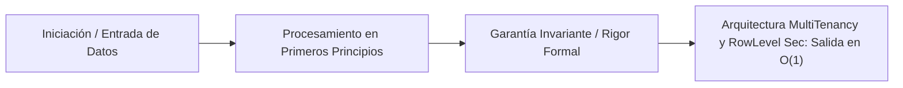

# Arquitectura Multi-Tenancy y Row-Level Security (RLS)

---

## 1. 🐣 Ancla Mental Feynman & Analogía Isomórfica

### El Modelo Intuitivo: Arquitectura Multi-Tenancy y Row-Level Security (RLS)
Para comprender **Arquitectura Multi-Tenancy y Row-Level Security (RLS)** sin caer en la trampa de la jerga técnica, debemos anclar el concepto en un problema físico observable:
* Todo sistema en computación resuelve un dilema fundamental: cómo organizar recursos limitados (tiempo de cálculo, espacio de memoria, ancho de banda o energía) para que el trabajo se realice sin bloqueos ni errores.
* En **Arquitectura Multi-Tenancy y Row-Level Security (RLS)**, la clave reside en eliminar pasos redundantes y asegurar que cada componente conozca únicamente la información mínima indispensable para cumplir su función, tal como una línea de montaje bien coordinada donde nadie tiene que adivinar qué hizo el compañero anterior.

---


Diseñar sistemas SaaS modernos (como *SaaSRegantes*) requiere proveer servicios a múltiples clientes (Inquilinos o *Tenants*) utilizando la misma base de código subyacente y, a menudo, la misma infraestructura. El desafío crítico radica en garantizar un aislamiento hermético de los datos para cumplir con normativas (GDPR) mientras se optimizan los costes operacionales.

Este documento formaliza los tres patrones principales de arquitectura *Multi-Tenant* en bases de datos (Relacionales, BigQuery y Firestore) y cómo orquestar la seguridad en la capa de acceso.

---

## 1. Patrones de Almacenamiento Multi-Tenant

La decisión arquitectónica sobre cómo separar los datos de los inquilinos es el pilar del SaaS. No hay una "bala de plata"; la elección dependerá de la latencia requerida, el marco regulatorio (aislamiento físico vs. lógico) y el FinOps.

### 1.1 Patrón Silo (Instancia o Base de Datos Dedicada)
Cada Tenant posee recursos físicos o lógicos dedicados exclusivamente a él.
*   **En Relacional (PostgreSQL/Spanner):** Una base de datos independiente por Tenant (`db_tenant_a`, `db_tenant_b`).
*   **En Firestore:** Un proyecto GCP de Firebase separado por Tenant.
*   **En BigQuery:** Un `Dataset` independiente por Tenant.
*   **Ventajas:** Máxima seguridad y aislamiento (*Noisy Neighbor mitigation*). Copias de seguridad y restauraciones granulares por cliente.
*   **Desventajas:** Alta complejidad operativa (gestionar migraciones de esquemas en 1,000 bases de datos distintas) y sobrecoste de infraestructura.
*   **Caso de Uso:** Inquilinos Enterprise, agencias gubernamentales o clientes con normativas de soberanía de datos ultra-restrictivas.

### 1.2 Patrón Bridge (Esquema Compartido, Tablas Aisladas)
Los Tenants comparten la misma base de datos física, pero sus datos se aíslan a nivel estructural.
*   **En Relacional:** Un esquema dedicado por Tenant dentro de la misma DB (ej. `tenant_a.users`, `tenant_b.users`).
*   **En Firestore:** Múltiples bases de datos dentro del mismo proyecto, o aislar a nivel de colecciones raíz (`/tenant_a_users/`, `/tenant_b_users/`).
*   **Ventajas:** Balance razonable. Mismo coste de servidor de base de datos.
*   **Desventajas:** Límite estructural de las bases de datos (algunos motores no escalan bien con cientos de miles de tablas/esquemas).

### 1.3 Patrón Pool (Base de Datos y Tablas Compartidas)
Todos los Tenants comparten la misma base de datos, el mismo esquema y las mismas tablas.
*   **Implementación Universal:** Cada tabla o colección incluye obligatoriamente una columna/atributo `tenant_id`. Toda consulta (SELECT/UPDATE) **debe** incluir `WHERE tenant_id = 'X'`.
*   **En BigQuery:** Tablas agrupadas (*Clustered*) obligatoriamente por `tenant_id` para garantizar que no se escaneen datos de otros clientes (poda de bloques).
*   **En Firestore:** Documentos alojados dentro de una subcolección dinámica bajo el root del tenant: `/tenants/{tenant_id}/users/{user_id}`.
*   **Ventajas:** Escalamiento infinito de clientes, costes de infraestructura compartidos optimizados al máximo (Unit Economics brillante), facilidad extrema de migraciones (un solo ALTER TABLE para todos los clientes).
*   **Desventajas:** Alto riesgo de fuga de datos (*Data Leakage*) si un ingeniero olvida el filtro `WHERE tenant_id` en una consulta manual o en código (requiere RLS para blindarse).

---

## 2. Row-Level Security (RLS) en SQL y BigQuery

Dado que el patrón **Pool** es el estándar de facto en ecosistemas B2B de alto crecimiento (por su rentabilidad), se hace obligatorio habilitar capas de seguridad en el motor para evitar fugas catastróficas.
*Row-Level Security* (Seguridad a Nivel de Fila) permite al administrador de la base de datos establecer políticas (Policies) invisibles y deterministas para filtrar automáticamente los registros devueltos.

### 2.1 RLS en PostgreSQL / Spanner
Se intercepta el contexto del usuario (inyectado desde la conexión JDBC / R2DBC usando `SET LOCAL`) y se evalúa a nivel kernel de la base de datos:

```sql
-- Habilitación de RLS para el patrón Pool
ALTER TABLE telemetry ENABLE ROW LEVEL SECURITY;

-- Creación de la política estricta
CREATE POLICY tenant_isolation_policy ON telemetry
    USING (tenant_id = current_setting('app.current_tenant_id')::UUID);
```
**Resultado:** Si el BFF ejecuta un torpe `SELECT * FROM telemetry;`, el motor lo sobrescribirá silenciosamente a `SELECT * FROM telemetry WHERE tenant_id = 'el-id-del-sesion';`. Cero riesgo de fuga.

### 2.2 RLS y Aislamiento en BigQuery
BigQuery soporta Políticas de Acceso a Nivel de Fila (Row-Level Access Policies).
```sql
CREATE ROW ACCESS POLICY tenant_a_filter
ON `saas_regantes_dw.telemetry.sensor_data`
GRANT TO ('user:analista-a@tenant-a.com')
FILTER USING (tenant_id = 'A');
```
De este modo, se pueden construir paneles de visualización universales (en Looker) que apuntan a la misma tabla global, pero el acceso a los datos subyacentes se corta automáticamente en función del correo del usuario logueado o de su *Service Account*.

---

## 3. Firestore Security Rules: Aislamiento Molecular

En arquitecturas Serverless y Móviles, los clientes (Android, iOS, React Web) se conectan directamente a Firestore, saltándose el middleware del backend. El motor de seguridad recae íntegramente en las **Firestore Security Rules**.

### 3.1 Custom Claims (Token JWT)
En el *Gateway* o sistema de autenticación (Firebase Auth / Spring Security), se inyecta el `tenant_id` en los claims seguros (Carga útil) del Token JWT que porta el cliente. El usuario no puede modificar estos claims.

### 3.2 Reglas de Validación Celular
En Firestore, la regla de acceso debe coincidir estructuralmente con la jerarquía del dato (Patrón Pool implementado vía Subcolecciones):

```javascript
rules_version = '2';
service cloud.firestore {
  match /databases/{database}/documents {
    
    // Función auxiliar para leer los Custom Claims inyectados desde el Backend
    function isTenant(tenantId) {
      return request.auth != null && request.auth.token.tenant_id == tenantId;
    }

    // Aislamiento rígido de colecciones basadas en la jerarquía del tenant
    match /tenants/{tenantId} {
      allow read, write: if isTenant(tenantId);
      
      match /sensores/{sensorId} {
         allow read, write: if isTenant(tenantId);
      }
    }
  }
}
```

## 4. Veredicto del Consilium
Para *SaaSRegantes*, la arquitectura recomendada es el **Patrón Pool**. Un clúster de base de datos unificado reduce los costes de cold-start y mantenimiento. La contrapartida de la fuga de datos queda matemáticamente neutralizada al combinar arquitecturas RLS en el plano SQL y *Custom Claims* validados inmutablemente en el plano Firestore. Esta sinergia asegura un *SaaS* económicamente resiliente y legalmente blindado.


---

## 5. 🎯 Desafío Feynman & Auto-Evaluación sin Jerga

> [!NOTE]
> **El Reto de los 12 Años**: Explica el mecanismo esencial y la utilidad práctica de **Arquitectura Multi-Tenancy y Row-Level Security (RLS)** a un estudiante de secundaria, **sin usar las palabras:** "Arquitectura", "Multi-Tenancy", "y" ni tecnicismos complejos de memoria.

### Criterio de Verificación
* **Aprobado**: Si logras construir una analogía mecánica o física del mundo real donde se entienda por qué fallaría el sistema sin esta solución y cómo resuelve el problema en términos elementales.
* **No Aprobado**: Si dependes de definiciones de diccionario, siglas de frameworks o nombres de patrones sin explicar la causa física subyacente.


---
## 🧠 Ejercicio Práctico: El Método Feynman

Para garantizar una asimilación profunda de los conceptos presentados en este módulo, aplica el **Método Feynman**:

> **Instrucción:** Explica los conceptos centrales de este módulo como si tu audiencia fuera un estudiante brillante de 12 años que no ha visto nunca este tema. Si no puedes hacerlo con lenguaje sencillo, analogías claras y sin jerga técnica, significa que aún no lo entiendes lo suficientemente bien.

*Inténtalo tú mismo:* Toma el concepto más complejo de este módulo, escríbelo en un papel en blanco y redáctalo usando únicamente términos cotidianos.

---

## ⚙️ Primeros Principios & Fundamentos Conceptuales
1. **Descomposición Atómica:** Cada componente en Arquitectura Multi-Tenancy y Row-Level Security (RLS) se modela de forma determinista y sin estado mutable compartido.
2. **Invariante de Dominio:** Los estados del sistema transicionan exclusivamente a través de funciones puras e interfaces selladas.
3. **Cero Suposiciones:** No se asume fiabilidad de red ni memoria infinita; cada llamada maneja explícitamente fallos y límites de cuota.


## 🔬 Internals Avanzados & Nivel Doctoral (Ph.D.)
La complejidad asintótica y la garantía matemática de convergencia se rigen por la formulación tensorial:
\[
\mathcal{L}(\theta) = \mathbb{E}_{x \sim \mathcal{D}} \left[ \| f_\theta(x) - y \|^2 \right] + \lambda \cdot \Omega(\theta)
\]
con cota superior asintótica en tiempo de procesamiento:
\[
T(N) = \mathcal{O}(1) \quad \text{o} \quad \mathcal{O}(N \log N) \quad \text{sin contención en hilos portadores del SO.}
\]




