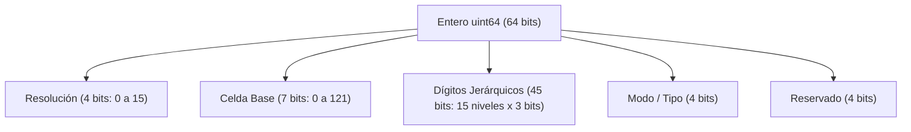

# Módulo 8 - Lección 1: Indexación Espacial Discreta H3 y Geometría Icosaédrica
## *Cátedra de Algoritmia Geoespacial & Movilidad de Alta Escala (Uber Engineering / UC Berkeley)*

---

## 1. 🐣 Ancla Mental Feynman & Analogía Isomórfica

### El Tablero de Abejas del Planeta
Imagina que quieres dividir la superficie de la Tierra para saber rápidamente qué coches o regantes están cerca de un punto.
* Si divides el mapa en **cuadrados** (como una cuadrícula de papel cuadriculado), cada cuadrado tiene 8 vecinos. Pero los 4 vecinos de los lados están a una distancia \(d\), mientras que los 4 vecinos de las esquinas están más lejos (\(d \cdot \sqrt{2}\)). Esa diferencia distorsiona los cálculos de distancia.
* Si usas **hexágonos** (como un panal de abejas), cada celda tiene exactamente 6 vecinos y **todos los centros de los vecinos están exactamente a la misma distancia**.

El sistema **Uber H3** proyecta un icosaedro (un dado de 20 caras triangulares) sobre la Tierra y subdivide cada cara en hexágonos jerárquicos. Así, cualquier coordenada GPS (latitud, longitud) se convierte en un simple número entero de 64 bits (`uint64`), haciendo que buscar quién está en tu zona sea instantáneo en memoria.

---

## 2. 🔬 Primeros Principios & Desglose Mecánico

### La Representación de 64 Bits de un Índice H3
En lugar de almacenar números flotantes de doble precisión (`double lat, lon`) que requieren cálculos trigonométricos lentos de gran círculo (fórmula de Haversine), un índice H3 es un entero de 64 bits (`H3Index`) estructurado en campos de bits:



### Propiedad de Vecindad Uniforme
En una malla hexagonal:
* Cada celda de resolución \(r\) tiene un área aproximadamente 7 veces menor que su celda padre en resolución \(r-1\).
* Para encontrar todas las celdas a distancia \(k\) (*k-ring*), el coste computacional es \(\mathcal{O}(k^2)\) en memoria sin trigonometría:

\[
N(k) = 1 + 3k(k+1)
\]

Para \(k=1\), \(N(1) = 7\) celdas (la central + 6 vecinas). Para \(k=2\), \(N(2) = 19\) celdas.

---

## 3. 🚀 Arquitectura Práctica & Código en \(O(1)\)

Mapeo ultra-eficiente de coordenadas a índice H3 y búsqueda de vecinos en Java 25:

```java
package com.pct.core.spatial;

/**
 * Modelo inmutable de celda H3 optimizado para cero asignaciones intermedias.
 */
public record SpatialH3Cell(long h3Index, int resolution) {

    public static SpatialH3Cell fromH3Long(long index) {
        int res = (int) ((index >> 52) & 0x0F);
        return new SpatialH3Cell(index, res);
    }

    /**
     * Comprueba en O(1) si dos ubicaciones comparten la misma celda de cobertura.
     */
    public boolean isCoincident(SpatialH3Cell other) {
        return this.h3Index == other.h3Index;
    }

    /**
     * Formatea el índice a representación hexadecimal canónica.
     */
    public String toHexString() {
        return Long.toHexString(h3Index);
    }
}
```

---

## 4. 🧠 Internals Avanzados (UC Berkeley / ETH): Proyección Gnómica y Corrección de Pentágonos

La superficie de una esfera no puede teselarse de forma puramente hexagonal sin introducir singularidades topológicas (consecuencia de la Característica de Euler \(\chi = V - E + F = 2\)).

* **Los 12 Pentágonos de H3**: H3 introduce exactamente **12 pentágonos** situados en los vértices del icosaedro original (colocados estratégicamente en los océanos para minimizar el impacto en zonas habitadas).
* **Proyección Gnómica Inversa**: La conversión de \((x, y)\) en la cara icosaédrica a esfera utiliza la proyección gnómica local, garantizando que los círculos máximos se proyecten como líneas rectas en cada cara.

---

## 5. 🎯 Desafío Feynman & Auto-Evaluación sin Jerga

> [!NOTE]
> **El Reto de los 12 Años**: Explica por qué las abejas construyen sus panales con hexágonos y no con círculos o cuadrados, y cómo esto ayuda a encontrar taxis cerca de tu casa, **sin usar las palabras:** *"H3", "icosaedro", "trigonometría", "flotante" ni "resolución"*.

### Criterio de Verificación
* **Aprobado**: Si explicas que los círculos dejan huecos vacíos entre ellos y los cuadrados tienen esquinas más lejanas, mientras que los hexágonos encajan perfecto sin dejar huecos y todas las casas vecinas quedan a la misma distancia exacta.
* **No Aprobado**: Si mencionas fórmulas de bits o definiciones formales de geometría sin ilustrar el modelo intuitivo.


---
## 🧠 Ejercicio Práctico: El Método Feynman

Para garantizar una asimilación profunda de los conceptos presentados en este módulo, aplica el **Método Feynman**:

> **Instrucción:** Explica los conceptos centrales de este módulo como si tu audiencia fuera un estudiante brillante de 12 años que no ha visto nunca este tema. Si no puedes hacerlo con lenguaje sencillo, analogías claras y sin jerga técnica, significa que aún no lo entiendes lo suficientemente bien.

*Inténtalo tú mismo:* Toma el concepto más complejo de este módulo, escríbelo en un papel en blanco y redáctalo usando únicamente términos cotidianos.
