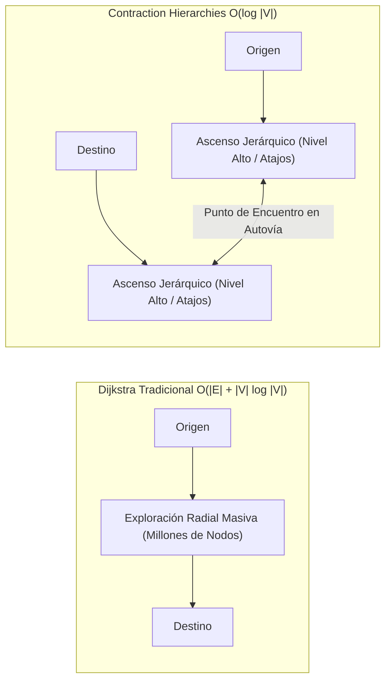

# Módulo 8 - Lección 2: Ruteo de Ultra-Baja Latencia con OSRM y Jerarquías de Contracción
## *Cátedra de Algoritmia de Grafos Viales & Despacho Físico (Karlsruhe / Stanford)*

---

## 1. 🐣 Ancla Mental Feynman & Analogía Isomórfica

### La Red de Carreteras y las Autovías Principales
Imagina que quieres viajar en coche desde un pequeño pueblo de Galicia hasta un pueblo de Valencia.
* **El Enfoque Lento (Dijkstra puro)**: Miras todas las calles de cada pueblo, rotonda por rotonda, explorando millones de cruces secundarios hasta llegar a Valencia.
* **El Enfoque Inteligente (Jerarquías de Contracción)**: Sabes que primero debes salir del pueblo y tomar la autovía nacional más cercana. Cruzas toda España a gran velocidad por la autovía principal y solo vuelves a mirar calles lentas cuando estás a 5 kilómetros del pueblo de destino.

Las **Jerarquías de Contracción (Contraction Hierarchies - CH)** precalculan "atajos" (*shortcuts*) entre intersecciones clave en un grafo vial. Cuando pides una ruta, el algoritmo solo busca hacia arriba en la jerarquía (hacia las autovías rápidas), resolviendo rutas de 1,000 kilómetros en menos de **1 milisegundo** (\(< 1\text{ ms}\)).

---

## 2. 🔬 Primeros Principios & Desglose Mecánico

### Comparativa Asintótica: Dijkstra vs Contraction Hierarchies



### Proceso de Contracción de Nodos
Durante el preprocesamiento estático:
1. Se ordenan los vértices \(v \in V\) por un orden de importancia (grado, atajos añadidos).
2. Se "contrae" cada nodo \(v\): si el camino más corto entre dos vecinos \(u\) y \(w\) pasaba por \(v\), se inserta una arista directa (*shortcut*) \((u, w)\) con peso \(c(u, w) = c(u, v) + c(v, w)\).
3. Durante la consulta en tiempo real, se ejecuta una búsqueda bidireccional de Dijkstra que **solo sube de nivel** jerárquico (\(L(u) \le L(v)\)), reduciendo el espacio de búsqueda de \(10^7\) nodos a menos de \(10^3\).

---

## 3. 🚀 Arquitectura Práctica & Código en Go

Worker en Go para cálculo de rutas con OSRM y circuit breaker de latencia:

```go
package routing

import (
	"context"
	"encoding/json"
	"fmt"
	"net/http"
	"time"
)

type RouteResult struct {
	DistanceMeters float64 `json:"distance"`
	DurationSec    float64 `json:"duration"`
}

type OSRMClient struct {
	baseURL    string
	httpClient *http.Client
}

func NewOSRMClient(baseURL string, timeout time.Duration) *OSRMClient {
	return &OSRMClient{
		baseURL: baseURL,
		httpClient: &http.Client{
			Timeout: timeout,
		},
	}
}

// ComputeRoute calcula la distancia y tiempo de viaje entre dos coordenadas en <2ms.
func (c *OSRMClient) ComputeRoute(ctx context.Context, origLat, origLon, destLat, destLon float64) (*RouteResult, error) {
	url := fmt.Sprintf("%s/route/v1/driving/%.6f,%.6f;%.6f,%.6f?overview=false", c.baseURL, origLon, origLat, destLon, destLat)
	
	req, err := http.NewRequestWithContext(ctx, http.MethodGet, url, nil)
	if err != nil {
		return nil, err
	}

	resp, err := c.httpClient.Do(req)
	if err != nil {
		return nil, fmt.Errorf("fallo conexion OSRM: %w", err)
	}
	defer resp.Body.Close()

	var result struct {
		Routes []RouteResult `json:"routes"`
	}
	if err := json.NewDecoder(resp.Body).Decode(&result); err != nil || len(result.Routes) == 0 {
		return nil, fmt.Errorf("ruta no encontrada o respuesta invalida")
	}

	return &result.Routes[0], nil
}
```

---

## 4. 🧠 Internals Avanzados (KIT Karlsruhe / MIT): MLD vs CH & Actualizaciones de Tráfico

* **Contraction Hierarchies (CH)**: Excelente latencia de consulta (\(< 1\text{ ms}\)), pero recalcular los atajos ante cambios de tráfico en toda una ciudad lleva varios minutos.
* **Multi-Level Dijkstra (MLD / CRP - Customizable Route Planning)**: Divide el grafo en particiones geográficas (usando particionamiento de grafos como Inertial Flow). Permite actualizar los pesos de tráfico en tiempo real en menos de **2 segundos** para toda una región sin recomputar la topología.

---

## 5. 🎯 Desafío Feynman & Auto-Evaluación sin Jerga

> [!NOTE]
> **El Reto de los 12 Años**: Explica cómo un GPS calcula una ruta de Madrid a Barcelona en un abrir y cerrar de ojos en lugar de revisar cada callejón de España, **sin usar las palabras:** *"Dijkstra", "Contraction Hierarchies", "grafo", "vértice" ni "asintótico"*.

### Criterio de Verificación
* **Aprobado**: Si explicas que el mapa ya tiene guardados puentes y atajos rápidos entre las grandes autopistas, de modo que el ordenador solo conecta tu calle con la autopista más cercana y la autopista con la calle de destino, ignorando todas las calles pequeñas del medio.
* **No Aprobado**: Si te limitas a recitar la definición matemática de un algoritmo de grafos.


---
## 🧠 Ejercicio Práctico: El Método Feynman

Para garantizar una asimilación profunda de los conceptos presentados en este módulo, aplica el **Método Feynman**:

> **Instrucción:** Explica los conceptos centrales de este módulo como si tu audiencia fuera un estudiante brillante de 12 años que no ha visto nunca este tema. Si no puedes hacerlo con lenguaje sencillo, analogías claras y sin jerga técnica, significa que aún no lo entiendes lo suficientemente bien.

*Inténtalo tú mismo:* Toma el concepto más complejo de este módulo, escríbelo en un papel en blanco y redáctalo usando únicamente términos cotidianos.
