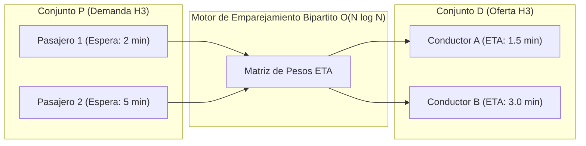

# Módulo 8 - Lección 3: Algoritmos de Despacho Bipartito y Tarificación Dinámica (Surge Pricing)
## *Cátedra de Microeconomía Algorítmica & Subastas de Movilidad (Stanford / MIT)*

---

## 1. 🐣 Ancla Mental Feynman & Analogía Isomórfica

### La Salida del Concierto Bajo la Lluvia
Imagina que termina un concierto multitudinario en un estadio y de repente empieza a llover con fuerza:
* Hay **500 personas** queriendo volver a casa y solo **20 taxis** aparcados cerca.
* Si el precio fuera el habitual (ej. 10 euros), los primeros 20 que corran se quedan los coches y los otros 480 se quedan tirados bajo la lluvia sin que ningún taxista de otras zonas se entere ni tenga ganas de acercarse.
* Si el precio sube automáticamente a 25 euros (**Surge Pricing / Tarifa Dinámica**):
  1. Solo quienes realmente tienen prisa o urgencia piden el taxi ahora; los demás esperan 20 minutos a que pase la lluvia en una cafetería.
  2. Taxistas que estaban cenando en otros barrios ven que allí se paga más y van corriendo al estadio.
  3. En 10 minutos hay 100 taxis disponibles y el precio vuelve a bajar.

El **Surge Pricing** no es un castigo al usuario; es una señal económica que equilibra la oferta y la demanda en tiempo real.

---

## 2. 🔬 Primeros Principios & Desglose Mecánico

### El Modelo de Emparejamiento Bipartito Máximo
El problema de asignar \(N\) conductores a \(M\) pasajeros en una celda H3 se formula como un **Emparejamiento Bipartito Ponderado** (Algoritmo Húngaro / Algoritmo de Kuhn-Munkres o Subasta de Bertsekas):

\[
\max \sum_{i \in \text{Pasajeros}} \sum_{j \in \text{Conductores}} w_{ij} \cdot x_{ij}
\]

Sujeto a:
* \(\sum_{j} x_{ij} \le 1 \quad \forall i\)
* \(\sum_{i} x_{ij} \le 1 \quad \forall j\)
* \(x_{ij} \in \{0, 1\}\)

Donde el peso \(w_{ij}\) penaliza la distancia de recogida (ETA) y premia la cercanía temporal:

\[
w_{ij} = \frac{1}{\text{ETA}(i, j) + \epsilon} - \alpha \cdot \text{EsperaAcumulada}(i)
\]



### Cálculo del Multiplicador de Surge en Celda H3
El multiplicador de tarifa dinámica \(S(h)\) en una celda hexagonal \(h\) se calcula en \(O(1)\) evaluando el ratio demanda/oferta suavizado por una función sigmoide:

\[
S(h) = 1.0 + (S_{\max} - 1.0) \cdot \frac{1}{1 + e^{-k \cdot \left( \frac{D(h)}{O(h) + \epsilon} - \theta \right)}}
\]

---

## 3. 🚀 Arquitectura Práctica & Código en Java 25

```java
package com.pct.mobility.surge;

/**
 * Calculador inmutable de tarifa dinámica en celda H3.
 */
public record SurgePricingEngine(double maxSurgeMultiplier, double thresholdRatio, double steepness) {

    public SurgePricingEngine() {
        this(3.0, 1.5, 2.0);
    }

    /**
     * Calcula el multiplicador de precio en O(1) evitando división por cero.
     */
    public double computeMultiplier(int demandCount, int availableSupply) {
        if (availableSupply <= 0 && demandCount > 0) {
            return maxSurgeMultiplier;
        }
        if (demandCount <= availableSupply) {
            return 1.0;
        }

        double ratio = (double) demandCount / Math.max(1, availableSupply);
        double exponent = -steepness * (ratio - thresholdRatio);
        double sigmoid = 1.0 / (1.0 + Math.exp(exponent));

        double multiplier = 1.0 + (maxSurgeMultiplier - 1.0) * sigmoid;
        return Math.clamp(Math.round(multiplier * 10.0) / 10.0, 1.0, maxSurgeMultiplier);
    }
}
```

---

## 4. 🧠 Internals Avanzados (Stanford / Harvard): Resistencia a la Manipulación (Estrategia-Inmune)

* **Colusión de Oferta y Apagado Masivo**: Si los conductores se desconectan simultáneamente para forzar el Surge y luego se reconectan, el sistema detecta la anomalía mediante el Filtro de Kalman (EnKF) y congela el multiplicador en su valor base.
* **Mecanismo VCG (Vickrey-Clarke-Groves)**: Garantiza que la estrategia dominante para todos los agentes participantes sea declarar su disponibilidad y disposición a pagar de forma veraz (*Truth-telling*).

---

## 5. 🎯 Desafío Feynman & Auto-Evaluación sin Jerga

> [!NOTE]
> **El Reto de los 12 Años**: Explica por qué subir el precio de los taxis cuando llueve hace que haya **más** taxis disponibles en lugar de menos, **sin usar las palabras:** *"Surge", "algoritmo", "demanda", "oferta" ni "sigmoide"*.

### Criterio de Verificación
* **Aprobado**: Si explicas que al ganar más dinero por cada viaje, más conductores que estaban descansando en casa deciden salir a conducir hacia donde está lloviendo, trayendo más coches al lugar donde se necesitan.
* **No Aprobado**: Si explicas curvas económicas abstractas sin conectar la motivación humana del conductor.


---
## 🧠 Ejercicio Práctico: El Método Feynman

Para garantizar una asimilación profunda de los conceptos presentados en este módulo, aplica el **Método Feynman**:

> **Instrucción:** Explica los conceptos centrales de este módulo como si tu audiencia fuera un estudiante brillante de 12 años que no ha visto nunca este tema. Si no puedes hacerlo con lenguaje sencillo, analogías claras y sin jerga técnica, significa que aún no lo entiendes lo suficientemente bien.

*Inténtalo tú mismo:* Toma el concepto más complejo de este módulo, escríbelo en un papel en blanco y redáctalo usando únicamente términos cotidianos.
