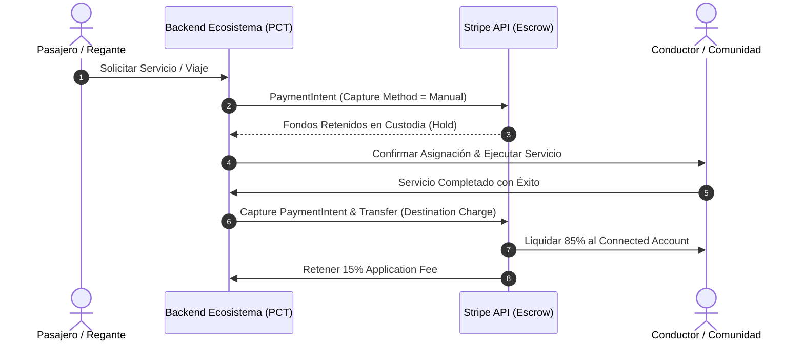

# Módulo 9 - Lección 1: Stripe Connect, Fondos en Custodia (Escrow) y Multi-Tenancy
## *Cátedra de Arquitectura Fintech & Sistemas de Pago Distribuidos (Stanford / Stripe Engineering)*

---

## 1. 🐣 Ancla Mental Feynman & Analogía Isomórfica

### El Árbitro con el Dinero en el Bolsillo (Escrow)
Imagina que le compras una bicicleta de segunda mano a una persona en otra ciudad:
* Si le transfieres el dinero antes de que te envíe la bicicleta, corres el riesgo de que se quede con tu dinero y no te envíe nada.
* Si él te envía la bicicleta primero, él corre el riesgo de que tú la recibas y nunca le pagues.
* **La Solución (El Custodio / Escrow)**: Le entregas el dinero a un árbitro de confianza. El árbitro le avisa al vendedor: *"Tengo los 200 euros en mi caja fuerte. Envía la bici con tranquilidad"*. Cuando tú recibes la bicicleta y confirmas que funciona, el árbitro le entrega los 200 euros al vendedor (menos una pequeña comisión de 5 euros por el servicio).

En software, **Stripe Connect** y el patrón **Escrow** actúan como este árbitro de confianza entre pasajeros y taxistas (en `AppViajes`) o entre agricultores y comunidades de regantes (en `SaaSRegantes`).

---

## 2. 🔬 Primeros Principios & Desglose Mecánico

### Flujo de Fondos con Stripe Connect (Direct Charges vs Destination Charges)



### Principio de Conservación de Capital y Cero Doble Gasto
En todo momento, la suma de saldos antes y después de cualquier transacción debe cumplir la ley de conservación:

\[
\Delta \text{Saldo}_{\text{Cliente}} + \Delta \text{Saldo}_{\text{Proveedor}} + \Delta \text{Saldo}_{\text{Plataforma}} + \text{Comisiones}_{\text{Stripe}} = 0
\]

---

## 3. 🚀 Arquitectura Práctica & Código en Java 25

Implementación de creación de intención de pago en custodia con clave de idempotencia:

```java
package com.pct.fintech.escrow;

import java.util.UUID;

/**
 * Comando inmutable para retención de fondos en custodia.
 */
public record CreateEscrowHoldCommand(
        String tenantId,
        String customerId,
        String connectedAccountId,
        long amountInCents,
        long applicationFeeInCents,
        String currency,
        String idempotencyKey
) {
    public CreateEscrowHoldCommand {
        if (amountInCents <= 0) {
            throw new IllegalArgumentException("El monto a retener debe ser estrictamente positivo");
        }
        if (applicationFeeInCents >= amountInCents) {
            throw new IllegalArgumentException("La comision no puede superar el importe total");
        }
    }

    public static String generateIdempotencyKey(String tripId, String eventType) {
        return "pct_tx_" + tripId + "_" + eventType;
    }
}
```

---

## 4. 🧠 Internals Avanzados (Stripe / BeyondCorp): Reconciliación Asíncrona & Webhooks Criptográficos

* **Verificación de Firmas de Webhook**: Todo webhook entrante de Stripe debe validarse con HMAC-SHA256 usando el *Webhook Secret* (`Stripe-Signature`), rechazando peticiones con un desfase de reloj superior a 300 segundos para mitigar ataques de repetición (*replay attacks*).
* **Manejo de Reversiones y Disputas (Chargebacks)**: Cuando un cliente abre una disputa, Stripe congela los fondos. El sistema debe contar con un puerto secundario para reflejar el estado de auditoría en BigQuery de forma automática sin bloquear la operativa del *tenant*.

---

## 5. 🎯 Desafío Feynman & Auto-Evaluación sin Jerga

> [!NOTE]
> **El Reto de los 12 Años**: Explica cómo una aplicación de viajes se asegura de que el taxista cobre su dinero y el pasajero no sea estafado, **sin usar las palabras:** *"Stripe", "Escrow", "PaymentIntent", "Webhook" ni "API"*.

### Criterio de Verificación
* **Aprobado**: Si explicas que la aplicación guarda el dinero del viaje en una alcancía cerrada al empezar el trayecto, y solo rompe la alcancía para darle el dinero al taxista cuando el coche llega al destino acordado.
* **No Aprobado**: Si te limitas a detallar parámetros de llamadas REST o endpoints.


---
## 🧠 Ejercicio Práctico: El Método Feynman

Para garantizar una asimilación profunda de los conceptos presentados en este módulo, aplica el **Método Feynman**:

> **Instrucción:** Explica los conceptos centrales de este módulo como si tu audiencia fuera un estudiante brillante de 12 años que no ha visto nunca este tema. Si no puedes hacerlo con lenguaje sencillo, analogías claras y sin jerga técnica, significa que aún no lo entiendes lo suficientemente bien.

*Inténtalo tú mismo:* Toma el concepto más complejo de este módulo, escríbelo en un papel en blanco y redáctalo usando únicamente términos cotidianos.
