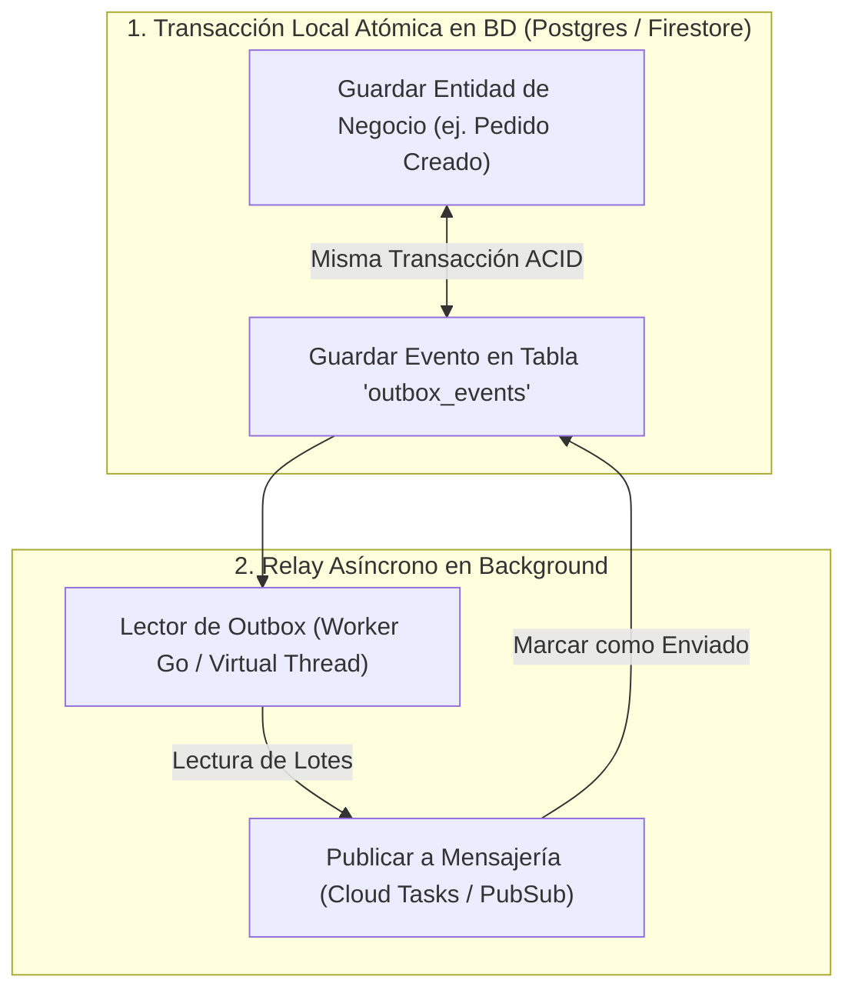

# Módulo 9 - Lección 2: Patrón Sagas, Bandeja de Salida Transaccional (Transactional Outbox) e Idempotencia
## *Cátedra de Transacciones Distribuidas & Consistencia Eventual (MIT / Amazon)*

---

## 1. 🐣 Ancla Mental Feynman & Analogía Isomórfica

### La Carta en el Buzón con Registro en el Diario
Imagina que quieres enviar una carta importante a un banco para transferir dinero, y al mismo tiempo quieres anotar en tu libreta de gastos que ese dinero ya salió:
* Si primero anotas el gasto en tu libreta y luego vas al buzón, pero se te cae la carta en un charco y se destruye, tu libreta dirá una mentira (crees que pagaste pero el banco nunca recibió la orden).
* Si primero echas la carta al buzón y luego intentas anotar el gasto en tu libreta, pero se te gasta la tinta del bolígrafo, la carta ya va en camino pero tu libreta no lo sabe.
* **La Solución (Transactional Outbox)**: Escribes la orden directamente en la última página de tu libreta encuadernada. Un cartero que pasa cada minuto mira esa página, copia la orden en un sobre y la lleva al banco. Como la orden quedó grabada en la libreta en el mismo acto de escribir, nunca se pierde ni se duplica.

El **Transactional Outbox** garantiza que guardar datos en tu base de datos local y publicar un mensaje a la red ocurran de forma atómica sin necesidad de bloqueos distribuidos lentos (como 2-Phase Commit).

---

## 2. 🔬 Primeros Principios & Desglose Mecánico

### El Problema de la Transacción Dual en Sistemas Distribuidos



### Idempotencia Transaccional: \(f(f(x)) = f(x)\)
En redes distribuidas, los mensajes pueden duplicarse por reintentos ante caídas transitorias de conexión. Una operación es **idempotente** si ejecutarla múltiples veces con los mismos parámetros produce exactamente el mismo efecto en el sistema que ejecutarla una sola vez:

\[
f(f(x)) = f(x)
\]

* Toda tabla o colección de pagos y órdenes debe tener una clave única (`idempotency_key`). Si llega una petición con una clave ya procesada, el sistema devuelve inmediatamente el resultado guardado previamente en \(\mathcal{O}(1)\) sin volver a cobrar.

---

## 3. 🚀 Arquitectura Práctica & Código en Java 25

Registro inmutable de Outbox Event con Java 25:

```java
package com.pct.fintech.outbox;

import java.time.Instant;
import java.util.UUID;

public record OutboxEventRecord(
        UUID id,
        String tenantId,
        String aggregateType,
        String aggregateId,
        String eventType,
        String payloadJson,
        Instant createdAt,
        boolean processed
) {
    public static OutboxEventRecord createNew(String tenantId, String aggType, String aggId, String eventType, String json) {
        return new OutboxEventRecord(
                UUID.randomUUID(),
                tenantId,
                aggType,
                aggId,
                eventType,
                json,
                Instant.now(),
                false
        );
    }
}
```

---

## 4. 🧠 Internals Avanzados (MIT / Cornell): Sagas Coreografiadas vs Orquestadas

* **Saga Orquestada**: Un coordinador central (ej. `TripPaymentSagaOrchestrator`) gestiona la máquina de estados y envía comandos de compensación explícitos si un paso falla (ej. si falla la asignación de vehículo tras retener el dinero, emite un comando `RefundEscrowHoldCommand`).
* **Compensabilidad Semántica**: Las acciones de compensación no son un "deshacer" a nivel de base de datos (`ROLLBACK`), sino una nueva transacción de negocio que equilibra el estado contable (nota de crédito / reembolso).

---

## 5. 🎯 Desafío Feynman & Auto-Evaluación sin Jerga

> [!NOTE]
> **El Reto de los 12 Años**: Explica por qué cuando pulsas dos veces seguidas por error el botón de "Pagar" en una tienda online, no te cobran dos veces en tu tarjeta bancaria, **sin usar las palabras:** *"Idempotencia", "Outbox", "Saga", "ACID" ni "Transacción"*.

### Criterio de Verificación
* **Aprobado**: Si explicas que el botón le pone un número de matrícula único a tu compra en el primer clic. Cuando llega el segundo clic con la misma matrícula, el cajero automático reconoce que ya procesó ese billete y simplemente te vuelve a mostrar el recibo en lugar de cobrarte otra vez.
* **No Aprobado**: Si te limitas a recitar la fórmula matemática de idempotencia sin la analogía.


---
## 🧠 Ejercicio Práctico: El Método Feynman

Para garantizar una asimilación profunda de los conceptos presentados en este módulo, aplica el **Método Feynman**:

> **Instrucción:** Explica los conceptos centrales de este módulo como si tu audiencia fuera un estudiante brillante de 12 años que no ha visto nunca este tema. Si no puedes hacerlo con lenguaje sencillo, analogías claras y sin jerga técnica, significa que aún no lo entiendes lo suficientemente bien.

*Inténtalo tú mismo:* Toma el concepto más complejo de este módulo, escríbelo en un papel en blanco y redáctalo usando únicamente términos cotidianos.
