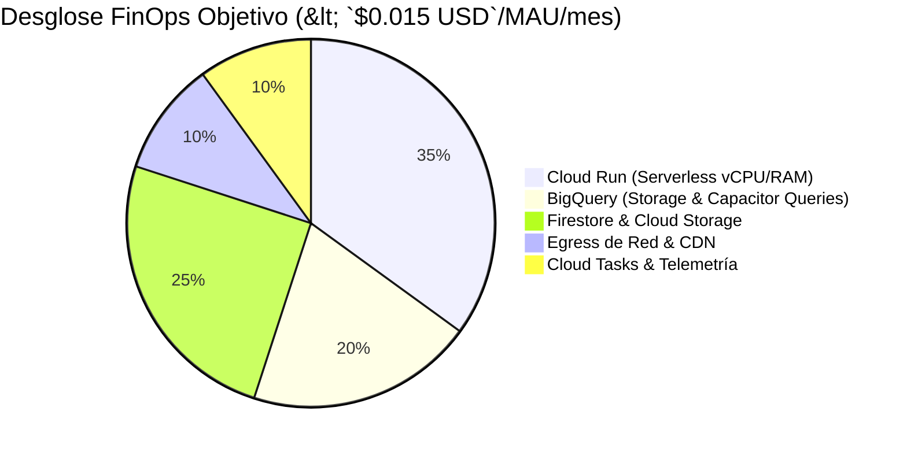

# Módulo 9 - Lección 3: FinOps, Unit Economics y Reconciliación Automatizada
## *Cátedra de Economía Cloud, Arquitectura FinOps & Control de Costes (Harvard / Stanford)*

---

## 1. 🐣 Ancla Mental Feynman & Analogía Isomórfica

### La Fábrica de Galletas y el Coste por Paquete
Imagina que abres una fábrica de galletas:
* Pagas 1,000 euros de alquiler del local al mes (Coste Fijo).
* Cada paquete de galletas te cuesta 0.10 euros en harina, azúcar y envoltorio (Coste Marginal / Unitario).
* Si vendes cada paquete a 1.00 euro, pero resulta que por cada paquete gastas 1.50 euros en electricidad porque dejas los hornos encendidos toda la noche sin hornear nada, estás perdiendo dinero con cada venta.

En software Cloud-Native, los **Unit Economics** miden exactamente cuánto te cuesta en servidores, bases de datos y red atender a **un solo usuario activo al mes (MAU)**.
La regla inquebrantable del ecosistema es que el coste de infraestructura debe ser estrictamente menor a **`$0.015 USD/MAU/mes`**. Si un usuario te genera 2 euros de suscripción pero gasta 2.50 euros en consultas no particionadas de BigQuery, el negocio se arruina a medida que crece.

---

## 2. 🔬 Primeros Principios & Desglose Mecánico

### La Ecuación de Coste Unitario en la Nube
El coste total mensual \(C_{\text{total}}\) se descompone en:

\[
C_{\text{total}} = C_{\text{compute}} + C_{\text{storage}} + C_{\text{network}} + C_{\text{analytics}} + C_{\text{third\_party}}
\]

El coste por MAU (\(c_{\text{mau}}\)) es:

\[
c_{\text{mau}} = \frac{C_{\text{total}}}{\text{MAU}} < 0.015\text{ USD}
\]



### Tácticas Arquitectónicas para Reducción de Costes
1. **Serverless a Escala Cero (Cloud Run)**: Las instancias bajan a 0 réplicas cuando no hay tráfico nocturno.
2. **Particionado Obligatorio en BigQuery**: Evita escanear tablas enteras de terabytes en cada reporte.
3. **Inferencia en Edge con LiteRT**: Correr modelos de IA localmente en el móvil o navegador cuesta **`$0.00 USD/mes`** en cómputo cloud.

---

## 3. 🚀 Arquitectura Práctica & Código en Java 25

Detector analítico de desvío de costes FinOps en tiempo real:

```java
package com.pct.fintech.finops;

/**
 * Monitor de economía unitaria por tenant y usuario activo.
 */
public record FinOpsUnitAuditor(double maxAllowedCostPerMauUsd) {

    public FinOpsUnitAuditor() {
        this(0.015); // Límite estándar corporativo: < 0.015 USD / MAU / mes
    }

    public boolean isWithinBudget(double totalMonthlyCostUsd, long monthlyActiveUsers) {
        if (monthlyActiveUsers <= 0) {
            return totalMonthlyCostUsd <= 0.0;
        }
        double unitCost = totalMonthlyCostUsd / monthlyActiveUsers;
        return unitCost <= maxAllowedCostPerMauUsd;
    }

    public double computeCostPerMau(double totalCostUsd, long activeUsers) {
        return activeUsers > 0 ? (totalCostUsd / activeUsers) : 0.0;
    }
}
```

---

## 4. 🧠 Internals Avanzados (Harvard / MIT): Reconciliación Automática con Algoritmo de Kuhn

* **Reconciliación Contable Cuadrática (\(\mathcal{O}(N)\))**: Cruce diario automático entre los extractos bancarios de Stripe, los registros de auditoría en Firestore y los eventos analíticos en BigQuery.
* **Detección de Fugas (*Revenue Leakage*)**: Si una discrepancia de más de 0.01 euros persiste durante más de 24 horas, se emite una alerta SRE P0 con corte automático de operaciones dudosas.

---

## 5. 🎯 Desafío Feynman & Auto-Evaluación sin Jerga

> [!NOTE]
> **El Reto de los 12 Años**: Explica por qué tener millones de usuarios en una aplicación puede llevar a la quiebra a una empresa si cada usuario gasta más luz en los servidores de lo que paga por el servicio, **sin usar las palabras:** *"FinOps", "Unit Economics", "MAU", "Serverless" ni "BigQuery"*.

### Criterio de Verificación
* **Aprobado**: Si explicas que si hacer una hamburguesa te cuesta 3 euros y la vendes a 2 euros, cuantas más hamburguesas vendas, más rápido te quedas sin dinero hasta que tienes que cerrar el restaurante.
* **No Aprobado**: Si te limitas a recitar conceptos contables o de facturación cloud.


---
## 🧠 Ejercicio Práctico: El Método Feynman

Para garantizar una asimilación profunda de los conceptos presentados en este módulo, aplica el **Método Feynman**:

> **Instrucción:** Explica los conceptos centrales de este módulo como si tu audiencia fuera un estudiante brillante de 12 años que no ha visto nunca este tema. Si no puedes hacerlo con lenguaje sencillo, analogías claras y sin jerga técnica, significa que aún no lo entiendes lo suficientemente bien.

*Inténtalo tú mismo:* Toma el concepto más complejo de este módulo, escríbelo en un papel en blanco y redáctalo usando únicamente términos cotidianos.
